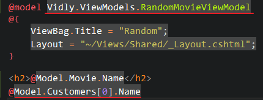
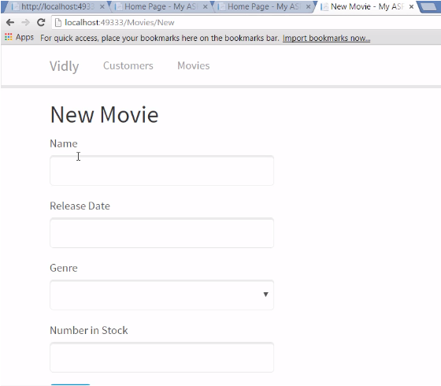
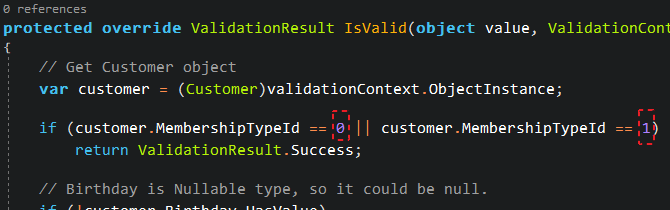
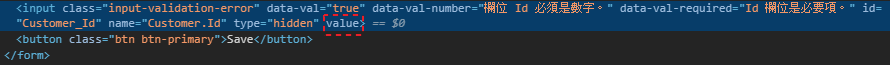
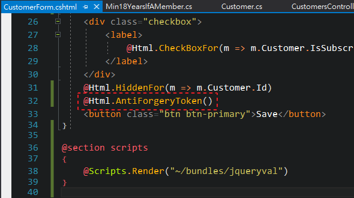
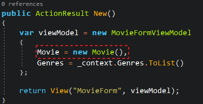

# The Complete ASP&#46;NET MVC 5 Course


Course Link: <https://codewithmosh.com/p/asp-net-mvc>

---

## Getting Started

### MVC 架構 (MVC Architectural Pattern)

|                |                                                                                               Model                                                                                                |                    View                     |                     Controller                     |                              Router                               |
|:--------------:|:--------------------------------------------------------------------------------------------------------------------------------------------------------------------------------------------------:|:-------------------------------------------:|:--------------------------------------------------:|:-----------------------------------------------------------------:|
|      職責      |                                                                                                                                                         |  |         |                        |
| 以租片網站為例 |                                                                                                                                                         |                                             |         |                        |
|      說明      | <ul align="left"><li>僅透過類別 (Class) 中的屬性 (Attribute) 或方法 (Method)，來表示應用程式的狀態或規則</li><li>因為不依賴 UI，所以 Model 中的邏輯也可以拿去套用在 desktop app 或 mobile app</li></ul> |                  網頁呈現                   | Controller 會去 Model 取得資料，並放到 View 作呈現 | 造訪任一網頁時，Router 會選擇出正確的 Controller 去作它該作的工作 |

### 建立 MVC 專案

1. 建立新專案時，選擇「ASP&#46;NET Web Application」

    

2. 設定專案名稱、存放路徑和 .NET Framework 版本

    

3. 選擇 MVC 範本，並將驗證模式改為「個別使用者帳戶 (Individual User Accounts)」

    

### 預設專案結構


- :file_folder: App_Data: 存放 DB 檔案
- :file_folder: App_Start: 應用程式啟動時會執行的檔案
    - BundleConfig.cs: 合併和壓縮 css 或 javascript 成一個 bundle，可以減少 http request 數，也就加快網頁載入速度
    - FilterConfig.cs
    - RouteConfig.cs: 設定 route 規則，以下圖為例

        

        當 url 符合「{controller}/{action}/{id}」格式時，route 就會去解析該由哪個 controller 的哪個 action 去作事

        

        

        如果不符合「{controller}/{action}/{id}」格式或 url 不完整時，就會將無法解析的項目交給預設值

        

- :file_folder: Content: 存放 css 檔案、圖片 .. 等等 client side 資源
- :file_folder: Controllers: 存放 controller 檔案
    - HomeController.cs: 首頁的 controller
- :file_folder: fonts: 存放字型檔案，可以考慮放到 Content 目錄底下
- :file_folder: Models: 存放 model 檔案
- :file_folder: Scripts: 存放 javascript 檔案
- :file_folder: Views: 存放 view 檔案，每個 controller 在這裡都會有一個對應名稱的資料夾
    - :file_folder: Home: 對應 HomeController.cs 的 view
    - :file_folder: Shared: 供不同 controller 共同使用的 view
- favicon.ico: 供瀏覽器顯示的網站圖示
- Global.asax: 為各種事件提供 hooks 或生命週期的全域類別
    - Application_Start() 中會在應用程式啟動時執行，例如註冊 route
- packages.config: NuGet 套件管理，與其逐一到外部套件網站下載，我們透過 NuGet 來統一下載、更新和管理套件

    

- Web.config: 應用程式的各種設定，為 xml 格式，通常只有兩個區塊會作編輯
    - ```connectionStrings```: DB 連線字串
    - ```appSettings```: 應用程式的各種設定

### MVC in Action

以新增隨選電影頁面為例

1. 新增 Model
    1. 在「Models」資料夾新增「Movie.cs」

        

    2. 在「Movie.cs」建立 ```Movie``` 類別並添加 ```Id``` 和 ```Name``` 屬性 (Property)

        

2. 新增 Controller
    1. 在「Controller」資料夾新增「MoviesController.cs」，此時 Visual Studio 也會幫我們建立對應名稱的「Views\Movies」資料夾

        

    2. 在「MoviesController.cs」中將 action 名稱改為 ```Random()```，函式中的電影在現實案例會是從資料庫撈出，這邊為作示範僅寫死一部電影，並將 ```movie``` 物件丟到 View 中回傳

        

3. 新增 View
    1. 有了 Controller 也要有對應的 View，在「Views\Movies」資料夾加入檢視 (View)
        - [部分檢視 (Partial View)](#partial-views) 指的是比較小單位的 View，可以重複使用、組合而成一個完整的 View，這邊不勾選
        - 版面配置頁 (Layout Page) 代表可以使用 template page 或 master page 讓檢視有相似的風格樣式，這邊選擇內建的「~/Views/Shared/_Layout.cshtml」

        

    2. 建立後的「Random.cshtml」分為兩個部分
        - C# code
            - ViewBag.Title: 供瀏覽器顯示的網站標題
            - Layout: 剛剛設定的版面配置頁
        - html

        

    3. 欲取得隨選電影的名稱，如果直接在 html 區塊寫 ```@Model``` 會是 dynamic 型別，無法在編譯階段知道 Model 中有什麼類別成員，但是透過在檔案最上方使用 ```@model``` 關鍵字，就可以在編譯階段使用 ```Movie``` 類別中的類別成員

        

4. Ctrl+F5 (開啟，但不進行偵錯) 檢查執行結果

    

### 加入主題 (Adding a Theme)

ASP<span>.</span>NET MVC 使用 [Bootstrap](https://getbootstrap.com/) 作為前端框架，我們可以到 [Bootswatch](https://bootswatch.com/3/) 尋找免費的 Bootstrap 主題回來替換，以「Lumen」這個主題為例

1. 下載 css，並重新命名為「bootstrap-lumen.css」
2. 加入至專案的「Content」資料夾下

    

3. 開啟「App_Start\BundleConfig.cs」，將原本載入 ```bootstrap.css``` 的地方改為 ```bootstrap-lumen.css```

    

4. Ctrl+Shift+B (建置方案) 後檢查執行結果

### 動作結果 (Action Results)

- ```ActionResult``` 類別用來表示每個 action 的結果
- 在下圖 Controller 中，我們可以看到 ```Random()``` 這個 action 應該要回傳 ```ActionResult``` 類別，但是實際上是回傳 ```ViewResult``` 類別，因為後者其實是前者的衍生類別 (Derived Class)

    

- ```ActionResult``` 類別有以下衍生類別，這些都可以當作 action 回傳的類別，有些還能透過 helper method 簡化

    | 較常用 |         類別          |   Helper Method    |                  功能                  |
    |:------:|:---------------------:|:------------------:|:--------------------------------------:|
    |   V    |      ViewResult       |       View()       |             return a view              |
    |        |   PartialViewResult   |   PartialView()    |         return a partial view          |
    |        |     ContentResult     |     Content()      |          return a simple text          |
    |   V    |    RedirectResult     |     Redirect()     |           redirect to a url            |
    |        | RedirectToRouteResult | RedirectToAction() |      redirect to an action method      |
    |        |      JsonResult       |       Json()       |          return a JSON object          |
    |        |      FileResult       |       File()       |             return a file              |
    |   V    |  HttpNotFoundResult   |   HttpNotFound()   | return "Not Found" or "404 Error" page |
    |        |      EmptyResult      |                    |     nothing to return, like "void"     |

- 以下述程式碼為例

    <table>
    <tr align="center">
    <th>程式碼</th>
    <th>結果</th>
    </tr>
    <tr>
    <td>

    ``` csharp
    public class MoviesController : Controller
    {
        // GET: Movies/Random
        public ActionResult Random()
        {
            // ContentResult
            return Content("Hello World!");
        }
    }
    ```

    </td>
    <td>

    

    </td>
    </tr>
    <tr>
    <td>

    ``` csharp
    public class MoviesController : Controller
    {
        // GET: Movies/Random
        public ActionResult Random()
        {
            // HttpNotFoundResult
            return HttpNotFound();
        }
    }
    ```

    </td>
    <td>

    

    </td>
    </tr>
    <tr>
    <td>

    ``` csharp
    public class MoviesController : Controller
    {
        // GET: Movies/Random
        public ActionResult Random()
        {
            // RedirectToRouteResult
            return RedirectToAction(
                "Index", "Home", new { page = 1, sortBy = "name" }
            );
        }
    }
    ```

    </td>
    <td>

    

    </td>
    </table>

### 動作參數 (Action Parameters)

- 參數綁定 (Parameter Binding) 的過程

    

- 參數可以有以下形式

    

- 以下述程式碼為例
    1. 在「MoviesController.cs」新增一個 ```Edit()``` action，並傳入參數 ```id```

        

    2. 建置後，可以透過「Movies/Edit/1」或「Movies/Edit?id=1」看到我們有正確取得參數

        

        

    3. 但是如果把參數名稱改為 ```movieId```

        

    4. 建置後，可以看到「Movies/Edit?movieId=1」可以運作，但「Movies/Edit/1」是出錯的

        

        

    5. 因為在「App_Start\RouteConfig.cs」中，預設 route 的預設參數寫作「id」

        

    6. 欲修正此錯誤有兩種方式
        1. 新增自定義的 route，會在下一個章節介紹
        2. 若參數為選填，可以將 value type 的參數改為 [Nullable](C%23%20Advanced.md#nullable-types)，並自訂預設值

            > ※ ```string``` 為 reference type，原本就允許空值，所以不必特別處理

            

            

### Convention Routing

- 在「App_Start\RouteConfig.cs」中設定
- route 宣告順序會影響優先權，所以越細的 route 要寫在越前面
- ```MapRoute()``` 有好幾種多載，最常用的下列前三個
    1. name: 必須是唯一值 (unique)
    2. url: url 格式，符合此格式就會使用這個 route，若有參數須用大括號包覆
    3. defaults (objects): 預設使用的 controller, action, default value of parameters
    4. constraints (objects): 可透過正規表示式 (regular expression) 設定 url 參數的條件約束
- 以下述程式碼為例
    1. 欲新增「依發行月份取得電影清單」之 action
    2. 先到「RouteConfig.cs」加入自定義 route，在 url 格式加上 ```{year}``` 和 ```{month}``` 參數

        > ※ 要記得寫在 default route 的前面，才有優先權

        

    3. 回到「MoviesController.cs」，新增 ```ByReleaseDate``` action

        

    4. Ctrl+Shift+B 建置後，瀏覽「*專案 url*/movies/release/」會找不到頁面，原因是這個 url 格式對應不到任何的 route

        

    5. 如果在 url 加上參數，就可以順利瀏覽

        

    6. 如果要更進一步限制年份為4碼數字、月份為2碼數字，可以回到「RouteConfig.cs」增加 url 參數的條件約束

        

    7. 建置後，剛剛的「*專案 url*/movies/release/2019/5」就找不到頁面了，原因同步驟 4

        

    8. 改用「*專案 url*/movies/release/2019/**05**」才能順利瀏覽

        

### Attribute Routing

- Convention Routing 有以下缺點
    1. 隨著自定義的 route 越來越多，「RouteConfig.cs」會越來越大
    2. 必須來回在 controller 和「RouteConfig.cs」間來回修改
    3. 承上點，若在任一邊修改 action name，另一邊須記得修改，否則無法順利導向
- 若專案為 ASP&#46;NET MVC 5 之後的版本，建議使用 Attribute Routing，可以更簡潔的作到自定義 route
- 以下述程式碼為例
    1. 原本的「RouteConfig.cs」如下

        

    2. 刪掉原本的自定義 route，並使用 ```MapMvcAttributeRoutes()```

        

    3. 回到 controller，在 action method 前面加上屬性

        > ※ 透過「{*參數*:regex(*expression*)}」可以為參數加上正規表示式的條件約束，其它條件約束方式可參考 [Routing Constraints](https://docs.microsoft.com/zh-tw/aspnet/web-api/overview/web-api-routing-and-actions/attribute-routing-in-web-api-2#route-constraints)

        

### Passing Data to Views

從 Controller 傳遞資料到 View 有以下方式

|          |                 ActionResult                 |                                                                                                                                   ViewData                                                                                                                                   |                                                                   ViewBag                                                                   |
|:--------:|:--------------------------------------------:|:----------------------------------------------------------------------------------------------------------------------------------------------------------------------------------------------------------------------------------------------------------------------------:|:-------------------------------------------------------------------------------------------------------------------------------------------:|
|   說明   |       透過 ```ActionResult``` 回傳物件       |                                                                                                          用 dictionary 型別的 ```ViewData``` 其 key/value 存放物件                                                                                                           |                                               用 dynamic 型別的 ```ViewBag``` 其屬性存放物件                                                |
|   範例   | 參考 [ActionResult](#動作結果-action-results) |                                                                             Controller<br><br><br>View<br>                                                                             |            Controller<br><br><br>View<br>             |
|   缺點   |                                              | <ul align="left"><li>修改 key 名稱的話，在 Controller 和 View 都得修改</li><li>View 的程式碼因必須轉型而顯得冗長</li><li>ViewData 的 dictionary value 為 object 型別，轉型會帶來[裝箱 (Boxing) 和拆箱 (Unboxing)](C%23%20Intermediate.md#boxing-and-unboxing) 的副作用</li></ul> | <ul align="left"><li>修改屬性名稱的話，在 Controller 和 View 都得修改</li><li>ViewBag 為 dynamic 型別，沒辦法在編譯階段就發現 bug</li></ul> |
| 建議使用 |              :heavy_check_mark:              |                                                                                                                                                                                                                                                                              |                                                                                                                                             |

### View Models

- 通常一個 View 只能指定一種 Model 類別，如果一個 View 中需要同時用到很多種 Model，可以改成建立 ViewModel，並將欲使用的 Model 們設為屬性，在 View 中則改為指定這個自定義的 ViewModel
- 以下述程式碼為例
    1. 目前程式碼如下
        |            |                             目前程式碼                             |
        |:----------:|:------------------------------------------------------------------:|
        |   Model    |      Movie.cs<br>       |
        |    View    |    Movie.cshtml<br>     |
        | Controller | MoviesController.cs<br> |
    2. 欲在 ```Random()``` action 中同時使用 ```Movie``` 和 ```List<Customer>``` 兩個類別
    3. 先新增 ```Customer``` 類別在 Model 中

        

        

    4. 接著在專案目錄中新增「ViewModels」資料夾，並新增「RandomMovieViewModel.cs」

        

        

    5. 回到 Controller 實作 ```RandomMovieViewModel``` 並放到 action result 中回傳

        

    6. 在 View 中，原本是指定 Model，現在要改成指定 ViewModel

        

### Razor Syntax

- 在「.cshtml」檔案中，可以混用 html 和 C# code (要使用 ```@``` 符號開頭)
- 以下述程式碼為例
    - foreach loop 和 if-else statement
        |                    View                     |                    結果                     |
        |:-------------------------------------------:|:-------------------------------------------:|
        |  |  |
    - dynamic attributes

        

    - 註解使用「```@*``` *comment* ```*@```」區塊

        

### Partial Views

- 想像成比較小單位的 View，可以重複使用在不同 View 中，也可以組合多個 Partial View 成一個完整的 View
- 命名規則為底線開頭，例如「_NavBar.cshtml」
- 以下述程式碼為例
    1. 欲將「Views\Shared\_Layout.cshtml」的導覽列拆成獨立的檔案
    2. 在「Views\Shared」資料夾新增部分檢視 (partial view)，命名須為底線開頭

        

        

    3. 將「Views\Shared\_Layout.cshtml」的導覽列程式碼剪下並貼到「_NavBar.cshtml」

        

    4. 接著在「_Layout.cshtml」原處，透過 ```@Html.Partial()``` 渲染 partial view

        

    5. ```@Html.Partial()``` 有另一個多載是傳入 partial view 和 model，不過這邊沒使用到

### Exercise in section 2

1. 在「/Movies」頁面用 hard code 方式，在表格中顯示兩部電影
2. 建立 ```Customer``` 類別
3. 在「/Customers」頁面用 hard code 方式，在表格中顯示兩個客戶姓名 (```Customer.Name```)
4. 承上，若目前無客戶，需顯示「Sorry, we don't have any customer yet.」
5. 承上，客戶姓名可超連結至「/Customers/Details/*{id}*」
6. 承上，該頁僅需顯示該客戶姓名

解答可參考我的 [repo](https://github.com/fdj184/Vidly/commits/develop)

## Working with Data

### Entity Framework

- 一種物件關聯式對應程式 (O/RM)，透過資料抽象化將將每個資料庫物件都轉換成應用程式物件 (entity)，而資料欄位都轉換為屬性 (property)，關聯則轉換為結合屬性 (association)

    

- Entity Framework 提供
    1. ```DbContext``` 類別：代表 DB 或是多張 table、view 的集合
    2. ```DbSet``` 類別：代表單張 table、view

    

- 實際使用時，我們會透過 LINQ 操作 ```DbSet``` 物件
    - 若 LINQ 為查詢指令，會在 runtime 階段轉為 SQL 向 DB 要資料，DB 再將撈到的資料回傳至 ```DbSet```

        

    - 若 LINQ 為新增、修改或刪除指令，```DbSet``` 會記錄過程的變化，並在我們要求異動時，一樣轉為 SQL 要求 DB 執行

        

#### Database First vs Code First

|        |               Database First                |                 Code First                  |
|:------:|:-------------------------------------------:|:-------------------------------------------:|
|  描述  |     傳統策略，先有 DB tables，才建立 EF     |     先寫程式，再透過 DF 建立 DB tables      |
| 示意圖 |  |  |

> ※ 兩者詳細差異，可參考 Mosh 的另一堂課 [Entity Framework 6 in Depth](https://codewithmosh.com/p/entity-framework)

### Code First Migrations

- 若使用 Code First 策略，在每次建立或修改類別 (Class) 時，我們就需要建立移轉 (Migration) 並寫至 DB
- 以下述操作為例
    1. 開啟套件管理器主控台 (Package Manager Console)

        

    2. 首次使用 Migration 時要先作啟用，在 console 輸入 ```enable-migrations```

        

    3. 啟用成功後會出現「Migrations\Configuration.cs」

        

    4. 輸入「add-migration *{移轉名稱}*」以建立移轉，例如 ```add-migration InitialModel```

        

    5. 建立後會出現「Migrations\\*{guid}*_*{移轉名稱}*.cs」，例如「Migrations\201905211620599_InitialModel.cs」

        

    6. 承上，這個建立移轉的動作，會在 Model 中尋找有使用 ```DbContext``` 的類別並建立快照，以此專案為例，目前快照的來源皆來自「Models\IdentityModels.cs」的 ```ApplicationDbContext``` 類別，為 ASP&#46;NET 內建的驗證身分和授權功能

        > ※ ```ApplicationDbContext``` 為 ```IdentityDbContext``` 的衍生類別，```IdentityDbContext``` 又為 ```DbContext``` 的衍生類別

        

    7. 為了讓我們自定義的 ```Movie``` 和 ```Customer``` 類別也建立自己的 table，我們在 ```ApplicationDbContext``` 類別下用增加屬性 (Property) 的方式宣告我們的自定義類別，型別為 ```DbSet<T>```

        

    8. 接著再一次建立移轉，可以使用新的移轉名稱，也可以用「add-migration *{移轉名稱}* -force」洗掉原本的移轉內容，這邊以後者為例

        > ※ ```cls``` 指令可以清掉 console 訊息

        

    9. 回到「Migrations\201905211620599_InitialModel.cs」可以看到 ```Movie``` 和 ```Customer``` 類別對應的 LINQ 語法已經建立

        

    10. 接著在 console 輸入 ```update-database```，便會在「App_Data」資料夾底下建立 DB 檔案 (.mdf)

        

    11. 如果在方案總管沒看到，可以點擊「顯示所有檔案」

        

    12. 雙擊 mdf 檔，即可在伺服器總管檢視我們的 table 和 column 的確有被建立

        

### Changing the Model

為了讓 Model 更接近實務般的複雜，我們欲在 ```Customer``` 類別加入 ```IsSubscribedToNewsletter``` 和 ```MembershipType``` 兩個屬性，其中，```MembershipType``` 為一類別，並擁有 ```SignUpFee```, ```DurationInMonths```, ```DiscountRate``` 三個屬性，以下述操作為例

1. 先在 ```Customer``` 類別加入 ```IsSubscribedToNewsletter``` 屬性

    

2. 建立移轉，並更新至 DB 檔案

    > ※ 使用 Code First 策略時，建立移轉時機類似於 Git 的 commit，每作完一個單位的異動就建立一次移轉，而不是作完全部功能才建立一個移轉，這樣比較不會有問題

    

3. 建立 ```MembershipType``` 類別，除了先前提到的三個屬性，我們還必須額外建立 ```Id``` 欄位，作為 DB table 的 primary key

    > ※ .NET Framework 和 SQL Server 資料型別對應可參考這篇：[C# Equivalent of SQL Server DataTypes](https://stackoverflow.com/questions/425389/c-sharp-equivalent-of-sql-server-datatypes)

    

4. 回到 ```Customer``` 類別
    1. 加入 ```MembershipType``` 屬性，這個屬性讓 EF 在建立移轉時，意識到也要建立 \[MembershipTypes] 這張 table
    2. 加入 ```MembershipTypeId``` 屬性，這個屬性讓 EF 知道要將 \[Customers].\[MembershipTypeId] 這個欄位當作 foreign key 指向 \[MembershipTypes].\[Id]

    

5. 建立移轉，並更新至 DB 檔案

    

    

### Seeding the Database

採用 Code First 策略時，如果欲新增的資料為應用程式的一部份，則應該透過程式碼和移轉來新增資料，而不是經由其它介面來下指令，以下述操作為例

> ※ 在此應用程式中，「客戶類別」為應用程式的一部份，必須事先定義且不太會異動

1. 欲在 \[MembershipTypes] table 新增四筆資料
2. 先建立一個空白的移轉

    

3. 承上，在產出的移轉檔案中，在 ```Up()``` 區塊手動加上新增資料的 SQL 語法

    

4. 更新至 DB 檔案

    

5. 檢查 \[MembershipTypes] table 確實有新增四筆資料

    

### Overriding Conventions

欲覆寫 DB column 的預設屬性，例如長度和不允許空值，可以透過 ```System.ComponentModel.DataAnnotations``` 命名空間，以下述操作為例

1. .NET Framework 的 ```string``` 型別在 SQL Server 中，預設會轉成 ```nvarchar(max)``` 而且允許 null
2. 以 \[Customers].\[Name] 為例

    

3. 在 ```Customer``` 類別中，在 ```Name``` 前面加上資料註解 (Data Annotation)

    

4. 建立移轉，並更新至 DB 檔案

    

5. 檢查 \[Customers].\[Name] 有限制長度且不允許 null

    

### Querying Objects

透過 EF 來查詢資料，以下述操作為例

1. 欲在「CustomersController.cs」中，將原本 hard code 的客戶改為由 DB 取得
2. 先透過伺服器總管在 \[Customers] 塞入兩筆資料

    > ※ 在此應用程式中，「客戶」並不是應用程式的一部份，無法事先定義，亦會不斷增加，所以不需透過程式碼和移轉的方式來新增資料

    

3. 在「CustomersController.cs」中，加入 ```ApplicationDbContext``` 類別的欄位 (Field) 和相關程式碼

    

4. 接著，原本 hard code 的地方全改成從 ```ApplicationDbContext``` 來取得資料

    > ※ 要注意的是，EF 並不是在一使用 ```ApplicationDbContext``` 就立刻作查詢，例如下圖的 ```_context.Customers``` 應不會立刻去查詢 \[Customers] 的資料，而是會等到真正要使用資料時，也就是傳到 View 在跑迴圈時才作查詢

    

    > ※ 在下圖中，因為 ```_context.Customers``` 緊接著 LINQ，馬上要使用真正的資料，所以在這行就會立刻作查詢

    

5. Ctrl+F5 檢查「/Customers」頁面有正常顯示

### Eager Loading

為了讓 EF 能夠載入相關的實體，我們需要 Eager Loading，以下述程式碼為例

1. 在下圖寫法中，EF 只會載入一個實體 (Entity)，也就是 ```Customers```

    

2. 但是實際上 ```Customer``` 類別還有另一個相關的實體 ```MembershipType```，就目前的寫法，我們無法取得其中的資料

    

3. 透過 Eager Loading，也就是 ```Include()``` 的方式，我們可以告訴 EF 要載入相關的 ```MembershipType``` 實體

    > ※ 使用 ```Include()``` 必須引用 ```System.Data.Entity```

    

4. 接著我們在「Views\Customers\Index.cshtml」就可以使用 ```MembershipType``` 中的資料

    |                    View                     |                    結果                     |
    |:-------------------------------------------:|:-------------------------------------------:|
    |  |  |

### Exercise in section 3

- 1st exercise
    1. 在「/Customers」頁面，顯示「客戶姓名」和「會員類型」
    2. 承上，會員類型必須是純文字內容

        

- 2nd exercise
    1. 在「/Customers/Details/*{id}*」頁面，顯示「會員類型」和「生日」
    2. 承上，「生日」無資料時不顯示

        

- 3rd exercise
    1. 在「/Movies」頁面顯示以下資料

        

    2. 承上，電影名稱可超連結至「/Movies/Details/*{id}*」，並在該頁顯示以下資料

        

## Building Forms

### The Markup

建立一個簡單的表單 (Form) 以新增客戶，以下述操作為例

1. 在 Controller 建立新的 Action

    

2. 在 ```return View();``` 按右鍵可以新增 View

    

3. 透過 ```@using (Html.BeginForm(actionName, controllerName)) { ... }``` 可以建立 ```<form></form>``` 元素

    > ※ 如果沒有使用 ```@using```，只有 ```@Html.BeginForm(actionName, controllerName)``` 的話，渲染出來會只有開頭的 ```<form>```，沒有結尾的 ```</form>```

    

4. 透過 ```@Html.LabelFor()``` 加入 Label、```@Html.TextBoxFor()``` 加入 TextBox

    > ※ ```form-group```, ```form-input``` 是 Bootstrap 的 [css 語法](https://getbootstrap.com/docs/3.4/css/#forms)
    >
    > ※ ```@Html.TextBoxFor()``` 預設會根據 Model 是否有設定長度等限制來設定驗證 (Validation) 屬性

    |        |                                             |
    |:------:|:-------------------------------------------:|
    | source |  |
    | result |  |
    |  html  |  |

5. 加入更多 TextBox 和 CheckBox

    > ※ CheckBox 的結構也是參考 Bootstrap 文件的範例

    |        |                                             |
    |:------:|:-------------------------------------------:|
    | source |  |
    | result |  |
    |  html  |  |

### Form Labels

如果要自訂 Label 文字，有以下兩種方式

|          |                                        使用 ```@Html.LabelFor()```                                        |                             使用純 html 的 ```<label></label>```                              |
|:--------:|:---------------------------------------------------------------------------------------------------------:|:---------------------------------------------------------------------------------------------:|
| 額外修改 | 須在 Model 加上資料註解 ```[Display(Name = "")]```，如下圖<br> |             須用 ```<label for="">``` 的方式，才能在點擊文字時，欄位也獲得 focus              |
|   缺點   |                                          改動 Model 就要重新編譯                                          | ```for``` 的值是為欄位 id，也就是 Model 中的屬性，若屬性名稱有異動，得記得修改 ```for``` 的值 |

### Drop-down Lists

透過 ```@Html.DropDownListFor()``` 可以加入下拉選單，以下述程式碼為例

1. 欲在「/Customers/New」頁加入會員類型的下拉選單
2. 承上，該頁會同時用到 ```Customer``` 和 ```MembershipType``` 兩個 Model，所以要改成使用 [ViewModel](#view-models)

    

    

3. 因為在步驟 4 會需要直接透過 ```ApplicationDbContext``` 撈 ```MembershipType``` 的資料，所以先到「IdentityModels.cs」加上相關程式碼

    

4. 回到「CustomersController.cs」，在 ```New()``` 中建立 ViewModel 的實體並回傳給 View 使用

    

5. 回到 View，原本開頭是 ```@model Vidly.Models.Customer```，要改成使用 ViewModel，Razor 使用到 Model 的地方也都要修改

    

6. 加入下拉選單

    > ※ 用 ```SelectList(items, valueField, textField)``` 渲染下拉選單中的項目

    |        |                                             |
    |:------:|:-------------------------------------------:|
    | source |  |
    | result |  |
    |  html  |  |

### Model Binding

按下 submit 按鈕將 View 的資料透過 Http Post 的方式傳回 Controller，以下述操作為例

1. 在 View 作出 submit 按鈕

    > ※ 黃色區塊中，我們當初有指定這個表單 (Form) submit 後要回傳給 ```Customers``` Controller 中的 ```Create``` Action

    

2. 在「CustomersController.cs」建立 ```Create``` Action

    > ※ ```[HttpPost]``` 用來限制此 Action 僅能處理來自 Http Post 的要求

    

#### 驗證 Http Post

1. 在 ```Create``` Action 下中斷點

    

2. F5 開始偵錯，到「Customers/New」頁填完資料後，先按下 F12 到「Network」頁籤

    

3. 按下表單的 Save 按鈕，執行到中斷點後，回來看瀏覽器的「Network」頁籤

    

4. 承上，可以看到 Post 方式送出的表單資訊

### Saving New Data

把 Controller 取得的資料存回 DB，以下述程式碼為例

1. 從剛剛 debug 時可以看出，```Create``` Action 接收的 ViewModel 都是屬於 ```Customer``` 類別的資料

    

2. 所以接收的參數類別可以從 ```NewCustomerViewModel```，改成 ```Customer```

    

3. 透過 ```ApplicationDbContext``` 新增客戶，並在完成後導至「/Customers」頁

    > ※ 一定要記得下 ```SaveChanges()``` 才會啟動交易

    

### Edit Form

在這章節要加上修改表單的功能，而且要和新增表單共用頁面，以下述操作為例

1. 原本在「/Customers」頁，點擊客戶姓名會導至「/Customers/Details/*{id}*」頁，我們改成導至「/Customers/Edit/*{id}*」頁

    > ※ 要記得這個 ActionLink 是有傳一個 ```Id``` 參數的

    

2. 建立 ```Edit``` Action，傳入 ```Id``` 參數

    > ※ 如果最後沒指定 View 名稱的話，MVC 會去找我們故意沒建的「Edit.cshtml」

    

3. 因為新增和修改表單都是使用同一個 View，所以我們修改所有的「New.cshtml」成「CustomerForm.cshtml」，相關程式碼也要修改

    

4. 同上，新增和修改表單都是使用同一個 ViewModel，所以修改所有的 ```NewCustomerViewModel``` 成 ```CustomerFormViewModel```

    > ※ 可以點擊任何一個 ```NewCustomerViewModel```，按下 F2 作全域修改

5. 最後，我們可以在 ```TextBoxFor()``` 使用指定日期格式的多載，讓日期格式符合我們的要求

    

    

### Updating Data

在新增表單 submit 後，我們使用 ```Create``` Action 去作新增資料到 DB 的動作。在修改表單 submit 後，也需要類似的動作儲存資料回 DB，以下述操作為例

1. 較簡潔的設計是讓新增和修改表單在 submit 後都使用同一個 Action，所以我們先調整 Form 要 post 的 Action 名稱

    > ※ 一樣可以用 F2 作全域修改

    

    

2. 在 Controller 會透過是否有 ```Customer.Id``` 來判斷這個 ```Save``` Action 是要新增還是修改，所以在 View 也要實作這個資訊

    > ※ ```Id``` 不需要讓使用者知道，所以用隱藏欄位 (Hidden Field)

    

3. 接著到 Controller，根據是否有 ```Customer.Id``` 來判斷要作新增或修改

    > ※ 另一種修改方式，在撈出 DB 中的狀態後，用 [```TryUpdateModel(model)```](https://docs.microsoft.com/zh-tw/dotnet/api/system.web.mvc.controller.tryupdatemodel?view=aspnet-mvc-5.2) 一次修改所有欄位，但是有以下問題須解決
    >   1. 安全性問題，來源的 Form data 有可能被竄改而異動到不該動的欄位
    >   2. 承上，需要額外下參數定義那些欄位可動、哪些不可動

    

### Exercise in section 4

1. 在「/Movies」頁面加入「New Movie」按鈕
2. 承上，點擊後進入以下表單

    

3. 在「/Movies」頁面點擊電影名稱，則會進入以下表單

    

4. 實作新增/修改電影的邏輯

## Implementing Validation

### Adding Validation

表單驗證 (Form Validation) 有三個簡單的步驟

1. 在 Model 使用資料註解 (Data Annotation)
2. 在 Controller 使用 ```ModelState.IsValid``` 來判斷是否符合上一步驟的資料註解
3. 在 View 透過 ```@Html.ValidationMessageFor()``` 顯示特定欄位不符合驗證時的警語

以下述操作為例

1. 在 ```Customer``` Model 已經有資料註解，限制此欄位必填且長度須小於255字元

    

2. 在 Controller 增加判斷式，如果沒通過驗證，就導回原本的表單頁面並帶入原本敲入的資訊

    

3. 在 View 加上警語

    

4. 在「/Customers/New」頁面故意不填 Name 欄位就送出表單，會被導回「/Customers/New」頁面並顯示警語

    

### Styling Validation Form

驗證失敗時，欄位的 css class 會被加上 ```input-validation-error```，警語則會加上 ```field-validation-error```


所以可以在 css 檔案中自定義這兩個 class 的語法


結果就如下圖


### Data Annotations for Validation

以下為常見的資料註解 (Data Annotation)

|                屬性                |                     描述                     |
|:----------------------------------:|:--------------------------------------------:|
|            \[Required]             |                 是否符合必填                 |
|     \[StringLength(*length*)]      |               是否符合長度限制               |
|       \[Range(*min*, *max*)]       |                 是否符合範圍                 |
|    \[Compare(*otherProperty*)]     | 跟另一個欄位作比較，例如用於二次確認密碼欄位 |
|              \[Phone]              |             是否符合電話號碼格式             |
|          \[EmailAddress]           |             是否符合 Email 格式              |
|               \[Url]               |              是否符合 Url 格式               |
| \[RegularExpression(*expression*)] |              是否符合正則表達式              |

也可以用來自定義驗證失敗的警語文字


### Custom Validation

透過繼承 ```ValidationAttribute``` 類別，並覆寫 (Override) ```IsValid()``` 方法，我們可以添加新的資料註解且用於驗證自定義的邏輯，以下述操作為例

1. 假設「Pay as You Go」以外的會員資格皆須年滿18歲才能申請
2. 先在 Model 建出 ```ValidationAttribute``` 的衍生類別，並覆寫 ```IsValid()``` 方法

    

    

3. 自定義驗證邏輯

    > ※ 使用 ```validationContext.ObjectInstance``` 取得欲驗證的物件 (須轉型)
    >
    > ※ 驗證成功回傳 ```return ValidationResult.Success;```
    >
    > ※ 驗證失敗回傳 ```return new ValidationResult(errorMessage);```

    

4. 在 Model 加上剛剛建立的資料註解屬性

    

5. 在 View 也要加上警語的 placeholder

    

#### Refactoring Magic Numbers

這裡的 magic number 指的是在下圖邏輯中的 0 和 1



因為 0 和 1 代表的意義必須翻資料庫才能知道，其它工程師也不見得知道要查哪一張 table，較好的作法是將 0 和 1 兩個數字改寫成有意義的程式碼，可以透過以下兩種方式達成

1. 建立 ```MembershipType.Id``` 屬性對應的[列舉 (enum)](C%23%20Basics.md#enum) 類別
2. 在 ```MembershipType``` 類別建立 ```public static readonly``` 的欄位 (Field)

    |              MembershipType.cs              |           Min18YearsIfAMember.cs            |
    |:-------------------------------------------:|:-------------------------------------------:|
    |  |  |

### Validation Summary

在 View 透過 ```@Html.ValidationSummary()``` 可以顯示不符合驗證時的警語結論，以下述操作為例

1. 在 View 的 Form 元素一開始就加入 ```@Html.ValidationSummary()```，便可以看到警語結論

    

    

2. 承上，會看到 hidden field 的 ```Id``` 欄位也驗證失敗是因為我們的 ```New``` Action 並沒有給 ```Customer.Id``` 值

    

3. 所以我們可以在 ```New``` Action 時，就先對 ```Customer``` 初始化，此時 ```Customer.Id``` 也會被給予預設值，就不會有後續的驗證失敗問題

    

4. 另外，也可以透過 ```@Html.ValidationSummary(true, message)``` 的多載自定義警語結論文字

    

### Client-side Validation

截至目前為止都是使用 Server-side 的驗證，通常安全性驗證和自定義驗證 (例如18歲才能辦會員) 會交給 Server-side，而基本格式的驗證則交給 Client-side

<table>
    <tr>
        <th colspan="2">Client-side Validation</th>
    </tr>
    <tr>
        <th>優點</th>
        <th>缺點</th>
    </tr>
    <tr>
        <td>
            <ul>
                <li>立即回饋，不必等到 Server-side 處理完才給回饋</li>
                <li>不需浪費 Server-side 的資源</li>
            </ul>
        </td>
        <td align="center">無法驗證自定義的資料註解 (Data Annotation) 屬性</td>
    </tr>
</table>

#### 啟用 Client-side Validation

1. 在「App_Start\BundleConfig.cs」可以看到 MVC 專案預設會將「jquery.validate*」等 script 打包成一支「jqueryval.js」

    

2. 但是在主版頁面「Views\Shared\_Layout.cshtml」的 scripts section 是不啟用的

    

3. 所以我們可以在欲使用 Client-side Validation 的 View 中自行啟用

    > ※ ```@section scripts``` 用來表示其中的內容要在主版頁面的 scripts section 呈現
    >
    > ※ ```@Scripts.Render(path)``` 則是用來宣告欲使用的 script 檔案

    

4. 檢查 Client-side Validation 是否確實啟用

    1. 在「/Customers/New」頁面，按下 F12 打開「Network」頁籤
    2. 按下 submit 按鈕，如果「Network」頁籤沒有出現任何 request 但表單已經出現驗證警語，代表是使用 Client-side Validation 驗證的

5. 承上，驗證原理是透過欄位的 ```data-val-*``` 屬性，此屬性是 MVC Framework 根據 Model 的資料註解加上的

    

### CSRF (Cross-site Request Forgery) 攻擊

CSRF 攻擊的原理如下

1. 使用者在 A 網站 (例如網路銀行) 登入後，未登出即瀏覽其它網站
2. 駭客在 B 網站的圖片或連結中埋 script，其內容會對 A 網站送出 post request
3. 使用者只要一瀏覽 B 網站就會中標，駭客可以任意竄改甚至刪除使用者在 A 網站上的資料 (例如把錢都轉走)
4. 承上，對 A 網站來說，這是使用者發出的 request，但卻**不是自願發出**的

> ※  [CSRF 攻擊](https://zh.wikipedia.org/wiki/%E8%B7%A8%E7%AB%99%E8%AF%B7%E6%B1%82%E4%BC%AA%E9%80%A0)和 [XSS 攻擊](https://zh.wikipedia.org/wiki/%E8%B7%A8%E7%B6%B2%E7%AB%99%E6%8C%87%E4%BB%A4%E7%A2%BC)不同

#### Anti-forgery Tokens

MVC Framework 透過兩個步驟來確保 request 是發自本身的網站表單

1. 在有表單的頁面加上 ```@Html.AntiForgeryToken()```

    

2. 在 Controller 的 post action 加上 ```[ValidateAntiForgeryToken]``` 屬性

    

背後邏輯如下

1. 在我們瀏覽此頁面時，MVC Framework 會藏一個 token 在 hidden field 中

    

2. 並且在 client side 也存一個加密過的 cookie

    

3. 因為駭客頂多可以偷到瀏覽器的 cookie，但是沒辦法知道原網頁中的 token，所以當我們送出 request 時，MVC Framework 就會去檢查兩個值是否一致，若一致就代表是在這個網站送出的 request，否則就有可能是 CSRF 攻擊

### Exercise in section 5

1. 在「/Movies/New」頁面加入驗證功能

    

2. 承上，其中「Number in Stock」欄位有其範圍限制

    

3. 「Release Date」和「Number in Stock」欄位必須有初始值
4. 啟用 Client-side Validation
5. 實作 Anti-forgery Token

#### 處理表單欄位初始值

為了在新增表單時能通過驗證，我們在 ```New``` Action 中初始化了一個 ```Movie``` 實體，使 ```Id``` 能夠擁有初始值



但是這會造成其它 Value Type 的欄位也跑出初始值，如下圖


為了解決這個問題，我們可以遵循以下原則

1. 將**所有實際儲存於 DB** 的欄位及特性寫在 Model，例如 ```[Required]``` (for not null column), ```[StringLength]``` (for column length) .. 等等
2. 將**欲呈現在 View** 的欄位及特性寫在 ViewModel，例如 ```[Required]``` (for form validation), ```[StringLength]``` (for form validation), ```[Range]```, ```[Display]``` .. 等等

以剛剛電影的新增表單為例

1. 將 ViewModel 中原本的 ```Movie``` 屬性，替換成所有會在 View 中使用的 ```Movie``` 類別中的屬性

    

2. 在 ViewModel，就可以把 ```ReleaseDate``` 和 ```NumberInStock``` 兩個欄位改為 Nullable
3. 在 ViewModel 加上建構式，讓日後的 ```New``` 和 ```Edit``` Action 使用

    

4. 回去調整 Controller，有使用到 ViewModel 的地方改用相對應的建構式
5. 回去調整 View，有使用到 ViewModel 的地方都要改

## Building RESTful Services with ASP&#46;NET Web API

### What is a Web API

先前的 MVC 策略都是在 Server-side 作好 Html 再回傳給 Client-side


有另一種替代方案是 Server-side 僅回傳 Data，Client-side 再根據 Data 渲染 Html


用第二種方案的優點如下

- 使用較少的 Server-side 資源 (增加可擴充性)
- 減少資料傳輸量 (增加效能)
- 能夠支援 Web Application 以外的 Client-side

    

這種策略就是透過「ASP&#46;NET Web API」framework 在 Server-side 提供 Web API


很多知名網站，例如 Facebook, YouTube, Twitter .. 等等，也會提供公開的 Web API 供他人使用，且 Web API 不僅是可以用來查詢，也可以用來修改、刪除資料

### RESTful Convention

RESTful API 即遵守 [REST (Representational State Transfer)] 風格的 Web API

<table>
    <tr>
        <th>HTTP Verbs</th>
        <th>描述</th>
        <th colspan="2">範例</th>
    </tr>
    <tr align="center">
        <td rowspan="2">GET</td>
        <td rowspan="2">取得資料</td>
        <td><b>GET</b> /api/customers</td>
        <td>取得所有客戶資料</td>
    </tr>
    <tr align="center">
        <td><b>GET</b> /api/customers/1</td>
        <td>取得 id = 1 的客戶資料</td>
    </tr>
    <tr align="center">
        <td>POST</td>
        <td>新增資料</td>
        <td><b>POST</b> /api/customers</td>
        <td>新增所有客戶資料</td>
    </tr>
    <tr align="center">
        <td>PUT</td>
        <td>修改資料</td>
        <td><b>PUT</b> /api/customers/1</td>
        <td>修改 id = 1 的客戶資料</td>
    </tr>
    <tr align="center">
        <td>DELETE</td>
        <td>刪除資料</td>
        <td><b>DELETE</b> /api/customers/1</td>
        <td>刪除 id = 1 的客戶資料</td>
    </tr>
</table>

### Building an API

建立操作 Customers 資料的 API，以下述操作為例

1. 建立「Controllers\Api」資料夾
2. 承上，在該資料夾中加入「CustomersController.cs」，這次我們選擇「Web API 2 控制器」

    

3. 首次使用 Web API 會開啟「readme.txt」，依照說明在「Global.asax」添加程式碼

    

4. 回到「Controllers\Api\CustomersController.cs」，加入 ```ApplicationDbContext``` 類別的欄位 (Field) 和相關程式碼

    

5. 加入供 GET request 使用的方法

    > ※ RESTful API 規定 exception 要用 ```throw new HttpResponseException(HttpStatusCode.{element});``` 的方式來回傳，在這裡的錯誤是找不到資料，所以用 ```HttpStatusCode.NotFound```

    

6. 加入供 POST request 使用的方法

    > ※ 要記得添加給 API Controller 用的 ```[System.Web.Http.HttpPost]``` 屬性，順帶一提， ```[System.Web.MVC.HttpPost]``` 是給 MVC Controller 用的，小心搞混
    >
    > ※ 這裡的錯誤會是無效的 ```Id```，所以用 ```HttpStatusCode.BadRequest```

    

7. 加入供 PUT request 使用的方法

    > ※ 要記得添加給 API Controller 用的 ```[System.Web.Http.HttpPut]``` 屬性

    

8. 加入供 DELETE request 使用的方法

    

### Testing an API

如果直接用瀏覽器開啟我們的 Web API，預設會是 xml 格式的 data


較好的作法是透過 [Postman](https://chrome.google.com/webstore/detail/postman/fhbjgbiflinjbdggehcddcbncdddomop) 套件，直接對 API 發出 request，以下述操作為例

1. 選擇 Http Verbs，輸入 URL 後，按下「Send」，即可取得 json 格式的 data

    

2. 如果想測 POST request，可以在「Body」頁籤輸入資料，然後按下「Send」

    

3. 承上，如果收到 media type 的錯誤，可以去「Headers」頁籤添加「Content-Type」的值為「application/json」

    

    

### 資料傳輸物件 (Data Transfer Objects)

讓 API 直接回傳 domain model 物件有以下風險

1. 修改 domain model 時會造成依賴於現行 API 的程式崩潰，例如重新命名 ```Customers``` 的屬性名稱
2. 將 domain model 的邏輯整個公開，恐遭有心人士惡意攻擊，例如修改不應異動的欄位

我們可以透過 DTO (Data Transfer Objects) 僅揭露 domain model 中的必要資訊給 client，以下述操作為例

1. 建立「Dtos」資料夾和「Dtos\CustomerDto.cs」檔案

    

2. 將「Models\Customer.cs」的屬性全部複製過來，然後刪掉所有 client 端不需要知道的屬性和資訊

    

3. ```CustomerDto``` 最後只保留 client 需要知道的內容

    

4. 接著回到 API，將所有使用到 Model，也就是用到 ```Customer``` 類別的地方，都改成使用 ```CustomerDto``` 類別，下個章節會介紹用 Auto Mapper 重新作欄位對應

### Auto Mapper

Auto Mapper 能自動在兩個對應的類別間作轉換，例如 Model <-> ViewModel 或是 Model <-> DTO，可省去一一條列 ```Class1.Attribute = Class2.Attribute``` 的動作，以下述操作為例

1. 開啟套件管理器主控台 (Package Manager Console)，並輸入 ```Install-Package AutoMapper```

    

2. 建立「App_Start\MappingProfile.cs」，為類別對應的設定檔

    

3. 承上，先繼承 ```Mapper``` 類別，然後在建構式中設定類別對應

    > ※ 不同版本會有不同寫法，此處為 8.1.0 版，語法為 ```CreateMap<TSource, TDestination>();```

    

4. 接著，修改「Global.asax」，讓應用程式一啟動就會載入這個設定檔

    > ※ 初始化並載入設定檔 ```Mapper.Initialize(c => c.AddProfile<profileName>());```

    

5. 再來就可以回到 API，將用到 ```Customer``` 類別的地方，都改成使用 ```CustomerDto``` 類別，並搭配 AutoMapper 作欄位對應
6. 調整 GET request

    > ※ 如果是物件集合，可以透過 [LINQ](C%23%20Advanced.md#linq) 用 ```.Select(Mapper.Map<TSource, TDestination>)``` 產生目標類別的集合
    >
    > ※ 如果是單一物件，可以透過 ```Mapper.Map<TSource, TDestination>(sourceClass)``` 產生目標類別

    

7. 調整 POST request

    > ※ ```Id``` 欄位會在新增進 DB 後有值，要更新回 ```customerDto``` 再回傳

    

8. 調整 PUT request

    > ※ 透過 ```Mapper.Map<TSource, TDestination>(sourceClass, destinationClass)```，或是簡化成 ```Mapper.Map(sourceClass, destinationClass)``` 可以將來源類別更新至目標類別，而且不必條列欄位

    

### Enable Camel Case

目前 API 產生的 json，其屬性名稱是 Pascal Case


但為了後續讓 javascript 便於使用 data，我們應該改成 Camel Case，以下述操作為例

1. 開啟「App_Start\WebApiConfig.cs」
2. 加上以下程式碼

    

### IHttpActionResult

目前我們的 GET 和 POST request 都是回傳自定義的類別，在[官方文件](https://docs.microsoft.com/zh-tw/aspnet/web-api/overview/getting-started-with-aspnet-web-api/action-results)寫到，如果回傳的類別不為 ```void```、```HttpResponseMessage``` 或 ```IHttpActionResult``` 其中一種，就會是回傳 [HTTP 狀態碼](https://zh.wikipedia.org/wiki/HTTP%E7%8A%B6%E6%80%81%E7%A0%81) 200


但根據 RESTful API 的規則，我們在 POST request 建立資料後，應該要回傳 HTTP 狀態碼 201 且提供該筆新資料的 Uri，在 ASP<span>.</span>NET Web API 中建議我們使用 ```IHttpActionResult``` 達成，以下述操作為例

1. 調整 POST request

    > ※ 透過 ```Created()``` helper method 可以回傳 201 狀態碼
    >
    > ※ 丟例外 ```HttpResponseException``` 也有更簡潔的寫法

    

    實際呼叫可以看到

    1. HTTP 狀態碼已經變成 201
    2. 回傳結果的 Header 多了 location 屬性並指向該筆新資料的 Uri

    

2. 調整 GET request

    > ※ 透過 ```Ok()``` helper method 可以回傳 200 狀態碼

    

### Exercise in section 6

加入對 ```Movie``` 操作 CRUD 的 API

## Client-side Development

### Calling an API Using jQuery

> ※ 沒學過 [jQuery](https://api.jquery.com/) 的話可能要先去稍微了解一下

在「Customers/Index」頁面建立「刪除」按鈕，並透過 jQuery 語法，用 Ajax 跟 API 發出 request，以下述操作為例

1. 加入按鈕和 script section

    > ※ ```btn-link``` 是 Bootstrap 的語法

    

2. 用 jQuery 監聽所有刪除按鈕的 click event

    > ※ ```table``` 元素加上 id、按鈕加上 class，都是為了方便寫 jQuery 的選擇器 (Selector)
    >
    > ※ 寫 js 時，可以透過 ```console.log()``` 來 debug，在 Chrome 按 F12，「Console」頁籤可以看到輸出結果

    

3. click event 觸發時，跳出 confirm 視窗，確認後用 Ajax 發出 DELETE request，接著刪除該行 tr 元素

    > ※ ```const``` 是 javascript ES 6 的語法
    >
    > ※ ```.data()```, ```.parents()```, ```.remove()``` 都是 jQuery 的語法

    

### Bootbox Plug-in

Bootstrap 風格的彈跳視窗套件，欲替換原生的 confirm 視窗，以下述操作為例

1. 用 NuGet 安裝 [Bootbox](http://bootboxjs.com/)
2. 在「App_Start\BundleConfig.cs」加入「~/Scripts/bootbox.js」為 bundle 的一部份

    

3. 改寫 jQuery 中原本使用 ```confirm()``` 的地方成 ```bootbox.confirm()```

    

4. 測試結果

    

### Optimizing jQuery Code

目前的 code 是將 event handler 綁在所有按鈕上

``` javascript
$("#customers .js-delete").on("click", function () {
    ...
});
```

Mosh 說，如果你有 100 個按鈕，上述寫法就代表你要在記憶體中存 100 個 event handler，較好的寫法是將 event handler 寫在按鈕的共同 parent 上，並用 ```.on()``` 去過濾出符合條件的選擇器，如下述程式

``` javascript
$("#customers").on("click", ".js-delete", function () {
    ...
});
```

參考文章：

- [Should all jquery events be bound to $(document)?](https://stackoverflow.com/questions/12824549/should-all-jquery-events-be-bound-to-document)
- [Why not take Javascript event delegation to the extreme?](https://stackoverflow.com/questions/9711118/why-not-take-javascript-event-delegation-to-the-extreme)

### DataTables Plug-in

表格套件，內建許多功能，例如排序、篩選、分頁 .. 等等，欲替換「/Customers/Index」頁面的表格，以下述操作為例

1. 用 NuGet 安裝 [DataTables](https://datatables.net/)
2. 在「App_Start\BundleConfig.cs」加入
    - 「~/Scripts/DataTables/jquery.dataTables.js」
    - 「~/Scripts/DataTables/dataTables.bootstrap.js」
    - 「~/Content/DataTables/css/dataTables.bootstrap.css」
3. 在 ```$(document).ready()``` 後套用 DataTables

    > ※ 如果沒作用，可以 F12 看「Console」頁籤是否有 error

    ``` javascript
    $(document).ready(function () {
        $("#customers").DataTable();

        $("#customers").on("click", ".js-delete", function () {
            ...
        });
    });
    ```

4. 檢視結果

    

### DataTables with Ajax Source

在剛剛的例子中，其實是很浪費 Server-side 資源的

1. 我們先在 Server-side 作好 Html (包含表格)
2. 傳到 Client-side
3. DataTables 元件讀取表格的 Html，再套用 DataTables

較好的作法是

1. 我們先在 Server-side 作好表格以外的 Html
2. 傳到 Client-side
3. DataTables 元件用 Ajax 去要表格的 data (json 格式)，用 data 作出 DataTables 的表格

以下述操作為例

1. 在套用 DataTables 時，加上初始化屬性

    ``` javascript
    $(document).ready(function () {
        $("#customers").DataTable({
            ajax: {
                url: "/api/customers",
                dataSrc: ""
            },
            columns: [
                {
                    data: "name",
                    render: function (data, type, row) {
                        return "<a href='/Customers/Edit/" + row.id + "'>" + data + "</a>";
                    }
                },
                {
                    // this data is temporary
                    data: "name"
                },
                {
                    data: "id",
                    render: function (data) {
                        return "<button class='btn-link js-delete' data-customer-id='" + data + "'>Delete</button>";
                    }
                }
            ]
        });
        ...
    });
    ```

    > ※ ```dataSrc``` 會依資料來源的格式給予不同的值
    >
    >> <table>
    >> <tr align="center">
    >> <th>資料來源</th>
    >> <th>DataTables 初始化</th>
    >> </tr>
    >> <tr>
    >> <td>
    >>
    >> ``` json
    >> {
    >>     count: 10,
    >>     customers: [
    >>         { ... },
    >>         { ... },
    >>         { ... }
    >>     ]
    >> }
    >> ```
    >>
    >> </td>
    >> <td>
    >>
    >> ``` javascript
    >> $("#customers").DataTable({
    >>     ajax: {
    >>         url: "/api/customers",
    >>         dataSrc: "customers"
    >>     },
    >>     ...
    >> });
    >> ```
    >>
    >> </td>
    >> </tr>
    >> <tr>
    >> <td>
    >>
    >> ``` json
    >> [
    >>     { ... },
    >>     { ... },
    >>     { ... }
    >> ]
    >> ```
    >>
    >> </td>
    >> <td>
    >>
    >> ``` javascript
    >> $("#customers").DataTable({
    >>     ajax: {
    >>         url: "/api/customers",
    >>         dataSrc: ""
    >>     },
    >>     ...
    >> });
    >> ```
    >>
    >> </td>
    >> </tr>
    >> </table>
    >
    > ※ ```columns``` 用來定義表格欄位的值來自哪個屬性

2. 原本的 Html 只需要保留 table 的基礎架構，資料就交給 DataTables 來渲染

    ``` html
    <h2>Customers</h2>
    <table id="customers" class="table table-bordered table-hover">
        <thead>
            <tr>
                <th>Customer</th>
                <th>Membership Type</th>
                <th>Delete</th>
            </tr>
        </thead>
        <tbody>
            <!-- everything here is deleted -->
        </tbody>
    </table>
    ```

3. Controller 的 ```Index()``` Action 也不再需要回傳 Model 物件

    ``` csharp
    // GET: Customers
    public ActionResult Index()
    {
        // everything here is deleted
        return View();
    }
    ```

4. 檢視結果

### Returning Hierarchical Data

在剛剛的例子中，因為 ```CustomerDto``` 類別中沒有 ```MembershipType``` 的屬性，所以在表格中我們無法用現有的 API 取得 ```MembershipType.Name```，為了解決這個問題，以下述操作為例

1. 建立 ```MembershipTypeDto``` 類別，目的只是為了讓 API 能夠揭露 ```MembershipType``` 的必要屬性

    ``` csharp
    public class MembershipTypeDto
    {
        public byte Id { get; set; }
        public string Name { get; set; }
    }
    ```

2. 在 ```CustomerDto``` 加入 ```MembershipTypeDto``` 屬性

    

3. 在 API 的 GET request method 加上 ```.Include()```

    

4. 也要在 「App_Start\MappingProfile.cs」，加上 ```MembershipType``` -> ```MembershipTypeDto``` 的對應

    

5. 用 Postman 檢查 API 是否有正確回傳 ```MembershipTypeDto```

    

6. 修改 script，定義成正確的屬性

    

7. 檢視結果

### DataTables: Removing Records

修正「刪除表格列」的寫法，以下述程式碼為例

> ※ ```draw()``` 是為了在刪除資料後，重新渲染表格


### Single Page Applications (SPAs)

user 點擊任何連結或發出 request 時

- Server-side 僅提供各種 API 來取得或修改資料
- 網站只有一個 View，而且全交由 Client-side 渲染 (不再需要 Razor view)

    

- 對使用者體驗會更快更流暢

### Exercise in section 7

在「/Movies/Index」頁面實作 DataTables 和刪除的 Bootbox 功能
