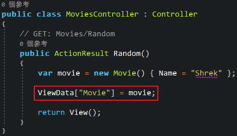
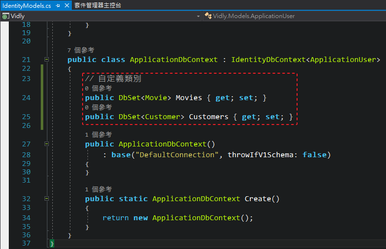

# The Complete ASP&#46;NET MVC 5 Course


Course Link: <https://codewithmosh.com/p/asp-net-mvc>

---

## Getting Started

### MVC 架構 (MVC Architectural Pattern)

|                |                                                                                               Model                                                                                                |                    View                     |                     Controller                     |                              Router                               |
|:--------------:|:--------------------------------------------------------------------------------------------------------------------------------------------------------------------------------------------------:|:-------------------------------------------:|:--------------------------------------------------:|:-----------------------------------------------------------------:|
|      職責      |                                                                                                                                                         |  |         |                        |
| 以租片網站為例 |                                                                                                                                                         |                                             |         |                        |
|      說明      | <ul align="left"><li>僅透過類別 (Class) 中的屬性 (Attribute) 或方法 (Method)，來表示應用程式的狀態或規則</li><li>因為不依賴 UI，所以 Model 中的邏輯也可以拿去套用在 desktop app 或 mobile app</li></ul> |                  網頁呈現                   | Controller 會去 Model 取得資料，並放到 View 作呈現 | 造訪任一網頁時，Router 會選擇出正確的 Controller 去作它該作的工作 |

### 建立 MVC 專案

1. 建立新專案時，選擇「ASP&#46;NET Web Application」

    

2. 設定專案名稱、存放路徑和 .NET Framework 版本

    

3. 選擇 MVC 範本，並將驗證模式改為「個別使用者帳戶 (Individual User Accounts)」

    

### 預設專案結構


- :file_folder: App_Data: 存放 DB 檔案
- :file_folder: App_Start: 應用程式啟動時會執行的檔案
    - BundleConfig.cs: 合併和壓縮 css 或 javascript 成一個 bundle，可以減少 http request 數，也就加快網頁載入速度
    - FilterConfig.cs
    - RouteConfig.cs: 設定 route 規則，以下圖為例

        

        當 url 符合「{controller}/{action}/{id}」格式時，route 就會去解析該由哪個 controller 的哪個 action 去作事

        

        

        如果不符合「{controller}/{action}/{id}」格式或 url 不完整時，就會將無法解析的項目交給預設值

        

- :file_folder: Content: 存放 css 檔案、圖片 .. 等等 client side 資源
- :file_folder: Controllers: 存放 controller 檔案
    - HomeController.cs: 首頁的 controller
- :file_folder: fonts: 存放字型檔案，可以考慮放到 Content 目錄底下
- :file_folder: Models: 存放 model 檔案
- :file_folder: Scripts: 存放 javascript 檔案
- :file_folder: Views: 存放 view 檔案，每個 controller 在這裡都會有一個對應名稱的資料夾
    - :file_folder: Home: 對應 HomeController.cs 的 view
    - :file_folder: Shared: 供不同 controller 共同使用的 view
- favicon.ico: 供瀏覽器顯示的網站圖示
- Global.asax: 為各種事件提供 hooks 或生命週期的全域類別
    - Application_Start() 中會在應用程式啟動時執行，例如註冊 route
- packages.config: NuGet 套件管理，與其逐一到外部套件網站下載，我們透過 NuGet 來統一下載、更新和管理套件

    

- Web.config: 應用程式的各種設定，為 xml 格式，通常只有兩個區塊會作編輯
    - ```connectionStrings```: DB 連線字串
    - ```appSettings```: 應用程式的各種設定

### MVC in Action

以新增隨選電影頁面為例

1. 新增 Model
    1. 在「Models」資料夾新增「Movie.cs」

        

    2. 在「Movie.cs」建立 ```Movie``` 類別並添加 ```Id``` 和 ```Name``` 屬性 (Property)

        

2. 新增 Controller
    1. 在「Controller」資料夾新增「MoviesController.cs」，此時 Visual Studio 也會幫我們建立對應名稱的「Views\Movies」資料夾

        

    2. 在「MoviesController.cs」中將 action 名稱改為 ```Random()```，函式中的電影在現實案例會是從資料庫撈出，這邊為作示範僅寫死一部電影，並將 ```movie``` 物件丟到 View 中回傳

        

3. 新增 View
    1. 有了 Controller 也要有對應的 View，在「Views\Movies」資料夾加入檢視 (View)
        - [部分檢視 (Partial View)](#partial-views) 指的是比較小單位的 View，可以重複使用、組合而成一個完整的 View，這邊不勾選
        - 版面配置頁 (Layout Page) 代表可以使用 template page 或 master page 讓檢視有相似的風格樣式，這邊選擇內建的「~/Views/Shared/_Layout.cshtml」

        

    2. 建立後的「Random.cshtml」分為兩個部分
        - C# code
            - ViewBag.Title: 供瀏覽器顯示的網站標題
            - Layout: 剛剛設定的版面配置頁
        - html

        

    3. 欲取得隨選電影的名稱，如果直接在 html 區塊寫 ```@Model``` 會是 dynamic 型別，無法在編譯階段知道 Model 中有什麼類別成員，但是透過在檔案最上方使用 ```@model``` 關鍵字，就可以在編譯階段使用 ```Movie``` 類別中的類別成員

        

4. Ctrl+F5 (開啟，但不進行偵錯) 檢查執行結果

    

### 加入主題 (Adding a Theme)

ASP<span>.</span>NET MVC 使用 [Bootstrap](https://getbootstrap.com/) 作為前端框架，我們可以到 [Bootswatch](https://bootswatch.com/3/) 尋找免費的 Bootstrap 主題回來替換，以「Lumen」這個主題為例

1. 下載 css，並重新命名為「bootstrap-lumen.css」
2. 加入至專案的「Content」資料夾下

    

3. 開啟「App_Start\BundleConfig.cs」，將原本載入 ```bootstrap.css``` 的地方改為 ```bootstrap-lumen.css```

    

4. Ctrl+Shift+B (建置方案) 後檢查執行結果

### 動作結果 (Action Results)

- ```ActionResult``` 類別用來表示每個 action 的結果
- 在下圖 Controller 中，我們可以看到 ```Random()``` 這個 action 應該要回傳 ```ActionResult``` 類別，但是實際上是回傳 ```ViewResult``` 類別，因為後者其實是前者的衍生類別 (Derived Class)

    

- ```ActionResult``` 類別有以下衍生類別，這些都可以當作 action 回傳的類別，有些還能透過 helper method 簡化

    | 較常用 |         類別          |   Helper Method    |                  功能                  |
    |:------:|:---------------------:|:------------------:|:--------------------------------------:|
    |   V    |      ViewResult       |       View()       |             return a view              |
    |        |   PartialViewResult   |   PartialView()    |         return a partial view          |
    |        |     ContentResult     |     Content()      |          return a simple text          |
    |   V    |    RedirectResult     |     Redirect()     |           redirect to a url            |
    |        | RedirectToRouteResult | RedirectToAction() |      redirect to an action method      |
    |        |      JsonResult       |       Json()       |          return a JSON object          |
    |        |      FileResult       |       File()       |             return a file              |
    |   V    |  HttpNotFoundResult   |   HttpNotFound()   | return "Not Found" or "404 Error" page |
    |        |      EmptyResult      |                    |     nothing to return, like "void"     |

- 以下述程式碼為例

    <table>
    <tr align="center">
    <th>程式碼</th>
    <th>結果</th>
    </tr>
    <tr>
    <td>

    ``` csharp
    public class MoviesController : Controller
    {
        // GET: Movies/Random
        public ActionResult Random()
        {
            // ContentResult
            return Content("Hello World!");
        }
    }
    ```

    </td>
    <td>

    

    </td>
    </tr>
    <tr>
    <td>

    ``` csharp
    public class MoviesController : Controller
    {
        // GET: Movies/Random
        public ActionResult Random()
        {
            // HttpNotFoundResult
            return HttpNotFound();
        }
    }
    ```

    </td>
    <td>

    

    </td>
    </tr>
    <tr>
    <td>

    ``` csharp
    public class MoviesController : Controller
    {
        // GET: Movies/Random
        public ActionResult Random()
        {
            // RedirectToRouteResult
            return RedirectToAction(
                "Index", "Home", new { page = 1, sortBy = "name" }
            );
        }
    }
    ```

    </td>
    <td>

    

    </td>
    </table>

### 動作參數 (Action Parameters)

- 參數綁定 (Parameter Binding) 的過程

    

- 參數可以有以下形式

    

- 以下述程式碼為例
    1. 在「MoviesController.cs」新增一個 ```Edit()``` action，並傳入參數 ```id```

        

    2. 建置後，可以透過「Movies/Edit/1」或「Movies/Edit?id=1」看到我們有正確取得參數

        

        

    3. 但是如果把參數名稱改為 ```movieId```

        

    4. 建置後，可以看到「Movies/Edit?movieId=1」可以運作，但「Movies/Edit/1」是出錯的

        

        

    5. 因為在「App_Start\RouteConfig.cs」中，預設 route 的預設參數寫作「id」

        

    6. 欲修正此錯誤有兩種方式
        1. 新增自定義的 route，會在下一個章節介紹
        2. 若參數為選填，可以將 value type 的參數改為 [Nullable](C%23%20Advanced.md#nullable-types)，並自訂預設值

            > ※ ```string``` 為 reference type，原本就允許空值，所以不必特別處理

            

            

### Convention Routing

- 在「App_Start\RouteConfig.cs」中設定
- route 宣告順序會影響優先權，所以越細的 route 要寫在越前面
- ```MapRoute()``` 有好幾種多載，最常用的下列前三個
    1. name: 必須是唯一值 (unique)
    2. url: url 格式，符合此格式就會使用這個 route，若有參數須用大括號包覆
    3. defaults (objects): 預設使用的 controller, action, default value of parameters
    4. constraints (objects): 可透過正規表示式 (regular expression) 設定 url 參數的條件約束
- 以下述程式碼為例
    1. 欲新增「依發行月份取得電影清單」之 action
    2. 先到「RouteConfig.cs」加入自定義 route，在 url 格式加上 ```{year}``` 和 ```{month}``` 參數

        > ※ 要記得寫在 default route 的前面，才有優先權

        

    3. 回到「MoviesController.cs」，新增 ```ByReleaseDate``` action

        

    4. Ctrl+Shift+B 建置後，瀏覽「*專案 url*/movies/release/」會找不到頁面，原因是這個 url 格式對應不到任何的 route

        

    5. 如果在 url 加上參數，就可以順利瀏覽

        

    6. 如果要更進一步限制年份為4碼數字、月份為2碼數字，可以回到「RouteConfig.cs」增加 url 參數的條件約束

        

    7. 建置後，剛剛的「*專案 url*/movies/release/2019/5」就找不到頁面了，原因同步驟 4

        

    8. 改用「*專案 url*/movies/release/2019/**05**」才能順利瀏覽

        

### Attribute Routing

- Convention Routing 有以下缺點
    1. 隨著自定義的 route 越來越多，「RouteConfig.cs」會越來越大
    2. 必須來回在 controller 和「RouteConfig.cs」間來回修改
    3. 承上點，若在任一邊修改 action name，另一邊須記得修改，否則無法順利導向
- 若專案為 ASP&#46;NET MVC 5 之後的版本，建議使用 Attribute Routing，可以更簡潔的作到自定義 route
- 以下述程式碼為例
    1. 原本的「RouteConfig.cs」如下

        

    2. 刪掉原本的自定義 route，並使用 ```MapMvcAttributeRoutes()```

        

    3. 回到 controller，在 action method 前面加上屬性

        > ※ 透過「{*參數*:regex(*expression*)}」可以為參數加上正規表示式的條件約束，其它條件約束方式可參考 [Routing Constraints](https://docs.microsoft.com/zh-tw/aspnet/web-api/overview/web-api-routing-and-actions/attribute-routing-in-web-api-2#route-constraints)

        

### Passing Data to Views

從 Controller 傳遞資料到 View 有以下方式

|          |                 ActionResult                 |                                                                                                                                   ViewData                                                                                                                                   |                                                                   ViewBag                                                                   |
|:--------:|:--------------------------------------------:|:----------------------------------------------------------------------------------------------------------------------------------------------------------------------------------------------------------------------------------------------------------------------------:|:-------------------------------------------------------------------------------------------------------------------------------------------:|
|   說明   |       透過 ```ActionResult``` 回傳物件       |                                                                                                          用 dictionary 型別的 ```ViewData``` 其 key/value 存放物件                                                                                                           |                                               用 dynamic 型別的 ```ViewBag``` 其屬性存放物件                                                |
|   範例   | 參考 [ActionResult](#動作結果-action-results) |                                                                             Controller<br><br><br>View<br>                                                                             |            Controller<br><br><br>View<br>             |
|   缺點   |                                              | <ul align="left"><li>修改 key 名稱的話，在 Controller 和 View 都得修改</li><li>View 的程式碼因必須轉型而顯得冗長</li><li>ViewData 的 dictionary value 為 object 型別，轉型會帶來[裝箱 (Boxing) 和拆箱 (Unboxing)](C%23%20Intermediate.md#boxing-and-unboxing) 的副作用</li></ul> | <ul align="left"><li>修改屬性名稱的話，在 Controller 和 View 都得修改</li><li>ViewBag 為 dynamic 型別，沒辦法在編譯階段就發現 bug</li></ul> |
| 建議使用 |              :heavy_check_mark:              |                                                                                                                                                                                                                                                                              |                                                                                                                                             |

### View Models

- 通常一個 View 只能指定一種 Model 類別，如果一個 View 中需要同時用到很多種 Model，可以改成建立 ViewModel，並將欲使用的 Model 們設為屬性，在 View 中則改為指定這個自定義的 ViewModel
- 以下述程式碼為例
    1. 目前程式碼如下
        |            |                             目前程式碼                             |
        |:----------:|:------------------------------------------------------------------:|
        |   Model    |      Movie.cs<br>       |
        |    View    |    Movie.cshtml<br>     |
        | Controller | MoviesController.cs<br> |
    2. 欲在 ```Random()``` action 中同時使用 ```Movie``` 和 ```List<Customer>``` 兩個類別
    3. 先新增 ```Customer``` 類別在 Model 中

        

        

    4. 接著在專案目錄中新增「ViewModels」資料夾，並新增「RandomMovieViewModel.cs」

        

        

    5. 回到 Controller 實作 ```RandomMovieViewModel``` 並放到 action result 中回傳

        

    6. 在 View 中，原本是指定 Model，現在要改成指定 ViewModel

        

### Razor Syntax

- 在「.cshtml」檔案中，可以混用 html 和 C# code (要使用 ```@``` 符號開頭)
- 以下述程式碼為例
    - foreach loop 和 if-else statement
        |                    View                     |                    結果                     |
        |:-------------------------------------------:|:-------------------------------------------:|
        |  |  |
    - dynamic attributes

        

    - 註解使用「```@*``` *comment* ```*@```」區塊

        

### Partial Views

- 想像成比較小單位的 View，可以重複使用在不同 View 中，也可以組合多個 Partial View 成一個完整的 View
- 命名規則為底線開頭，例如「_NavBar.cshtml」
- 以下述程式碼為例
    1. 欲將「Views\Shared\_Layout.cshtml」的導覽列拆成獨立的檔案
    2. 在「Views\Shared」資料夾新增部分檢視 (partial view)，命名須為底線開頭

        

        

    3. 將「Views\Shared\_Layout.cshtml」的導覽列程式碼剪下並貼到「_NavBar.cshtml」

        

    4. 接著在「_Layout.cshtml」原處，透過 ```@Html.Partial()``` 渲染 partial view

        

    5. ```@Html.Partial()``` 有另一個多載是傳入 partial view 和 model，不過這邊沒使用到

### Exercise in section 2

1. 在「/Movies」頁面用 hard code 方式，在表格中顯示兩部電影
2. 建立 ```Customer``` 類別
3. 在「/Customers」頁面用 hard code 方式，在表格中顯示兩個客戶姓名 (```Customer.Name```)
4. 承上，若目前無客戶，需顯示「Sorry, we don't have any customer yet.」
5. 承上，客戶姓名可超連結至「/Customers/Details/*{id}*」
6. 承上，該頁僅需顯示該客戶姓名

解答可參考我的 [repo](https://github.com/fdj184/Vidly/commits/develop)

## Working with Data

### Entity Framework

- 一種物件關聯式對應程式 (O/RM)，透過資料抽象化將將每個資料庫物件都轉換成應用程式物件 (entity)，而資料欄位都轉換為屬性 (property)，關聯則轉換為結合屬性 (association)

    

- Entity Framework 提供
    1. ```DbContext``` 類別：代表 DB 或是多張 table、view 的集合
    2. ```DbSet``` 類別：代表單張 table、view

    

- 實際使用時，我們會透過 LINQ 操作 ```DbSet``` 物件
    - 若 LINQ 為查詢指令，會在 runtime 階段轉為 SQL 向 DB 要資料，DB 再將撈到的資料回傳至 ```DbSet```

        

    - 若 LINQ 為新增、修改或刪除指令，```DbSet``` 會記錄過程的變化，並在我們要求異動時，一樣轉為 SQL 要求 DB 執行

        

#### Database First vs Code First

|        |               Database First                |                 Code First                  |
|:------:|:-------------------------------------------:|:-------------------------------------------:|
|  描述  |     傳統策略，先有 DB tables，才建立 EF     |     先寫程式，再透過 DF 建立 DB tables      |
| 示意圖 |  |  |

> ※ 兩者詳細差異，可參考 Mosh 的另一堂課 [Entity Framework 6 in Depth](https://codewithmosh.com/p/entity-framework)

### Code First Migrations

- 若使用 Code First 策略，在每次建立或修改類別 (Class) 時，我們就需要建立移轉 (Migration) 並寫至 DB
- 以下述操作為例
    1. 開啟套件管理器主控台 (Package Manager Console)

        

    2. 首次使用 Migration 時要先作啟用，在 console 輸入 ```enable-migrations```

        

    3. 啟用成功後會出現「Migrations\Configuration.cs」

        

    4. 輸入「add-migration *{移轉名稱}*」以建立移轉，例如 ```add-migration InitialModel```

        

    5. 建立後會出現「Migrations\\*{guid}*_*{移轉名稱}*.cs」，例如「Migrations\201905211620599_InitialModel.cs」

        

    6. 承上，這個建立移轉的動作，會在 Model 中尋找有使用 ```DbContext``` 的類別並建立快照，以此專案為例，目前快照的來源皆來自「Models\IdentityModels.cs」的 ```ApplicationDbContext``` 類別，為 ASP&#46;NET 內建的驗證身分和授權功能

        > ※ ```ApplicationDbContext``` 為 ```IdentityDbContext``` 的衍生類別，```IdentityDbContext``` 又為 ```DbContext``` 的衍生類別

        

    7. 為了讓我們自定義的 ```Movie``` 和 ```Customer``` 類別也建立自己的 table，我們在 ```ApplicationDbContext``` 類別下用增加屬性 (Property) 的方式宣告我們的自定義類別，型別為 ```DbSet<T>```

        

    8. 接著再一次建立移轉，可以使用新的移轉名稱，也可以用「add-migration *{移轉名稱}* -force」洗掉原本的移轉內容，這邊以後者為例

        > ※ ```cls``` 指令可以清掉 console 訊息

        

    9. 回到「Migrations\201905211620599_InitialModel.cs」可以看到 ```Movie``` 和 ```Customer``` 類別對應的 LINQ 語法已經建立

        

    10. 接著在 console 輸入 ```update-database```，便會在「App_Data」資料夾底下建立 DB 檔案 (.mdf)

        

    11. 如果在方案總管沒看到，可以點擊「顯示所有檔案」

        

    12. 雙擊 mdf 檔，即可在伺服器總管檢視我們的 table 和 column 的確有被建立

        

### Changing the Model

為了讓 Model 更接近實務般的複雜，我們欲在 ```Customer``` 類別加入 ```IsSubscribedToNewsletter``` 和 ```MembershipType``` 兩個屬性，其中，```MembershipType``` 為一類別，並擁有 ```SignUpFee```, ```DurationInMonths```, ```DiscountRate``` 三個屬性，以下述操作為例

1. 先在 ```Customer``` 類別加入 ```IsSubscribedToNewsletter``` 屬性

    

2. 建立移轉，並更新至 DB 檔案

    > ※ 使用 Code First 策略時，建立移轉時機類似於 Git 的 commit，每作完一個單位的異動就建立一次移轉，而不是作完全部功能才建立一個移轉，這樣比較不會有問題

    

3. 建立 ```MembershipType``` 類別，除了先前提到的三個屬性，我們還必須額外建立 ```Id``` 欄位，作為 DB table 的 primary key

    > ※ .NET Framework 和 SQL Server 資料型別對應可參考這篇：[C# Equivalent of SQL Server DataTypes](https://stackoverflow.com/questions/425389/c-sharp-equivalent-of-sql-server-datatypes)

    

4. 回到 ```Customer``` 類別
    1. 加入 ```MembershipType``` 屬性，這個屬性讓 EF 在建立移轉時，意識到也要建立 \[MembershipTypes] 這張 table
    2. 加入 ```MembershipTypeId``` 屬性，這個屬性讓 EF 知道要將 \[Customers].\[MembershipTypeId] 這個欄位當作 foreign key 指向 \[MembershipTypes].\[Id]

    

5. 建立移轉，並更新至 DB 檔案

    

    

### Seeding the Database

採用 Code First 策略時，如果欲新增的資料為應用程式的一部份，則應該透過程式碼和移轉來新增資料，而不是經由其它介面來下指令，以下述操作為例

> ※ 在此應用程式中，「客戶類別」為應用程式的一部份，必須事先定義且不太會異動

1. 欲在 \[MembershipTypes] table 新增四筆資料
2. 先建立一個空白的移轉

    

3. 承上，在產出的移轉檔案中，在 ```Up()``` 區塊手動加上新增資料的 SQL 語法

    

4. 更新至 DB 檔案

    

5. 檢查 \[MembershipTypes] table 確實有新增四筆資料

    

### Overriding Conventions

欲覆寫 DB column 的預設屬性，例如長度和不允許空值，可以透過 ```System.ComponentModel.DataAnnotations``` 命名空間，以下述操作為例

1. .NET Framework 的 ```string``` 型別在 SQL Server 中，預設會轉成 ```nvarchar(max)``` 而且允許 null
2. 以 \[Customers].\[Name] 為例

    

3. 在 ```Customer``` 類別中，在 ```Name``` 前面加上 DataAnnotations 的屬性

    

4. 建立移轉，並更新至 DB 檔案

    

5. 檢查 \[Customers].\[Name] 有限制長度且不允許 null

    

### Querying Objects

透過 EF 來查詢資料，以下述操作為例

1. 欲在「CustomersController.cs」中，將原本 hard code 的客戶改為由 DB 取得
2. 先透過伺服器總管在 \[Customers] 塞入兩筆資料

    > ※ 在此應用程式中，「客戶」並不是應用程式的一部份，無法事先定義，亦會不斷增加，所以不需透過程式碼和移轉的方式來新增資料

    

3. 在「CustomersController.cs」中，加入 ```ApplicationDbContext``` 類別的欄位 (Field) 和相關程式碼

    

4. 接著，原本 hard code 的地方全改成從 ```ApplicationDbContext``` 來取得資料

    > ※ 要注意的是，EF 並不是在一使用 ```ApplicationDbContext``` 就立刻作查詢，例如下圖的 ```_context.Customers``` 應不會立刻去查詢 \[Customers] 的資料，而是會等到真正要使用資料時，也就是傳到 View 在跑迴圈時才作查詢

    

    > ※ 在下圖中，因為 ```_context.Customers``` 緊接著 LINQ，馬上要使用真正的資料，所以在這行就會立刻作查詢

    

5. Ctrl+F5 檢查「/Customers」頁面有正常顯示

### Eager Loading

為了讓 EF 能夠載入相關的實體，我們需要 Eager Loading，以下述程式碼為例

1. 在下圖寫法中，EF 只會載入一個實體 (Entity)，也就是 ```Customers```

    

2. 但是實際上 ```Customer``` 類別還有另一個相關的實體 ```MembershipType```，就目前的寫法，我們無法取得其中的資料

    

3. 透過 Eager Loading，也就是 ```Include()``` 的方式，我們可以告訴 EF 要載入相關的 ```MembershipType``` 實體

    > ※ 使用 ```Include()``` 必須引用 ```System.Data.Entity```

    

4. 接著我們在「Views\Customers\Index.cshtml」就可以使用 ```MembershipType``` 中的資料

    |                    View                     |                    結果                     |
    |:-------------------------------------------:|:-------------------------------------------:|
    |  |  |

### Exercise in section 3

- 1st exercise
    1. 在「/Customers」頁面，顯示「客戶姓名」和「會員類型」
    2. 承上，會員類型必須是純文字內容

        

- 2nd exercise
    1. 在「/Customers/Details/*{id}*」頁面，顯示「會員類型」和「生日」
    2. 承上，「生日」無資料時不顯示

        

- 3rd exercise
    1. 在「/Movies」頁面顯示以下資料

        

    2. 承上，電影名稱可超連結至「/Movies/Details/*{id}*」，並在該頁顯示以下資料

        

解答可參考我的 [repo](https://github.com/fdj184/Vidly/commits/develop)
