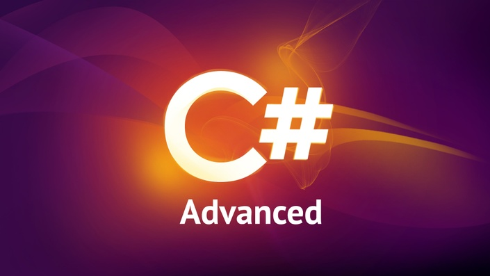
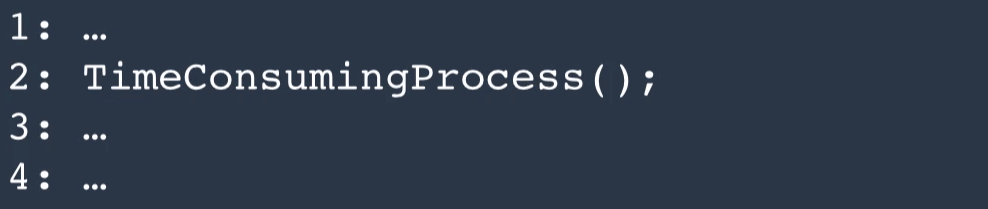
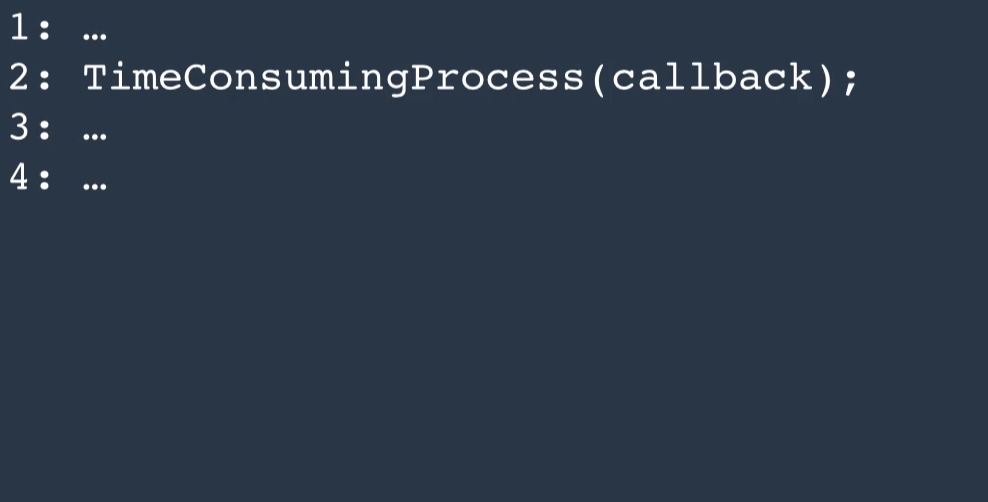

# C# Advanced: Get Ready for Job Interviews



Course Link: <https://codewithmosh.com/p/csharp-advanced>

---

## 泛型 (Generics)

- 在 C# 1.0 時代，如果需要可變長度陣列，有兩種作法
    1. 建立各種型別的陣列類別：因為每個類別都需要 Add()、Remove() .. 等等方法，造成大量的重複程式碼
    2. 建立 Object 型別的陣列類別：雖然解決了前者的問題，但在執行過程產生[裝箱 (Boxing)、拆箱 (Unboxing)](C%23%20Intermediate.md#Boxing-and-Unboxing)，造成效能低落
- 在 C# 2.0 之後，我們可以使用泛型，也就是在定義類別或方法時，可以使用一個或多個不指定型別的變數，等到建立實體時，再明定型別為何

    ``` csharp
    // T 代表 Type 或 Template，不指定型別
    public class GenericList<T>
    {
        public void Add(T element)
        {

        }
    }

    partial class Program
    {
        static void Main(string[] args)
        {
            // 建立實體時才指定此陣列為哪種型別
            var genericList = new GenericList<int>();
            genericList.Add(10);
        }
    }
    ```

### 條件約束 (Constraints)

- 使用條件約束可以讓 compiler 知道，泛型類別或方法建立實體後的型別會有那些功能
- 語法為在類別或方法之後加上「```where T :``` + 條件約束」
- 條件約束有以下幾種
    1. 介面 (Interface)

        ``` csharp
        public class Utilities
        {
            // 數字型別的比大小
            public int IntBigger(int a, int b)
            {
                return a > b ? a : b;
            }

            // 泛型的比大小
            // 因為 a 跟 b 本身是 object 型別，無法單純用數學的方式比大小，
            // 但是可以透過條件約束 IComparable，告訴 compiler 這兩個值在建立實體時能夠比大小
            public T GenericBigger<T>(T a, T b) where T : IComparable
            {
                return a.CompareTo(b) > 0 ? a : b;
            }
        }
        ```

    2. 類別 (Class)

        ``` csharp
        public class Product
        {
            public int Id { get; set; }
            public int Price { get; set; }
        }

        // 條件約束使用類別，即可使用該類別的類別成員
        public class DiscountList<T> where T : Product
        {
            public decimal GetDiscount(T product)
            {
                return product.Price * 0.8m;
            }
        }
        ```

    3. Value Types

        ``` csharp
        public class Nullable<T> where T : struct
        {

        }
        ```

    4. 無參數建構式

        ``` csharp
        public class Nullable<T> where T : new()
        {
            object obj = new T();
        }
        ```

    5. 其它用法可參考[微軟文件](https://docs.microsoft.com/zh-tw/dotnet/csharp/programming-guide/generics/constraints-on-type-parameters)

## 委派 (Delegates)

- 把一或多個方法 (Method) 當作參數，傳遞到某一個類別的方法中
- 用於建立彈性且可擴充的應用程式
- 以下述程式碼為例
    1. 假設我們有一個後製照片的流程如下

        ``` csharp
        // PhotoFilters.cs 相片後製細節
        public class PhotoFilters
        {
            public void ApplyBrightness(Photo photo)
            {
                Console.WriteLine("Apply brightness");
            }

            public void ApplyContrast(Photo photo)
            {
                Console.WriteLine("Apply contrast");
            }

            public void Resize(Photo photo)
            {
                Console.WriteLine("Resize the photo");
            }
        }

        // PhotoProcessor.cs 相片後製的標準流程
        public class PhotoProcessor
        {
            public void Process(string path)
            {
                var photo = new Photo(path);

                var filters = new PhotoFilters();
                filters.ApplyBrightness(photo);
                filters.ApplyContrast(photo);
                filters.Resize(photo);

                photo.Save();
            }
        }

        // Photo.cs 相片物件
        public class Photo
        {
            public Photo(string path) { }

            public void Save() { }
        }

        // Program.cs 主程式
        partial class Program
        {
            static void Main(string[] args)
            {
                var processor = new PhotoProcessor();
                processor.Process(@"C:\123.jpg");
            }
        }
        ```

    2. 承上，相片後製的標準流程是寫死的，今天如果有其它工程師要在某張相片添加新的後製功能，例如去除紅眼，就必須要改動 PhotoFilters.cs (增加去除紅眼的細節) 和 PhotoProcessor.cs (流程增加去除紅眼)，改動程式也等於要重新編譯和部署，產生諸多不便
    3. 這個時候就可以把流程作成 delegate，透過增減方法 (Method) 的方式來決定流程

        ``` csharp
        // PhotoFilters.cs 相片後製細節
        public class PhotoFilters
        {
            public void ApplyBrightness(Photo photo)
            {
                Console.WriteLine("Apply brightness");
            }

            public void ApplyContrast(Photo photo)
            {
                Console.WriteLine("Apply contrast");
            }

            public void Resize(Photo photo)
            {
                Console.WriteLine("Resize the photo");
            }
        }

        // PhotoProcessor.cs 相片後製的標準流程
        public class PhotoProcessor
        {
            // 宣告委派
            public delegate void PhotoFilterHandler(Photo photo);

            public void Process(string path, PhotoFilterHandler filterHandler)
            {
                var photo = new Photo(path);

                // 這裡透過委派，只定義相片要經過後製，但是是那些後製項目則在主程式才決定
                filterHandler(photo);

                photo.Save();
            }
        }

        // Photo.cs 相片物件
        public class Photo
        {
            public Photo(string path) { }

            public void Save() { }
        }

        // CustomPhotoFilters.cs 去除紅眼功能
        public class CustomPhotoFilters
        {
            // 需要和 PhotoFilters.cs 中的方法，使用相同型別和數量的傳入參數
            public void RemoveRedEyes(Photo photo)
            {
                Console.WriteLine("Remove red eyes on the photo");
            }
        }

        // Program.cs 主程式
        partial class Program
        {
            static void Main(string[] args)
            {
                var processor = new PhotoProcessor();

                var filters = new PhotoFilters();
                // 建立委派的實體，並指明要經過哪些後製項目
                PhotoProcessor.PhotoFilterHandler filterHandler = filters.ApplyBrightness;
                filterHandler += filters.ApplyContrast;
                filterHandler += filters.Resize;
                // 後來新增的去除紅眼功能，可以不異動到 PhotoFilters.cs 和 PhotoProcessor.cs 就加到後製流程中
                var customFilters = new CustomPhotoFilters();
                filterHandler += customFilters.RemoveRedEyes;

                processor.Process(@"C:\123.jpg", filterHandler);
            }
        }
        ```

### System.Action and System.Func

<table style="text-align: center;">
    <tr>
        <th></th>
        <th>System.Action&lt;T&gt;</th>
        <th>System.Func&lt;T&gt;</th>
    </tr>
    <tr>
        <td>描述</td>
        <td colspan="2">內建的委派泛型集合</td>
    </tr>
    <tr>
        <td>差異</td>
        <td>一般使用</td>
        <td>要多傳一個 out 參數</td>
    </tr>
</table>

用前面的相片例子來改寫

``` csharp
// PhotoFilters.cs 相片後製細節
public class PhotoFilters
{
    // code 不變
    ...
}

// PhotoProcessor.cs 相片後製的標準流程
public class PhotoProcessor
{
    // 不必再自行宣告委派型別
    // public delegate void PhotoFilterHandler(Photo photo);

    // 傳入的委派型別改用內建的 Action<T>
    public void Process(string path, Action<Photo> filterHandler)
    {
        var photo = new Photo(path);

        filterHandler(photo);

        photo.Save();
    }
}

// Photo.cs 相片物件
public class Photo
{
    // code 不變
    ...
}

// CustomPhotoFilters.cs 去除紅眼功能
public class CustomPhotoFilters
{
    // code 不變
    ...
}

// Program.cs 主程式
partial class Program
{
    static void Main(string[] args)
    {
        var processor = new PhotoProcessor();

        var filters = new PhotoFilters();
        // 建立委派的實體，也要改成使用內建的 Action<T>
        Action<Photo> filterHandler = filters.ApplyBrightness;
        filterHandler += filters.ApplyContrast;
        filterHandler += filters.Resize;
        var customFilters = new CustomPhotoFilters();
        filterHandler += customFilters.RemoveRedEyes;

        processor.Process(@"C:\123.jpg", filterHandler);
    }
}
```

### 委派 (Delegate) vs. 介面 (Interface)

<table style="text-align: center;">
    <tr>
        <th></th>
        <th>Delegate</th>
        <th>Interface</th>
    </tr>
    <tr>
        <td>用途</td>
        <td colspan="2">建立彈性且可擴充的應用程式</td>
    </tr>
    <tr>
        <td>差異</td>
        <td style="text-align: left;">委派類似於只有一種方法 (Method) 的介面，<br>建立實體後傳入的方法只會作類似的事，並使用相同的傳入參數</td>
        <td style="text-align: left;">一個介面可以有多個方法 (Method)，<br>介面被實作後，會根據定義，實作不一樣的方法<br></td>
    </tr>
    <tr>
        <td>適用情況</td>
        <td style="text-align: left;">
            <ul>
                <li>使用觀察者模式 (Observer Pattern) 時</li>
                <li>會被多次建立實體時 (不同實體會註冊不同的方法)</li>
            </ul>
        </td>
        <td style="text-align: left;">介面實作後的方法僅會建立一次時</td>
    </tr>
</table>

參考文章：

[Delegate vs Interfaces-Any more clarifications available?](https://softwareengineering.stackexchange.com/questions/114138/delegate-vs-interfaces-any-more-clarifications-available)

[When to Use Delegates Instead of Interfaces](https://stackoverflow.com/questions/11204598/when-to-use-delegates-instead-of-interfaces)

## Lambda Expressions

- 一種匿名函式 (Anonymous Function)，沒有存取關鍵字 (Access Modifier)、名稱 (Name)，也不需要寫明 ```return``` 關鍵字
- 可以用較少的程式碼達成目的
- 基本語法為 ```args => expression```，中間的箭頭讀作「goes to」，以下程式碼為常見格式

    ``` csharp
    // 沒有參數
    () => ...

    // 1 個參數
    x => ...

    // 多個參數
    (x, y, z) => ...
    ```

- 以計算數字的平方為例，比較以下兩種寫法

    <table>
    <tr>
    <th></th>
    <th>一般使用函式</th>
    <th>使用 Lambda</th>
    </tr>
    <tr>
    <td>程式碼</td>
    <td>

    ``` csharp
    static void Main(string[] args)
    {
        Console.WriteLine(Square(5));
    }

    static int Square(int x)
    {
        return x * x;
    }

    // output:
    // 25
    ```

    </td>
    <td>

    ``` csharp
    static void Main(string[] args)
    {
        // 因為要回傳值，所以用 Func<> 而不是 Action<>
        Func<int, int> Square = x => x * x;
        Console.WriteLine(Square(5));
    }

    // output:
    // 25
    ```

    </td>
    </tr>
    <tr>
    <td>差異</td>
    <td></td>
    <td>透過 delegate 和 lambda，用較少的程式碼達成相同目的</td>
    </tr>
    </table>

### Lambda Expression 的現實案例

常用來逐一查看集合中是否有符合條件的元素，以下述程式碼為例

1. 假設我們有一個書本資料庫 (這邊寫死在 List 中作示範)

    ``` csharp
    // Book.cs 書本基本資訊
    public class Book
    {
        public string Title { get; set; }
        public decimal Price { get; set; }
    }

    // BookDB.cs 書本資料庫
    public class BookDB
    {
        public List<Book> GetBooks()
        {
            return new List<Book>
            {
                new Book { Title = "Apple", Price = 5m },
                new Book { Title = "Banana", Price = 7m },
                new Book { Title = "Cherry", Price = 13m }
            };
        }
    }
    ```

2. 我們欲找出小於 10 塊錢的書本，如果用一般函式寫法

    ``` csharp
    // Program.cs 主程式
    partial class Program
    {
        // 函式判斷
        static bool IsCheapBook(Book book)
        {
            return book.Price < 10m;
        }

        static void Main(string[] args)
        {
            // 取得所有從 DB 撈到的書本
            var books = new BookDB().GetBooks();

            // 找出所有書本中符合判斷的書本
            var cheapBooks = books.FindAll(IsCheapBook);
            foreach (var book in cheapBooks)
            {
                Console.WriteLine(book.Title);
            }
        }

        // output:
        // Apple
        // Banana
    }
    ```

3. 如果直接把判斷寫成 Lambda Expression

    ``` csharp
    // Program.cs 主程式
    partial class Program
    {
        // 不再需要額外寫函式判斷
        //static bool IsCheapBook(Book book)
        //{
        //    return book.Price < 10m;
        //}

        static void Main(string[] args)
        {
            // 取得所有從 DB 撈到的書本
            var books = new BookDB().GetBooks();

            // 找出所有書本中符合敘述的書本
            var cheapBooks = books.FindAll(book => book.Price < 10);
            foreach (var book in cheapBooks)
            {
                Console.WriteLine(book.Title);
            }
        }

        // output:
        // Apple
        // Banana
    }
    ```

## 事件和委派 (Events and Delegates)

- 物件 (Object) 間溝通的機制，例如在物件 A 中發生一些事後，可以通知其它物件 B 和 C
- 承上例，物件 A 稱為 publisher 或 event sender，而物件 B 和 C 稱為 subscriber 或 event receiver
- 用來建立低耦合 (Loosely Coupled) 的應用程式，也就有更高的可擴充性
- 欲使用事件，有三個步驟
    1. Declare a delegate (命名結尾使用「EventHandler」)
    2. Declare an event based on the delegate
    3. Raise the event (命名開頭使用「On」，並使用 ```protected virtual void``` 修飾詞)
- 以下述程式碼為例
    1. 假設有一個影像編碼程式如下

        ``` csharp
        // Video.cs 影片基本資訊
        public class Video
        {
            public string Title { get; set; }
        }

        // VideoEncode.cs 影像編碼核心
        public class VideoEncode
        {
            public void Encode(Video video)
            {
                Console.WriteLine("Encoding the video ..");
                Thread.Sleep(3000);
            }
        }

        // Program.cs 主程式
        partial class Program
        {
            static void Main(string[] args)
            {
                var video = new Video { Title = "Apple" };
                var encoder = new VideoEncode();
                encoder.Encode(video);
            }
        }
        ```

    2. 今天欲在 VideoEncode.cs 加入影片編碼完成後寄送通知的功能，我們把「寄送通知」作成事件，而不在這支程式中寫死要透過什麼管道寄送，以便日後擴充成各種通知管道

        ``` csharp
        // Video.cs 影片基本資訊
        public class Video
        {
            public string Title { get; set; }
        }

        // VideoEncode.cs 影像編碼核心
        public class VideoEncode
        {
            // 1. Declare the delegate
            // 參數的 source 代表來源 class，args 則代表事件欲額外傳送的資料，此為標準格式
            public delegate void VideoEncodedEventHandler(object source, EventArgs args);

            // 2. Declare the event based on the delegate
            public event VideoEncodedEventHandler VideoEncoded;

            public void Encode(Video video)
            {
                Console.WriteLine("Encoding the video ..");
                Thread.Sleep(3000);

                // 3. 把 event 包裝成 protected virtual method，讓此類別被實作後可以用此方法訂閱 event
                OnVideoEncoded();
            }

            protected virtual void OnVideoEncoded()
            {
                // 如果實作後有訂閱事件才執行
                // 其中，this 代表目前的 class，EventArgs.Empty 代表事件不傳送額外的資料
                if (VideoEncoded != null)
                    VideoEncoded(this, EventArgs.Empty);
            }
        }

        // Program.cs 主程式
        partial class Program
        {
            static void Main(string[] args)
            {
                var video = new Video { Title = "Apple" };
                // publisher
                var encoder = new VideoEncode();
                // subscriber
                var mailService = new MailService();
                // 訂閱事件
                encoder.VideoEncoded += mailService.OnVideoEncoded;

                encoder.Encode(video);
            }
        }

        // MailService.cs 寄送 Email 功能
        public class MailService
        {
            // 使用和 VideoEncodedEventHandler 相同的參數
            public void OnVideoEncoded(object source, EventArgs e)
            {
                Console.WriteLine("MailService: Sending an email ..");
            }
        }
        ```

    3. 假設今天有新的通知管道，例如簡訊通知，我們只需要新增 SmsService 類別，並在主程式增加事件訂閱即可，不必動到其它核心程式

        ``` csharp
        // Video.cs 影片基本資訊
        public class Video
        {
            // 不變
            ...
        }

        // VideoEncode.cs 影像編碼核心
        public class VideoEncode
        {
            // 不變
            ...
        }

        // Program.cs 主程式
        partial class Program
        {
            static void Main(string[] args)
            {
                var video = new Video { Title = "Apple" };
                // publisher
                var encoder = new VideoEncode();
                // subscriber
                var mailService = new MailService();
                // 訂閱事件
                encoder.VideoEncoded += mailService.OnVideoEncoded;

                // another subscriber
                var smsService = new SmsService();
                // 訂閱事件
                encoder.VideoEncoded += SmsService.OnVideoEncoded;

                encoder.Encode(video);
            }
        }

        // MailService.cs 寄送 Email 功能
        public class MailService
        {
            // 不變
            ...
        }

        // SmsService.cs 寄送 Email 功能
        public class SmsService
        {
            // 使用和 VideoEncodedEventHandler 相同的參數
            public void OnVideoEncoded(object source, EventArgs e)
            {
                Console.WriteLine("SmsService: Sending SMS ..");
            }
        }
        ```

### EventArgs

我們可以建立 EventArgs 的衍生類別，用來在事件中傳送額外的資料，以前面的影片編碼程式為例

``` csharp
// Video.cs 影片基本資訊
public class Video
{
    public string Title { get; set; }
}

// VideoEventArgs.cs
// 自行建立 EventArgs 的衍生類別
public class VideoEventArgs : EventArgs
{
    public Video Video { get; set; }
}

// VideoEncode.cs 影像編碼核心
public class VideoEncode
{
    // 參數改成我們建立的 VideoEventArgs
    //public delegate void VideoEncodedEventHandler(object source, EventArgs args);
    public delegate void VideoEncodedEventHandler(object source, VideoEventArgs args);

    public event VideoEncodedEventHandler VideoEncoded;

    public void Encode(Video video)
    {
        Console.WriteLine("Encoding the video ..");
        Thread.Sleep(3000);

        // 這邊把 video 傳入，後續才能取得相關資料
        OnVideoEncoded(video);
    }

    protected virtual void OnVideoEncoded(Video video)
    {
        if (VideoEncoded != null)
        {
            // 實體化 VideoEventArgs
            //VideoEncoded(this, EventArgs.Empty);
            VideoEncoded(this, new VideoEventArgs() { Video = video });
        }
    }
}

// Program.cs 主程式
partial class Program
{
    static void Main(string[] args)
    {
        var video = new Video { Title = "Apple" };
        var encoder = new VideoEncode();
        var mailService = new MailService();
        encoder.VideoEncoded += mailService.OnVideoEncoded;

        encoder.Encode(video);
    }
}

// MailService.cs 寄送 Email 功能
public class MailService
{
    // 使用和 VideoEncodedEventHandler 相同的參數
    //public void OnVideoEncoded(object source, EventArgs e)
    public void OnVideoEncoded(object source, VideoEventArgs e)
    {
        // 這邊就可以取得 video 的資料
        Console.WriteLine($"MailService: Sending an email .. {e.Video.Title}");
    }
}
```

### EventHandler and EventHandler\<TEventArgs>

內建的 EventHandler\<T> 可以省略宣告 delegate 的步驟，以前面的影片編碼程式為例

<table>
<tr>
<th></th>
<th>自行宣告 delegate</th>
<th>使用 EventHandler&lt;T&gt;</th>
</tr>
<tr>
<td>程式碼</td>
<td>

``` csharp
// VideoEncode.cs 影像編碼核心
public class VideoEncode
{
    public delegate void VideoEncodedEventHandler(object source, VideoEventArgs args);

    public event VideoEncodedEventHandler VideoEncoded;

    public void Encode(Video video)
    {
        Console.WriteLine("Encoding the video ..");
        Thread.Sleep(3000);

        OnVideoEncoded(video);
    }

    protected virtual void OnVideoEncoded(Video video)
    {
        if (VideoEncoded != null)
            VideoEncoded(this, new VideoEventArgs() { Video = video });
    }
}
```

</td>
<td>

``` csharp
// VideoEncode.cs 影像編碼核心
public class VideoEncode
{
    // 使用 EventHandler<TEventArgs> 省略宣告 delegate 的步驟
    public event EventHandler<VideoEventArgs> VideoEncoded;

    public void Encode(Video video)
    {
        Console.WriteLine("Encoding the video ..");
        Thread.Sleep(3000);

        OnVideoEncoded(video);
    }

    protected virtual void OnVideoEncoded(Video video)
    {
        if (VideoEncoded != null)
            VideoEncoded(this, new VideoEventArgs() { Video = video });
    }
}
```

</td>
</tr>
</table>

## 擴充方法 (Extension Methods)

- 可以在不改動原始碼或不使用衍生類別繼承的前提下，為某個類別增加新的方法 (Method)
- 宣告擴充方法的類別和使用擴充方法的類別**必須在同一個 namespace 中**或是另外「using *namespace*」
- 宣告語法有以下規則
    1. 須宣告於 ```static``` 類別中，類別命名為「目標類別 + Extensions」
    2. 須使用 ```static``` 方法，傳入的第一個參數為「this *目標類別 變數名稱*」
- 以擴充 ```String``` 類別之方法為例

    ``` csharp
    // StringExtensions.cs 擴充方法
    // 使用靜態類別，類別命名為「目標類別 + Extensions」
    public static class StringExtensions
    {
        // 使用靜態方法，傳入的第一個參數為「this 目標類別 變數名稱」
        public static string Shorten(this String str, int numberOfWords)
        {
            if (numberOfWords < 0)
                throw new IndexOutOfRangeException("numberOfWords should greater than or equal to 0.");

            if (String.IsNullOrEmpty(str.Trim()))
                return "";

            var words = str.Split(' ');

            if (numberOfWords >= words.Length)
                return str;

            return String.Join(" ", words.Take(numberOfWords)) + "...";
        }
    }

    // Program.cs 主程式
    partial class Program
    {
        static void Main(string[] args)
        {
            var post = "this is a very long long long long long long long post";
            Console.WriteLine(post.Shorten(5));
        }
    }

    // output:
    // this is a very long...
    ```

- 擴充方法有其風險，以上述的 ```String.Shorten()``` 為例，如果今天 C# 自己內建同樣名稱的方法，我們自訂的擴充方法便會失效，所以微軟文件建議必要時才使用擴充方法，且應該用在自行衍生的類別上，而非像此例中使用在內建的 ```String``` 類別上

## LINQ

- **L**anguage **In**tegrated **Q**uery
- 可以查詢以下物件
    - LINQ to Objects: Objects in memory, eg: collections
    - LINQ to Entities: Databases
    - LINQ to XML: XML
    - LINQ to DataSet: ADO .NET DataSet
- LINQ 可以透過 [Lambda Expression](#Lambda-Expressions) 簡化程式碼
- LINQ 可以串連多個查詢，例如 ```books.Where(...).OrderBy(...)```
- LINQ 有兩種寫法
    1. LINQ Extension Methods
    2. LINQ Query Operators: 語法總是由 ```from``` 開頭，並用 ```select``` 作結尾
- 以下為常見的擴充方法/查詢語法

    | Syntax in Extension Methods | Syntax in Query Operators |                                Description                                 |
    |:---------------------------:|:-------------------------:|:--------------------------------------------------------------------------:|
    |          .Where()           |           where           |                             篩選符合敘述的元素                             |
    |         .OrderBy()          |          orderby          |                                正序排列集合                                |
    |    .OrderByDescending()     |  orderby ... descending   |                                倒序排列集合                                |
    |          .Select()          |          select           |                 將符合敘述的元素或元素屬性產生至新的集合中                 |
    |          .Single()          |                           | 回傳唯一符合敘述的元素，<br>若符合元素之數量為零或多於一個則會丟 exception |
    |     .SingleOrDefault()      |                           |  回傳唯一符合敘述的元素，<br>若符合元素之數量為零或多於一個則會回傳預設值  |
    |          .First()           |                           |     回傳第一個符合敘述的元素，<br>若符合元素之數量為零則會丟 exception     |
    |      .FirstOrDefault()      |                           |      回傳第一個符合敘述的元素，<br>若符合元素之數量為零則會回傳預設值      |
    |           .Last()           |                           |              回傳最後一個符合敘述的元素，其它情況同 .First()               |
    |      .LastOrDefault()       |                           |          回傳最後一個符合敘述的元素，其它情況同 .FirstOrDefault()          |
    |           .Skip()           |                           |                     略過前 N 個元素後，回傳剩下的集合                      |
    |           .Take()           |                           |                              回傳前 N 個元素                               |
    |          .Count()           |                           |                            回傳集合中的元素數量                            |
    |           .Max()            |                           |                            回傳符合敘述的最大值                            |
    |           .Min()            |                           |                            回傳符合敘述的最小值                            |
    |           .Sum()            |                           |                             回傳符合敘述的總和                             |

- 以下述程式碼為例

    1. 假設我們有一個書本資料庫 (這邊寫死在 List 中作示範)

        ``` csharp
        // Book.cs 書本基本資訊
        public class Book
        {
            public string Title { get; set; }
            public decimal Price { get; set; }
        }

        // BookDB.cs 書本資料庫
        public class BookDB
        {
            public List<Book> GetBooks()
            {
                return new List<Book>
                {
                    new Book { Title = "ADO .Net Step by Step", Price = 5m },
                    new Book { Title = "ASP.NET MVC", Price = 9.99m },
                    new Book { Title = "ASP.NET Web API", Price = 13m },
                    new Book { Title = "C# Advanced", Price = 7m },
                    new Book { Title = "C# Advanced", Price = 9m }
                };
            }
        }
        ```

    2. 對書本作查詢

        ``` csharp
        // Program.cs 主程式
        partial class Program
        {
            static void Main(string[] args)
            {
                var books = new BookDB().GetBooks();

                // LINQ Extension Methods
                var cheapBooks = books
                                    .Where(b => b.Price < 10) // 篩選出小於 10 塊錢的書
                                    .OrderBy(b => b.Title) // 用書名作正排序
                                    .Select(b => b.Title); // 產出只有書名(string type)的集合

                // LINQ Query Operators
                cheapBooks = from b in books
                             where b.Price < 10
                             orderby b.Title
                             select b.Title;

                // 以上兩者是相同的查詢結果
            }
        }
        ```

## Nullable Types

- 首先，要知道 C# 中的 [Value Type](C%23%20Basics.md#Value-Types-and-Reference-Types) 不能是 null
- 但在現實案例中，還是有機會會遇到空值，例如 DB 裡有個生日 (DateTime) 欄位，客戶可能不願意填，就會是 null，一旦把 DB 資料倒進程式中，就會遇到值為 null 的 DateTime
- Nullable Type 的宣告規則為「Nullable<*Class*>」，例如 ```Nullable<DateTime>```，也可以簡寫成「*Class*?」，例如 ```DateTime?```

    ``` csharp
    DateTime? date = null;
    ```

- 以下為常見的方法

    |       Method        |        Description         |
    |:-------------------:|:--------------------------:|
    | GetValueOrDefault() | 有值回傳值，沒值回傳預設值 |
    |      HasValue       |   檢查是否有值，回傳布林   |
    |        Value        | 回傳值，沒值會丟 exception |

- 不能直接把 Nullable Type 指派給 Value Type，因為 compiler 會不知道遇到 null 時該如何處理

    ``` csharp
    DateTime? date1 = null;
    DateTime date2 = date1; // error
    ```

### null 聯合運算子 (Null-coalescing Operator)

若指派值為 null 則給另一個指定值

``` csharp
DateTime? date1 = null;

// 若 date1 != null，則 date2 = date1
// 若 date1 == null，則 date2 = DateTime.Today
DateTime date2 = date1 ?? DateTime.Today;
```

## Dynamic

- 首先，先知道程式語言可分為

    |                            | 靜態語言<br>(Static Programming Languages) | 動態語言<br>(Dynamic Programming Languages) |
    |:--------------------------:|:------------------------------------------:|:-------------------------------------------:|
    |        解析變數型別        |              at compile-time               |                 at run-time                 |
    | 使用不存在類別中的類別成員 |               編譯時就會報錯               |               執行時才會報錯                |
    |          代表語言          |                  C#, Java                  |          Ruby, JavaScript, Python           |

- .NET 4 加入了 dynamic 型別以利和動態語言互動
- 以下述程式碼為例

    ``` csharp
    // 不會報錯，因為是透過 DLR (Dynamic Language Runtime) 一行一行解析型別
    dynamic obj = "Hello";
    obj = 10;
    ```

## 例外處理 (Exception Handling)

- 當程式執行時遇到非預期的錯誤，就會產生例外 (Exception)，若未作例外處理就會導致程式崩潰
- 例外會有以下資訊
    - 例外訊息 (Message)：發生例外的原因
    - 例外來源 (Source)：發生例外的程式其 namespace
    - 呼叫堆疊 (Stack Trace)：倒序列出程式呼叫的過程和程式行數
- 透過「Try-Catch」區塊可以捕捉例外

    ``` csharp
    try
    {
        // 程式於此段執行
    }
    catch (Exception)
    {
        // 在 try 區塊發生例外時，就會跳到此區塊，
        // 我們可以選擇在此區塊修正錯誤，或是重新拋出 (Rethrow) 例外到更外層的程式
    }
    ```

- ```Exception``` 類別是所有例外的父類別
- 除了使用最上層的 ```Exception``` 類別進行捕捉，我們也可以列出其他更細 (更下層) 的例外類別，但是要記得越細 (越下層) 的類別要寫在程式越前面

    ``` csharp
    try
    {
        int x = 0;
        int y = 1 / x;
    }
    catch (DivideByZeroException)
    {
        Console.WriteLine("Captured by DivideByZeroException class.");
    }
    catch (ArithmeticException)
    {
        Console.WriteLine("Captured by ArithmeticException class.");
    }
    catch (Exception)
    {
        Console.WriteLine("Captured by Exception class.");
    }
    ```

- 透過「Try-Catch-Finally」區塊，無論是否發生例外，都會執行 ```finally``` 中的程式碼，常見的案例為使用 unmanaged resources 後無論程式是否正常執行，最後都須釋放資源，否則程式可能造成檔案咬死或資源用盡 (out of resources)
    > Unmanaged Resources: 不會自動被 GC 機制清理的物件，例如開啟檔案、開啟連線 .. 等等

    ``` csharp
    StreamReader reader = null;
    try
    {
        // 開啟檔案
        reader = new StreamReader(@"C:\test.txt");
        var content = reader.ReadToEnd();
    }
    catch (Exception)
    {
        Console.WriteLine("something is wrong.");
    }
    finally
    {
        if (reader != null)
        {
            // 釋放資源
            reader.Dispose();
        }
    }
    ```

- 上述程式碼，可以更進一步透過 using statement 來簡化，並同時確保有使用 IDisposable 物件

    ```csharp
    try
    {
        // 開啟檔案
        using (var reader = new StreamReader(@"C:\test.txt"))
        {
            var content = reader.ReadToEnd();
        }
        // using 一結束就會呼叫 Dispose()
    }
    catch (Exception)
    {
        Console.WriteLine("something is wrong.");
    }
    ```

- 我們可以建立衍生自 ```Exception``` 類別的自訂例外類別，避免將底層資訊透漏給使用者

    ``` csharp
    // Video.cs 影片基本資訊
    public class Video
    {
        public string Title { get; set; }
    }

    // YouTubeException.cs 自訂例外類別
    public class YouTubeException : Exception
    {
        public YouTubeException(string message, Exception innerException)
            : base(message, innerException)
        {

        }
    }

    // YouTubeApi.cs 取得使用者影片
    public class YouTubeApi
    {
        public List<Video> GetVideos(string user)
        {
            try
            {
                // Access YouTube web service
                // Read the data
                // Create a list of Video objects
                throw new Exception("Oops some low level YouTube error.");
            }
            catch (Exception ex)
            {
                // Writing logs in somewhere else

                // 呼叫自訂的例外類別
                throw new YouTubeException("Could not fetch the videos from YouTube.", ex);
            }

            return new List<Video>();
        }
    }

    partial class Program
    {
        static void Main(string[] args)
        {
            try
            {
                var videos = new YouTubeApi().GetVideos("Wayne");
            }
            catch (Exception ex)
            {
                Console.WriteLine(ex.Message);
            }
        }
    }

    // output:
    // Could not fetch the videos from YouTube.
    ```

## 非同步處理 (Async/Await)

- 同步和非同步的差異

    |          |                      同步處理<br>(Synchronous Programming Execution)                       |                      非同步處理<br>(Asynchronous Programming Execution)                      |
    |:--------:|--------------------------------------------------------------------------------------------|----------------------------------------------------------------------------------------------|
    |   定義   | 程式逐行執行，當遇到函式 (function) 被呼叫，執行緒**會**封鎖，等到該函式回傳後，再往下行執行 | 程式逐行執行，當遇到函式 (function) 被呼叫，執行緒**不會**封鎖，在該函式回傳前便繼續往下行執行 |
    |  示意圖  |                                                 |                                                   |
    | 現實案例 |                                                                                            |                                      影片播放器、瀏覽器                                      |
    | 適用情況 |                                                                                            |         <ul><li>存取網頁</li><li>存取檔案</li><li>存取 DB</li><li>存取圖片</li></ul>         |

- 如何達成非同步
    - 傳統作法
        - 多執行緒 (Multi-Threading)
        - Callback
    - .NET 4.5 後的新作法
        - Async/Await
- 若函式使用 ```await``` 關鍵字，則其父函式也須使用 ```async``` 關鍵字，並在父函式名稱後面加上「Async」
- 非同步函式若本身無回傳值，須回傳 ```Task``` 類別，反之則回傳 ```Task<T>``` 泛型類別，例如 ```Task<string>```
- 以使用 WPF 撰寫點擊按鈕後，將某網頁文字寫至檔案之功能為例

    <table>
    <tr>
    <th></th>
    <th>同步處理</th>
    <th>非同步處理</th>
    </tr>
    <tr>
    <td>程式碼</td>
    <td>

    ``` csharp
    // 只是為了紀錄執行過程時間
    DateTime begin = DateTime.Now;

    private void Button_Click(object sender, RoutedEventArgs e)
    {
        Log("A");
        DownloadHtml("https://docs.microsoft.com/zh-tw/dotnet/csharp/");
        Log("G");
    }

    public void DownloadHtml(string url)
    {
        Log("B");
        var webClient = new WebClient();
        // 採同步處理的 DownloadString()
        var html = webClient.DownloadString(url);

        Log("C");
        using (var writer = new StreamWriter(@"D:\123.txt"))
        {
            Log("D");
            writer.Write(html);
            Log("E");
        }
        Log("F");
    }

    public void Log(string message)
    {
        var time = DateTime.Now - begin;
        textBox.Text += $"\r\n[{time.ToString("mm':'ss':'fff")}] {message}";
    }
    ```

    </td>
    <td>

    ``` csharp
    // 只是為了紀錄執行過程時間
    DateTime begin = DateTime.Now;

    private void Button_Click(object sender, RoutedEventArgs e)
    {
        Log("A");
        DownloadHtmlAsync("https://docs.microsoft.com/zh-tw/dotnet/csharp/");
        Log("G");
    }

    // 因為函式中有使用 await 的函式，父函式也要使用 async 關鍵字，並在名稱後面加上「Async」
    // 又因為 DownloadHtml() 本身不回傳值，須使用 Task 類別 (不能寫 async void)
    public async Task DownloadHtmlAsync(string url)
    {
        Log("B");
        var webClient = new WebClient();
        // 執行耗費較多時間，所以改採非同步處理的 DownloadStringTaskAsync()，並加上 await 關鍵字
        var html = await webClient.DownloadStringTaskAsync(url);

        Log("C");
        using (var writer = new StreamWriter(@"D:\123.txt"))
        {
            Log("D");
            writer.Write(html);
            Log("E");
        }
        Log("F");
    }

    public void Log(string message)
    {
        var time = DateTime.Now - begin;
        textBox.Text += $"\r\n[{time.ToString("mm':'ss':'fff")}] {message}";
    }
    ```

    </td>
    </tr>
    <tr>
    <td>結果</td>
    <td>[00:01:929] A<br>[00:01:932] B<br>[00:02:457] C<br>[00:02:458] D<br>[00:02:459] E<br>[00:02:460] F<br>[00:02:460] G</td>
    <td>[00:03:125] A<br>[00:03:128] B<br><b>[00:04:217] G</b><br>[00:04:286] C<br>[00:04:286] D<br>[00:04:287] E<br>[00:04:287] F</td>
    </tr>
    <tr>
    <td>說明</td>
    <td>程式逐行執行，沒什麼好說的</td>
    <td><ol><li>程式逐行執行</li><li>在 <code>DownloadHtmlAsync()</code> 函式中遇到關鍵字 <code>await</code> 時，會將控制權還給呼叫 <code>DownloadHtmlAsync()</code> 的函式 <code>Button_Click()</code></li><li>等到 <code>Button_Click()</code> 所有程式都執行完，執行緒沒事作了</li><li>再回頭執行 <code>DownloadHtmlAsync()</code> 中 <code>await</code> 後面的程式</li></ol></td>
    </tr>
    </table>

- 以下述程式碼為例，示範非同步處理有回傳值的函式

    <table>
    <tr>
    <th></th>
    <th>非同步處理</th>
    </tr>
    <tr>
    <td>程式碼</td>
    <td>

    ``` csharp
    // 只是為了紀錄執行過程時間
    DateTime begin = DateTime.Now;

    private async void Button_Click(object sender, RoutedEventArgs e)
    {
        Log("A");
        // 這邊取得的 getHtmlTask 是 Task<string>
        var getHtmlTask = GetHtmlAsync("https://docs.microsoft.com/zh-tw/dotnet/csharp/");
        Log("C");
        // 這邊用 await 將 Task<string> 解開成 string
        var html = await getHtmlTask;
        Log("D");

        MessageBox.Show(html.Substring(0, 10));
        Log("E");
    }

    // 欲回傳 string，所以改使用 Task<string>
    public async Task<string> GetHtmlAsync(string url)
    {
        Log("B");
        var webClient = new WebClient();
        // 一樣使用 await 關鍵字和 DownloadStringTaskAsync()
        return await webClient.DownloadStringTaskAsync(url);
    }

    public void Log(string message)
    {
        var time = DateTime.Now - begin;
        textBox.Text += $"\r\n[{time.ToString("mm':'ss':'fff")}] {message}";
    }
    ```

    </td>
    </tr>
    <tr>
    <td>結果</td>
    <td>[00:01:919] A<br>[00:01:922] B<br>[00:03:031] C<br>[00:03:101] D<br>[00:04:660] E<br></td>
    </tr>
    </table>
