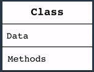
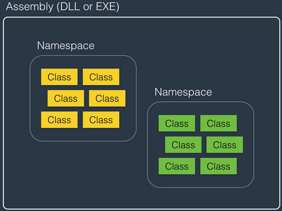
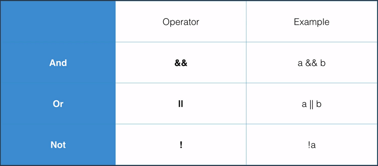
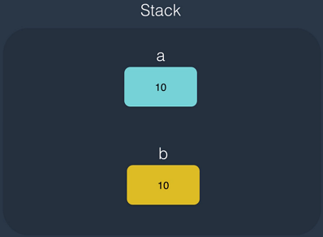

# C# Basics for Beginners


Course Link: <https://codewithmosh.teachable.com/p/csharp-basics-for-beginners>

---

## C# vs .NET

|      |      C#      |               .NET                |
|:----:|:------------:|:---------------------------------:|
| 定義 | 一種程式語言 | 一種軟體框架，並不限於用 C# 撰寫  |
| 組成 |              | 包含 CLR 和函式庫(Class Library) |

## CLR

- 透過編譯器(compiler) 把 C# 轉成中介語言(IL)，再透過 JIT 編譯器轉成原生機器語言
- 提供記憶體管理、例外處理、垃圾回收機制(GC)、執行緒管理等服務

  

可參考[保哥文章](https://blog.miniasp.com/post/2015/07/28/Clarify-the-versions-between-CLR-NET-CSharp-Visual-Studio-and-ASPNET)

## Architecture of .NET Applications

|                       |                        描述                        |                  概念                   |
|:---------------------:|:--------------------------------------------------:|:---------------------------------------:|
|      類別(Class)      | 每個 Class 都有自己的屬性(Attribute)和方法(Method) |        |
|  命名空間(Namespace)  |       相似的 Class 會放在同一個 Namespace 中       |    |
|    組件(Assembly)     |     相似的 Namespace 會放在同一個 Assembly 中      |     |
| 應用程式(Application) |               由很多的 Assembly 組成               |  |

## Visual Studio 基本介紹 (以 Console 為例)

### 方案總管


- 一個方案(Solution)可以有很多個專案(Project)
- 專案中的「Properties\AssemblyInfo.cs」用來描述建立出來的 Assembly 有什麼資訊，例如版本號
- 專案中的「參考」是系統預設你可能會用到的 Assembly，實際上不一定會全用到
- 專案中的「App.config」是這個應用程式的設定檔，例如 DB 連線字串

### 編輯區


- 「紅色區塊」用來引用其它 Namespace 的程式
- 「Main」區塊是程式進入點
- 「黃色區塊」放函式回傳值，這裡的 void 代表不回傳值
- 「綠色區塊」放函式傳入值

## Primitive Types and Expressions

### 變數與常數宣告

|                |                  描述                  |
|:--------------:|:--------------------------------------:|
| 變數(Variable) |      在記憶體中的儲存位置給予命名      |
| 常數(Constant) | 在應用程式中不會被更動的值，例如圓周率 |

- 命名首字不能是數字
- 命名中間不能有空格
- 命名不能是關鍵字，例如「int」
- 命名要用有意義的名稱，例如使用「firstName」而不用「fn」
- 命名慣例
  - 駝峰式(Camel Case)，例如「firstName」
  - 帕斯卡命名法(Pascal Case)，例如「FirstName」
  - 匈牙利命名法(Hungarian Notation)，例如「strFirstName」

``` csharp
// 變數宣告，可選擇是否給予初始值
int num1;
int num2 = 10;
// 常數宣告，必須給予值
const float pi = 3.14f;
```

### 資料型態(Data Type)


(不用硬背範圍)

``` csharp
// 宣告小數時，預設會是採用 double
double a = 1.5;
// 欲宣告 float 時，必須在數字後面加上「f」
float b = 1.5f;
// 欲宣告 decimal 時，必須在數字後面加上「m」
decimal c = 1.5m;
```

### 溢位(Overflow)

超出範圍時會產生溢位，實際應用上，會用較大的資料型態去宣告以避免溢位

### 變數有效範圍(Scope)

變數只有在自己的大括號以內才能被存取


### 型態轉換

|                                                      |                                               描述                                               |                    範例                     |
|:----------------------------------------------------:|:------------------------------------------------------------------------------------------------:|:-------------------------------------------:|
|      隱含型態轉換<br>(Implicit Type Convention)      | 編譯器確定目標型態可轉換且資料不會遺失(原型態 range 小於目標型態)才轉換，否則會有 compiler error |  |
| 明確型態轉換<br>(Explicit Type Convention = Casting) |                                     明確指定指定欲轉換的型態                                     |  |
|                 Non-compatible Type                  |                    當兩個型態不相容時，需使用 Convert 或 Parse 關鍵字來作轉換                    |  |

### 運算子(Operator)

#### 數學運算


要小心「++」這種寫法在前綴或後綴的不同

``` csharp
// 後綴寫法：先指派，再運算
int a = 1;
int b = a++;
// a = 2, b = 1

// 後綴寫法：先運算，再指派
int a = 1;
int b = ++a;
// a = 2, b = 2
```

#### 比較運算


#### 指派運算


#### 邏輯運算



#### 位元運算


### 註解(Comment)

- 增加程式可讀性、易維護性
- 盡量用來解釋 why & how，而不是說明 what

``` csharp
// 單行註解用「//」
// int a = 1;

// 多行註解用「/* ... */」
/*
int a = 1;
int b = 2;
*/
```

## Non-Primitive Types and Expressions

### Class

- 有自己的屬性(Attribute/Field)和方法(Method)
- 物件(Object)是從類別(Class)建立出來的實體(Instance)
- 不同 Class 最好寫在獨立的 .cs 檔


``` csharp
// 宣告 Class
public class Person
{
    public string Name;
    public void Talk()
    {
        Console.WriteLine("Hello");
    }
}

// 建立物件
Person son = new Person();

// 使用物件中的屬性和方法
son.name = "John";
son.Talk();
```

### Static 修飾詞

``` csharp
public class Person
{
    // 沒有使用 Static
    public void Talk()
    {
        Console.WriteLine("Hello");
    }

    // 使用 Static
    public static void Walk()
    {
        Console.WriteLine("go");
    }
}
```

| Class 中的方法，例如 Add() |              建立多個物件時              |                   示意圖                    |
|:--------------------------:|:----------------------------------------:|:-------------------------------------------:|
|    不使用 Static 修飾詞    | Add() 會在不同實體中各占有一個記憶體空間 |  |
|     使用 Static 修飾詞     |    Add() 僅在 Class 占一個記憶體空間     |  |

### Struct

類似 Class，但實際案例上 9 成都會用 Class

``` csharp
public struct RgbColor
{
    public string Red;
    public string Green;
    public string Blue;
}
```

### Array

- 用來儲存若干個相同型態的變數
- 宣告後不能改變 size
- 索引起始值為 0

``` csharp
// Declaration
int[] numbers = new int[3];

// Accessing the array
number[0] = 1;
number[1] = 2;
number[2] = 3;
```

### String

``` csharp
// Declaration
string name = "Wayne";

// Template string
name = string.Format("I am {0}", name);
```

#### 跳脫字元


#### 逐字字串

在字串前面加上「@」


### Enum

列舉中為遞增的值，常用來表示狀態

``` csharp
public enum Day
{
    Sun, // 0
    Mon, // 1
    Tue  // 2
}

public enum Fruit
{
    apple = 1, // 1
    banana,    // 2
    cherry     // 3
}
```

### Value Types and Reference Types

#### Value Types

- 以 Structure 方式建立
- Primitive types 和 custom structures 屬於此類
- 宣告時會自動分配記憶體空間
- 在有效範圍外就會立刻被釋放資源


|                 程式碼範例                  |                 資料示意圖                  |
|:-------------------------------------------:|:-------------------------------------------:|
|  |  |

#### Reference Types

- 以 Class 方式建立
- Non-primitive types 和 custom classes 屬於此類
- 宣告時需手動分配記憶體空間
- 會由 GC 機制決定何時釋放資源


|                 程式碼範例                  |                 資料示意圖                  |
|:-------------------------------------------:|:-------------------------------------------:|
|  |  |

#### Value Types vs. Reference Types


## Control Flow

### Condition Statements

#### if / else

若只是判斷真偽後給值，可以用判斷運算子寫法「(條件) ? a : b」

``` csharp
bool isVIP = true;
int price;
if (isVIP)
{
    price = 10;
}
else
{
    price = 20;
}
```

``` csharp
// 等同於上一段 code
bool isVIP = true;
int price = (isVIP) ? 10 : 20;
```

#### switch / case

``` csharp
public enum Season
{
    Spring,
    Summer,
    Autumn,
    Winter
}

class Program
{
    static void Main(string[] args)
    {
        var season = Season.Autumn;
        switch (season)
        {
            case Season.Spring:
                Console.WriteLine("It's Spring.");
                break;
            case Season.Autumn:
                Console.WriteLine("It's Autumn.");
                break;
            // 同樣內容的 case 可以放在一起，避免撰寫重複的 code
            case Season.Summer:
            case Season.Winter:
                Console.WriteLine("We've got promotion!");
                break;
            default:
                Console.WriteLine("Not a season.");
                break;
        }
    }
}
```

### Iteration Statements

#### For Loop

``` csharp
// 給予一個初始變數 i = 0，
// 在 i < 10 前會一直執行，
// 每一次執行後 i++
for (int i = 0; i < 10; i++)
{
    ...
}
```

#### Foreach Loop

``` csharp
int[] numbers = new int[5];
foreach (int number in numbers)
{
    ...
}
```

#### While Loop

``` csharp
while (i < 10)
{
    ...
    i++;
}
```

#### Do-While Loop

和 While Loop 的差別在於迴圈至少會執行一次

``` csharp
do
{
    ...
    i++;
} while (i < 10);
```

#### Break & Continue

| 迴圈中的關鍵字 |        描述        |
|:--------------:|:------------------:|
|     break      | 離開迴圈(不再執行) |
|    continue    |    跳至下次迴圈    |

## Random

用來產生亂數

``` csharp
Random random = new Random();
random.Next();
```
