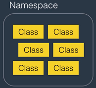
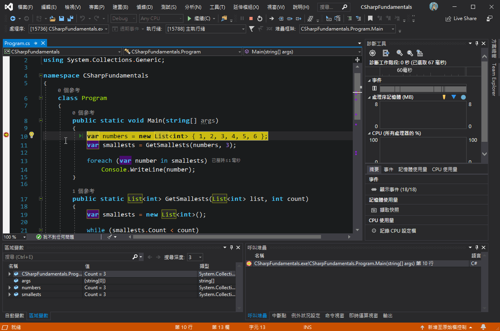

# C# Basics for Beginners


Course Link: <https://codewithmosh.teachable.com/p/csharp-basics-for-beginners>

---

## C# vs .NET

|      |      C#      |               .NET                |
|:----:|:------------:|:---------------------------------:|
| 定義 | 一種程式語言 | 一種軟體框架，並不限於用 C# 撰寫  |
| 組成 |              | 包含 CLR 和函式庫(Class Library) |

## CLR

- 透過編譯器(compiler) 把 C# 轉成中介語言(IL)，再透過 JIT 編譯器轉成原生機器語言
- 提供記憶體管理、例外處理、垃圾回收機制(GC)、執行緒管理等服務

  

可參考[保哥文章](https://blog.miniasp.com/post/2015/07/28/Clarify-the-versions-between-CLR-NET-CSharp-Visual-Studio-and-ASPNET)

## Architecture of .NET Applications

|                       |                        描述                        |                  概念                   |
|:---------------------:|:--------------------------------------------------:|:---------------------------------------:|
|      類別(Class)      | 每個 Class 都有自己的屬性(Property)和方法(Method) |        |
|  命名空間(Namespace)  |       相似的 Class 會放在同一個 Namespace 中       |    |
|    組件(Assembly)     |     相似的 Namespace 會放在同一個 Assembly 中      |     |
| 應用程式(Application) |               由很多的 Assembly 組成               |  |

## Visual Studio 基本介紹 (以 Console 為例)

### 方案總管


- 一個方案(Solution)可以有很多個專案(Project)
- 專案中的「Properties\AssemblyInfo.cs」用來描述建立出來的 Assembly 有什麼資訊，例如版本號
- 專案中的「參考」是系統預設你可能會用到的 Assembly，實際上不一定會全用到
- 專案中的「App.config」是這個應用程式的設定檔，例如 DB 連線字串

### 編輯區


- 「紅色區塊」用來引用其它 Namespace 的程式
- 「Main」區塊是程式進入點
- 「黃色區塊」放函式回傳值，這裡的 void 代表不回傳值
- 「綠色區塊」放函式傳入值

## Primitive Types and Expressions

### 變數與常數宣告

|                |                  描述                  |
|:--------------:|:--------------------------------------:|
| 變數(Variable) |      在記憶體中的儲存位置給予命名      |
| 常數(Constant) | 在應用程式中不會被更動的值，例如圓周率 |

- 命名首字不能是數字
- 命名中間不能有空格
- 命名不能是關鍵字，例如「int」
- 命名要用有意義的名稱，例如使用「firstName」而不用「fn」
- 命名慣例
  - 駝峰式(Camel Case)，例如「firstName」
  - 帕斯卡命名法(Pascal Case)，例如「FirstName」
  - 匈牙利命名法(Hungarian Notation)，例如「strFirstName」

``` csharp
// 變數宣告，可選擇是否給予初始值
int num1;
int num2 = 10;

// 常數宣告，必須給予值
const float pi = 3.14f;
```

### 資料型態(Data Type)


(不用硬背範圍)

``` csharp
// 宣告小數時，預設會是採用 double
double a = 1.5;
// 欲宣告 float 時，必須在數字後面加上「f」
float b = 1.5f;
// 欲宣告 decimal 時，必須在數字後面加上「m」
decimal c = 1.5m;
```

### 溢位(Overflow)

超出範圍時會產生溢位，實際應用上，會用較大的資料型態去宣告以避免溢位

### 變數有效範圍(Scope)

變數只有在自己的大括號以內才能被存取


### 型態轉換

|                                                      |                                               描述                                               |                    範例                     |
|:----------------------------------------------------:|:------------------------------------------------------------------------------------------------:|:-------------------------------------------:|
|      隱含型態轉換<br>(Implicit Type Convention)      | 編譯器確定目標型態可轉換且資料不會遺失(原型態 range 小於目標型態)才轉換，否則會有 compiler error |  |
| 明確型態轉換<br>(Explicit Type Convention = Casting) |                                     明確指定指定欲轉換的型態                                     |  |
|                 Non-compatible Type                  |                    當兩個型態不相容時，需使用 Convert 或 Parse 關鍵字來作轉換                    |  |

### 運算子(Operator)

#### 數學運算


要小心「++」這種寫法在前綴或後綴的不同

``` csharp
// 後綴寫法：先指派，再運算
int a = 1;
int b = a++;
// a = 2, b = 1

// 後綴寫法：先運算，再指派
int a = 1;
int b = ++a;
// a = 2, b = 2
```

#### 比較運算


#### 指派運算


#### 邏輯運算


#### 位元運算


### 註解(Comment)

- 增加程式可讀性、易維護性
- 盡量用來解釋 why & how，而不是說明 what

``` csharp
// 單行註解用「//」
// int a = 1;

// 多行註解用「/* ... */」
/*
int a = 1;
int b = 2;
*/
```

## Non-Primitive Types and Expressions

### Class

- 有自己的屬性(Property/Field)和方法(Method)
- 物件(Object)是從類別(Class)建立出來的實體(Instance)
- 不同 Class 最好寫在獨立的 .cs 檔


``` csharp
// 宣告 Class
public class Person
{
    public string Name;
    public void Talk()
    {
        Console.WriteLine("Hello");
    }
}

// 建立物件
Person son = new Person();

// 使用物件中的屬性和方法
son.name = "John";
son.Talk();
```

### Static 修飾詞

``` csharp
public class Person
{
    // 沒有使用 Static
    public void Talk()
    {
        Console.WriteLine("Hello");
    }

    // 使用 Static
    public static void Walk()
    {
        Console.WriteLine("go");
    }
}
```

| Class 中的方法，例如 Add() |              建立多個物件時              |                   示意圖                    |
|:--------------------------:|:----------------------------------------:|:-------------------------------------------:|
|    不使用 Static 修飾詞    | Add() 會在不同實體中各占有一個記憶體空間 |  |
|     使用 Static 修飾詞     |    Add() 僅在 Class 占一個記憶體空間     |  |

### Struct

類似 Class，但實際案例上 9 成都會用 Class

``` csharp
public struct RgbColor
{
    public string Red;
    public string Green;
    public string Blue;
}
```

### Array

- 用來儲存若干個相同型態的變數
- 宣告後不能改變 size
- 索引起始值為 0

#### 一維陣列

``` csharp
var numbers = new int[3]{ 1, 2, 3 };
```

#### 多維陣列

``` csharp
// Rectangular Array
var numbers = new int[3, 5]
{
    { 1, 2, 3, 4, 5 },
    { 6, 7, 8, 9, 10 },
    { 11, 12, 13, 14, 15 }
};

// Jagged Array
var arrays = new int[3][];
arrays[0] = new int[4] { 1, 2, 3, 4 };
arrays[1] = new int[5] { 5, 6, 7, 8, 9 };
arrays[2] = new int[3] { 10, 11, 12 };
```

#### Array 常用的屬性和方法

``` csharp
var numbers = new int[5]{ 10, 2, 8, 5, 7 };

// Length
Console.WriteLine(numbers.Length);

// Array.IndexOf()
var index = Array.IndexOf(numbers, 8);
Console.WriteLine(index);

// Array.Clear()
Array.Clear(numbers, 0, 2);
foreach (var number in numbers)
{
    Console.Write(number + " ");
}

/* output:
 * 5
 * 2
 * 0 0 8 5 7 */

// Array.Sort()
Array.Sort(numbers);
foreach (var number in numbers)
{
    Console.Write(number + " ");
}

// output:
// 0 0 5 7 8
```

### String

- String 是 immutable，每次都是賦予新的值，而不是修改原本的字串
- 數值轉自訂格式字串可參考[官方文件](https://docs.microsoft.com/zh-tw/dotnet/standard/base-types/standard-numeric-format-strings)

``` csharp
// Declaration
string name = "Wayne";

// Template string
name = string.Format("I am {0}", name);

// String interpolation
name = string.Format($"I am {name}");
```

#### String 常用的屬性和方法

``` csharp
var fullName = " Bruce Wayne ";

// Trim()
Console.WriteLine($"'{fullName.Trim()}'");
fullName = fullName.Trim();
// ToUpper()
Console.WriteLine(fullName.ToUpper());
// ToLower()
Console.WriteLine(fullName.ToLower());
// Replace()
Console.WriteLine(fullName.Replace("Wayne", "Willis"));

// output:
// 'Bruce Wayne'
// BRUCE WAYNE
// bruce wayne
// Bruce Willis

// IndexOf()
var index = fullName.IndexOf(' ');
// SubString()
var firstName = fullName.Substring(0, 5);
var LastName = fullName.Substring(index + 1);
Console.WriteLine(firstName);
Console.WriteLine(LastName);

// output:
// Bruce
// Wayne

// Split()
var names = fullName.Split(' ');
Console.WriteLine(names[0]);
Console.WriteLine(names[1]);

// output:
// Bruce
// Wayne

// String.IsNullOrEmpty()
Console.WriteLine(String.IsNullOrEmpty(" "));
// String.IsNullOrWhiteSpace()
Console.WriteLine(String.IsNullOrWhiteSpace(" "));

// output:
// false
// true

// ToString()
var price = 29.99f;
Console.WriteLine(price.ToString("C"));
Console.WriteLine(price.ToString("C0"));

// output:
// $29.99
// $30
```

#### 跳脫字元


#### 逐字字串

在字串前面加上「@」


### Enum

列舉中為遞增的值，常用來表示狀態

``` csharp
public enum Day
{
    Sun, // 0
    Mon, // 1
    Tue  // 2
}

public enum Fruit
{
    apple = 1, // 1
    banana,    // 2
    cherry     // 3
}
```

### Value Types and Reference Types

#### Value Types

- 以 Structure 方式建立
- Primitive types 和 custom structures 屬於此類
- 宣告時會自動分配記憶體空間
- 在有效範圍外就會立刻被釋放資源


|                 程式碼範例                  |                 資料示意圖                  |
|:-------------------------------------------:|:-------------------------------------------:|
|  |  |

#### Reference Types

- 以 Class 方式建立
- Non-primitive types 和 custom classes 屬於此類
- 宣告時需手動分配記憶體空間
- 會由 GC 機制決定何時釋放資源


|                 程式碼範例                  |                 資料示意圖                  |
|:-------------------------------------------:|:-------------------------------------------:|
|  |  |

#### Value Types vs. Reference Types


## Lists

類似 Array，但宣告後仍然可以改變 size

### List 常用的屬性和方法

``` csharp
var numbers = new List<int>() { 1, 2, 3 };

// Count
Console.WriteLine(numbers.Count);

// Add()
numbers.Add(1);

// AddRange()
numbers.AddRange(new int[2] { 5, 6 });

foreach (var number in numbers)
{
    Console.Write(number + " ");
}

// output:
// 3
// 1 2 3 1 5 6

// IndexOf()
Console.WriteLine(numbers.IndexOf(1));
// LastIndexOf()
Console.WriteLine(numbers.LastIndexOf(1));

// output:
// 0
// 3

// Remove()
numbers.Remove(1);

foreach (var number in numbers)
{
    Console.Write(number + " ");
}

// output:
// 2 3 1 5 6

// Clear()
numbers.Clear();
Console.WriteLine(numbers.Count);

// output:
// 0
```

## DateTime

- DateTime 是 non-primitive type，但屬於 value type
- DateTime 是 immutable
- 自訂時間格式字串可參考[官方文件](https://docs.microsoft.com/zh-tw/dotnet/standard/base-types/custom-date-and-time-format-strings)

``` csharp
var now = DateTime.Now;

// some properties
Console.WriteLine(now.Day);
Console.WriteLine(now.Hour);

// some methods
now.AddYears(1);
now.AddDays(1);

// ToString()
Console.WriteLine(now.ToLongDateString());
Console.WriteLine(now.ToString("yyyy-MM-dd HH:mm:ss"));

// Parse()
DateTime.Parse("2019-01-01");
```

## TimeSpan

- 用來記錄一段時間
- TimeSpan 是 immutable

``` csharp
// 3 ways to declaration
var timeSpan1 = new TimeSpan(1, 2, 3);

var timeSpan2 = TimeSpan.FromHours(2);

var start = DateTime.Now;
var end = DateTime.Now.AddMinutes(5);
var timeSpan3 = end - start;

// some properties
Console.WriteLine(timeSpan1.Minutes);
Console.WriteLine(timeSpan1.TotalMinutes);

// some methods
Console.WriteLine(timeSpan1.Add(TimeSpan.FromHours(2)));
Console.WriteLine(timeSpan1.Subtract(TimeSpan.FromSeconds(1)));

// ToString()
Console.WriteLine(timeSpan1.ToString());

// Parse()
TimeSpan.Parse("01:02:03");
```

## Random

用來產生亂數

``` csharp
Random random = new Random();
random.Next();
```

## StringBuilder

- 用來組合大量文字，會比 string + string 的方式節省資源，詳細可參考 [Stack Overflow](https://stackoverflow.com/questions/21644658/how-to-use-stringbuilder-wisely)
- 沒有搜尋相關的 method，例如 IndexOf()

``` csharp
var builder = new StringBuilder("Hello World");

builder
    .Append('-', 10)
    .AppendLine()
    .Replace("-", "=")
    .Remove(0, 5)
    .Insert(0, new string('g', 10));
```

## File and FileInfo

<table style="text-align: center;">
    <tr>
        <th></th>
        <th>File</th>
        <th>FileInfo</th>
    </tr>
    <tr>
        <td>用途</td>
        <td colspan="2">針對檔案作新建、開啟、移動、複製、刪除 ... 等動作</td>
    </tr>
    <tr>
        <td>Methods</td>
        <td>Provide static methods</td>
        <td>Provide instance methods</td>
    </tr>
    <tr>
        <td>OS security check</td>
        <td>每次使用 File 的方法都會作使用者權限檢查</td>
        <td>只有 FileInfo 物件建立時會作一次使用者權限檢查</td>
    </tr>
    <tr>
        <td>適用情況</td>
        <td>操作小量檔案，例如開啟某個檔案</td>
        <td>操作大量檔案，例如複製資料夾中的所有檔案</td>
    </tr>
</table>

### File 和 FileInfo 常見的方法

- Create()
- Copy()
- Delete()
- Exists()
- GetAttributes()
- Move()
- ReadAllText()

## Directory and DirectoryInfo

<table style="text-align: center;">
    <tr>
        <th></th>
        <th>Directory</th>
        <th>DirectoryInfo</th>
    </tr>
    <tr>
        <td>用途</td>
        <td colspan="2">針對資料夾作新建、開啟、移動、複製、刪除 ... 等動作</td>
    </tr>
    <tr>
        <td>Methods</td>
        <td>Provide static methods</td>
        <td>Provide instance methods</td>
    </tr>
    <tr>
        <td>OS security check</td>
        <td>每次使用 Directory 的方法都會作使用者權限檢查</td>
        <td>只有 DirectoryInfo 物件建立時會作一次使用者權限檢查</td>
    </tr>
    <tr>
        <td>適用情況</td>
        <td>操作小量資料夾，例如開啟某個資料夾</td>
        <td>操作大量資料夾，例如複製多個資料夾</td>
    </tr>
</table>

### Directory 和 DirectoryInfo 常見的方法

- CreateDirectory()
- Copy()
- Delete()
- Exists()
- GetFiles()
- Move()

## Path

對資料夾路徑或檔案路徑作操作

### Path 常見的方法

- GetDirectoryName()
- GetFileName()
- GetExtension()

## Control Flow

### Condition Statements

#### if / else

若只是判斷真偽後給值，可以用判斷運算子寫法「(條件) ? a : b」

``` csharp
bool isVIP = true;
int price;
if (isVIP)
{
    price = 10;
}
else
{
    price = 20;
}
```

``` csharp
// 等同於上一段 code
bool isVIP = true;
int price = (isVIP) ? 10 : 20;
```

#### switch / case

``` csharp
public enum Season
{
    Spring,
    Summer,
    Autumn,
    Winter
}

class Program
{
    static void Main(string[] args)
    {
        var season = Season.Autumn;
        switch (season)
        {
            case Season.Spring:
                Console.WriteLine("It's Spring.");
                break;
            case Season.Autumn:
                Console.WriteLine("It's Autumn.");
                break;
            // 同樣內容的 case 可以放在一起，避免撰寫重複的 code
            case Season.Summer:
            case Season.Winter:
                Console.WriteLine("We've got promotion!");
                break;
            default:
                Console.WriteLine("Not a season.");
                break;
        }
    }
}
```

### Iteration Statements

#### For Loop

``` csharp
// 給予一個初始變數 i = 0，
// 在 i < 10 前會一直執行，
// 每一次執行後 i++
for (int i = 0; i < 10; i++)
{
    ...
}
```

#### Foreach Loop

``` csharp
int[] numbers = new int[5];
foreach (int number in numbers)
{
    ...
}
```

#### While Loop

``` csharp
while (i < 10)
{
    ...
    i++;
}
```

#### Do-While Loop

和 While Loop 的差別在於迴圈至少會執行一次

``` csharp
do
{
    ...
    i++;
} while (i < 10);
```

#### Break & Continue

| 迴圈中的關鍵字 |        描述        |
|:--------------:|:------------------:|
|     break      | 離開迴圈(不再執行) |
|    continue    |    跳至下次迴圈    |

## Procedural Programming

- 一種程式設計方法
- 將與本身無關的邏輯/計算獨立到其它 function 中
- 承上，這些 function 在其它非 Console 的程式中(例如：Web App)也能直接運用

以下述程式碼為例，可分為三個部分

1. 要求使用者輸入
2. 字串反轉運算
3. 輸出結果

``` csharp
static void Main(string[] args)
{
    // part 1
    Console.WriteLine("What's your name?");
    var name = Console.ReadLine();

    // part 2
    var array = new char[name.Length];
    for (var i = name.Length; i > 0; i--)
        array[name.Length - 1] = name[i];
    var reversedName = new string(array);

    // part 3
    Console.WriteLine($"Reversed name: {reversedName}");
}
```

承上，依照 Procedural Programming，可改寫成下述程式碼

``` csharp
static void Main(string[] args)
{
    // 有和 Console 互動，故保留在 Main() 中
    Console.WriteLine("What's your name?");
    var name = Console.ReadLine();

    // 改寫成呼叫 function 的方式
    var reversedName = ReverseName(name);

    // 有和 Console 互動，故保留在 Main() 中
    Console.WriteLine($"Reversed name: {reversedName}");
}

// 將與 Console 無關的運算獨立成自己的 function
// 使用 static 修飾詞，否則身為 static 的 Main() 會無法呼叫
public static string ReverseName(string name)
{
    var array = new char[name.Length];
    for (var i = name.Length; i > 0; i--)
        array[name.Length - 1] = name[i];

    return new string(array);
}
```

## Debugging Applications

### Debugging Tools in Visual Studio

1. 在程式中設定一或多個中斷點
2. 進入偵錯模式(Debug Mode)
3. 偵錯模式執行到中斷點時會暫停，此時去檢查變數值是否與預期相符
4. 偵錯時，開啟「偵錯(Debug) -> 視窗(Windows) -> 監看式(Watch)」，並自行輸入變數名稱，可以監看其值變化

|   快捷鍵    |                 功能                 |
|:-----------:|:------------------------------------:|
|     F9      |              設定中斷點              |
|     F5      |             進入偵錯模式             |
|     F5      | 若已經進入偵錯模式，移至下一個中斷點 |
|     F10     |        逐步進行，遇函式不進入        |
|     F11     |         逐步進行，遇函式進入         |
| Shift + F11 |             離開目前函式             |
| Shift + F5  |             離開偵錯模式             |

#### 設定中斷點、進入偵錯模式


#### 逐步進行、查看變數值、回先前步驟、進入函式



### Side Effect

以下述程式碼為例，會產生 Side Effect

``` csharp
public static void Main(string[] args)
{
    var numbers = new List<int> { 1, 2, 3, 4, 5, 6 };
    var targets = GetTargets(numbers, 3);

    foreach (var number in targets)
        Console.WriteLine(number);
}

public static List<int> GetTargets(List<int> list, int count)
{
    var targets = new List<int>();

    while (targets.Count < count)
    {
        var min = GetSmallest(list);
        targets.Add(min);
        // 這一行會去異動到原本傳入的 List，而產生 side effect
        list.Remove(min);
    }

    return targets;
}

public static int GetSmallest(List<int> list)
{
    ...
}
```

應該改寫成下述程式碼

``` csharp
public static void Main(string[] args)
{
    var numbers = new List<int> { 1, 2, 3, 4, 5, 6 };
    var targets = GetTargets(numbers, 3);

    foreach (var number in targets)
        Console.WriteLine(number);
}

public static List<int> GetTargets(List<int> list, int count)
{
    // 複製一個和原本 List 長得一樣的 List
    var buffer = new List<int>(list);
    var targets = new List<int>();

    while (targets.Count < count)
    {
        // 後續程式只對複製出來的 List 去作操作
        var min = GetSmallest(buffer);
        targets.Add(min);
        // 後續程式只對複製出來的 List 去作操作
        buffer.Remove(min);
    }

    return targets;
}

public static int GetSmallest(List<int> list)
{
    ...
}
```

### Defensive Programming

考量各種情況，在 function 執行運算前，先判斷傳入的值或是欲運算的問題是否符合邏輯，並作例外處理，以下述程式碼為例

``` csharp
Console.WriteLine("enter a number that 100 divided by");
var input = Console.ReadLine();
var number = 0;

// Defensive Programming
// 考量輸入值若不為數字或為數字 0 都無法當作除數
if (!Int32.TryParse(input, out number))
    throw new FormatException("input must be a number.");
if (number == 0)
    throw new DivideByZeroException("input must not be 0.");

Console.WriteLine(100 / number);
```

### Call Stack Window

偵錯時，開啟「偵錯(Debug) -> 視窗(Windows) -> 呼叫堆疊(Call Stack)」，可以了解進入函式的歷程，每一行為一個函式進入點


### Autos Window

偵錯時，開啟「偵錯(Debug) -> 視窗(Windows) -> 自動變數(Autos)」，可以看到所有經歷過的變數

### Locals Window

或是「偵錯(Debug) -> 視窗(Windows) -> 區域變數(Locals)」，可以看到目前 Scope 中的變數
