# C# Intermediate: Classes, Interfaces and Object-oriented Programming


Course Link: <https://codewithmosh.teachable.com/p/object-oriented-programming-in-csharp>

---

## Classes

### 類別(Classes)

- 應用程式(Application)由眾多的類別(Class)組成，每個類別有自己的工作，例如在一個部落格(blog)中，會有
  
    1. 表現層(Presentation Layer)：有負責瀏覽文章的 Class
    2. 商業邏輯層(Business Logic Layer)/領域層(Domain Layer)：有負責張貼文章的 Class
    3. 資料存取層(Data Access Layer)/持久層(Persistence Layer)：有儲存文章的 Class

    

- Class 擁有

    1. 資料(Data)：透過欄位(field)來呈現
    2. 行為(Behavior)：透過方法(method)/函式(function)來呈現

- 在 UML 中，一個 Class 由上至下，分別為 Class Name、Fields、Methods

    

- 宣告時，Class Name 須使用 Pascal Case，即所有單字之首字母大寫
- 在介紹到 OOP 的[封裝(Encapsulation)](#封裝Encapsulation)概念以前，本筆記所有範例中的欄位(Field)都會暫時用 public 來展示

    ``` csharp
    // 在官方文件的 coding style 中，建議類別的欄位宣告和方法宣告中間要有一行空白
    public class Person {
        public string Name;

        public void SayHi()
        {
            Console.Write("Hello World");
        }
    }
    ```

### 物件(Objects)

- 從某個類別建立出來的實體(Instance)

    

- 宣告時，Object Name 須使用 Camel Case，即首單字之首字母小寫，其餘單字之首字母大寫

    ``` csharp
    Person person = new Person();

    // 在官方文件的 coding style 中，建議能判斷等號右邊類別的宣告，等號左邊改使用隱含宣告(var)
    var person = new Person();
    ```

- 使用 Object

    ``` csharp
    var person = new Person();
    person.Name = "John";
    person.SayHi();
    ```

### 類別成員(Class Members)

Fields 和 Methods 都屬於類別成員，類別成員又可分成

1. Instance Members
    - 從 object 存取
    - 在每個實體都可能有不同定義的類別成員
    - 在每個實體中各自佔有記憶體空間
2. Static Members
    - 從 class 存取
    - 不需要在每個實體都定義的類別成員
    - 不論有多少實體，都只會有一個靜態成員複本
    - 在型別前面加上 static 關鍵字即成為 static member

#### Code Samples for Class Members

1. 建立一個 Person 類別
2. 承上，給予 Name 欄位和 SayHi() 方法，因為這兩者在不同實體中可能有不同的定義，所以應設為 instance member

    

3. 承上，為 Person 類別添加一個 Parse() 方法，因為無論何時使用 Parse() 都是為了作同一件事(建立實體)，所以應設為 static member

    

### 建構式(Constructor)

- 類別建立實體建立時所呼叫的方法
- 目的是讓物件擁有初始狀態
- 建構式名稱須和類別名稱相同，且沒有回傳值(return)
- 若 class 沒定義建構式，編譯器會自動產生一個沒傳入值且內容為空的建構式，且該建構式不做任何事

    ``` csharp
    public class Person
    {
        // 空的建構式
        public Person()
        {

        }
    }
    ```

- 建構式可以多載(Overloading)，即針對不同傳入值有不同的行為

    ``` csharp
    public class Person
    {
        // 以下都是建構式
        public Person() { ... }
        public Person(string name) { ... }
        public Person(int id, string name) { ... }
    }
    ```

#### Code Samples for Constructors

1. 建立 Customer 類別並將其獨立成一支 Customer.cs

    

2. 在 Main() 建立 Customer 的實體，並查看其欄位，會是沒有初始值的狀態

   

3. 回到 Customer.cs，建立三個建構式

    ※ 小技巧：在類別中輸入「ctor」即可產生建構式程式碼片段(code snippet)

    

4. 回到 Main()，即可透過建構式在建立 Customer 實體時給予初始值

    

#### Best Practices for Constructors

- 在現實世界中，類別不可能為每個欄位都建立建構式，我們只針對有必要給予初始狀態的欄位給予建構式
- 以下述程式碼為例

    1. 在 Customer 類別中加入一個 Order 欄位，其型態為 List\<string>

        

    2. 回到 Main() 欲使用該欄位會出現 NullReferenceException，因為 ```customer.Order``` 現在還是 null，沒辦法執行 ```Add()``` 方法，換句話說，List<> 型態需要初始化過才能使用

        

    3. 承上，初始化的動作不應該是在 Main() 裡面進行，而是應該在類別就有初始化過，這就是建構式派上用場的時候

        

    4. 此時建構式還不算完整，因為僅有傳入空值的建構式會初始化 Order 欄位，若是呼叫其它多載的建構式來建立物件，一樣會有步驟2的問題，所以我們可以透過 ```: this()``` 的寫法來複製建構式

        

    5. 在上圖中，呼叫 B 之前就會一併呼叫 A，呼叫 C 之前也會呼叫 B，如此一來不管使用哪個建構式來建立物件，都會對 Order 欄位作初始化
    6. 此範例僅是為了 demo ```: this()``` 的用法，實際上 Id 和 Name 兩個欄位是沒必要初始化的， Customer.cs 簡化成下圖即可

        

### Object Initializers

- 快速建立物件並不呼叫其類別之任一建構式的寫法
- 此寫法可以避免定義大量的建構式，導致日後難以維護的情況

#### Code Samples for Object Initializers

假設 Person 類別有 4 個欄位，與其在類別中定義 4 個或更多建構式，我們可以在建立物件時使用 Object Initializer 的寫法直接對我們需要的欄位作初始化

``` csharp
// 類別
public class Person
{
    public int Id;
    public string FirstName;
    public string LastName;
    public DateTime Birthday;
}

// 主程式
partial class Program
{
    static void Main(string[] args)
    {
        // 僅針對 FirstName 和 LastName 兩個欄位作初始化
        var person = new Person
        {
            FirstName = "Bruce",
            LastName = "Wayne"
        };
    }
}
```

### 方法(Methods)

#### 方法簽章(Signature of Methods)

用以區別不同方法的特徵，有以下兩點

1. 方法名稱(Name)
2. 傳入參數的型態(Type)和數量

#### 多載(Overloading)

Having a method with same name but different signatures.

``` csharp
public class Person
{
    public void Walk(int distance) { ... }
    public void Walk(string location) { ... }
    public void Walk(string location, int speed) { ... }
}
```

#### Param 修飾詞

- 知道傳入參數都是同樣型態，但不知道個數時可使用
- 參數型態必須是一維陣列
- 呼叫時，可以用陣列或逗號分隔的方式傳入值

``` csharp
public class Calculator
{
    // Add() 可以傳入任何數量的 integer
    public int Add(param int[] numbers) { ... }
}

partial class Program
{
    static void Main(string[] args)
    {
        var calculator = new Calculator();
        var result1 = calculator.Add(new int[] { 1, 2, 3, 4 });
        var result2 = calculator.Add(5, 6, 7);
    }
}
```

#### Ref 修飾詞

- It's a code smell in Mosh's opinion. **不建議使用**，知道有這個東西就好
- 將 value type 當成 reference type 來使用 (兩者差異可參考 [C# Basics.md](C%23%20Basics.md#Value-Types-and-Reference-Types))
- 以下述程式碼為例

    |        |                                                         沒有使用 ref 修飾詞                                                         |                                                           使用 ref 修飾詞                                                           |
    |:------:|:-----------------------------------------------------------------------------------------------------------------------------------:|:-----------------------------------------------------------------------------------------------------------------------------------:|
    | 程式碼 | MyClass.cs<br><br>Program.cs<br>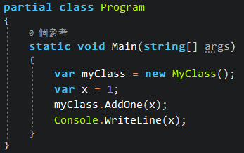<br>output: 1 | MyClass.cs<br><br>Program.cs<br><br>output: 2 |
    |  差異  |                                             因為 ```int``` 是 value type，所以 x 還是 1                                             |                                          因為 ```int``` 被當成 reference type，所以 x 是 2                                          |

#### Out 修飾詞

- It's a code smell in Mosh's opinion. **不建議使用**，知道有這個東西就好
- 可以使方法回傳 1 個以上的值，不過較好的作法應該是把欲回傳的多個結果作成另一個 class 的欄位，並回傳該 class 即可
- 以 C# 內建的 TryParse() 為例

    ``` csharp
    int number;
    var result = Int32.TryParse("abc", out number);

    if (result)
        Console.WriteLine(number);
    else
        Console.WriteLine("Conversion failed.");
    ```

### 欄位(Fields)

在類別中宣告的變數，用來存放類別的資料

#### 欄位初始化(Initialization)

- 可以寫在建構式中
- 也可以在宣告時就定義，其好處是無論有多少個建構式，都能保證該欄位會被初始化

    ``` csharp
    // 在建構式中作欄位初始化
    public class Person
    {
        public List<string> Orders;

        public Person()
        {
            Orders = new List<string>();
        }
    }
    ```

    ``` csharp
    // 在宣告時作欄位初始化
    public class Person
    {
        public List<string> Orders = new List<string>();
    }
    ```

#### 唯讀欄位(Read-Only Fields)

- 用來避免欄位被重複初始化(會導致第一次初始化後存放的資料被清空)
- 以下述程式碼來說明

    1. 建立一個 Customer 類別，並給予 Order 欄位，且預先作好初始化，然後在 Main() 使用

        ``` csharp
        public class Customer
        {
            public List<string> Orders = new List<string>();
        }

        partial class Program
        {
            static void Main(string[] args)
            {
                var customer = new Customer();
                customer.Order.Add("apple");
                customer.Order.Add("banana");

                Console.WriteLine(customer.Order.Count);
            }
        }

        // output:
        // 2
        ```

    2. 如果 Customer 類別裡面有個方法，不小心又初始化了一次 Order 欄位，會發生原本存放的資料被清空

        ``` csharp
        public class Customer
        {
            public List<string> Orders = new List<string>();

            public void Cashing()
            {
                // 不小心又初始化了一次 Order 欄位
                Order = new List<string>();
                ...
            }
        }

        partial class Program
        {
            static void Main(string[] args)
            {
                var customer = new Customer();
                customer.Order.Add("apple");
                customer.Order.Add("banana");

                // 在這個呼叫後，原本 Order 的資料會被清空
                customer.Cashing();

                Console.WriteLine(customer.Order.Count);
            }
        }

        // output:
        // 0
        ```

    3. 如果 Order 欄位是使用唯讀欄位，在 compile 階段就會報錯，禁止在一個以上的地方為該欄位作初始化

        ``` csharp
        public class Customer
        {
            // 使用 readonly 關鍵字
            public readonly List<string> Orders = new List<string>();

            public void Cashing()
            {
                // 這行會編譯失敗
                Order = new List<string>();
                ...
            }
        }
        ```

### 封裝(Encapsulation)

- 想像餐廳是一個應用程式(Application)，裡面的員工們就是類別(Class)，服務生不應插手、也不需要知道廚師的工作內容，也就是說，類別之間不需要知道彼此的細節，只要能互相溝通即可
- 實際作法是將類別中的欄位(Field)設為 [private 層級](#存取修飾詞access-modifiers)，並提供 [public 層級](#存取修飾詞access-modifiers)的 setter/getter 方法，讓其它類別可以透過這兩種方法來設定/取得欄位資訊
- 類別中的欄位名稱，應使用 Camel Case 並加上底線前綴，例如 ```private int _myNumber;```
- 以下述程式碼為例

    ``` csharp
    public class Person
    {
        // 欄位使用 private 層級，並使用 Camel Case 加上底線前綴作命名
        private string _name;

        // setter 使用 public 層級，供其它類別叫用
        public void SetName(string name)
        {
            if (!String.IsNullOrEmpty(name))
                this._name = name;
        }

        // getter 使用 public 層級，供其它類別叫用
        public string GetName()
        {
            return this._name;
        }
    }
    ```

### 屬性(Properties)

- 簡化封裝概念中，欄位(Field)的 setter/getter
- 屬性使用 public 層級，供其它類別叫用
- 屬性名稱應使用 Pascal Case
- 以下述程式碼為例

    ``` csharp
    public class Person
    {
        private string _name;

        // 屬性使用 public 層級
        public string Name
        {
            get { return _name; }
            set { Name = _name; }
        }
    }
    ```

#### 自動實作屬性(Auto-Implement Properties)

- 若屬性(Property)無其它邏輯，只是給值/取值，可以更進一步簡化屬性的寫法
- 在編譯階段，編譯器會自動為我們建立 private 層級的欄位(Field)
- 承上，透過 ildasm 工具去反組譯 compile 後的 exe 檔，可以看到中介語言(IL)真的會將這種寫法轉成 private 欄位和對應的 setter/getter
- 以下述程式碼為例

    ※ 小技巧：在類別中輸入「prop」即可產生自動實作屬性的程式碼片段

    ``` csharp
    public class Person
    {
        public string Name { get; set; }
    }
    ```

- 若屬性有其它邏輯，就不應該使用，例如下例的 ```Age```

    ``` csharp
    // 類別
    public class Person
    {
        public DateTime Birthday { get; set; }

        // 年齡應該是根據生日自動算出來的，有其邏輯，所以不使用自動實作，
        // 且年齡不應允許設定其值，所以不給 setter
        public int Age
        {
            get
            {
                var timeSpan = DateTime.Now - this.Birthday;
                var years = timeSpan.Days / 365;

                return years;
            }
        }
    }

    // 主程式
    partial class Program
    {
        static void Main(string[] args)
        {
            var person = new Person();
            person.Birthday = new DateTime(1990, 1, 1);
            Console.WriteLine(person.Age);
        }
    }

    // output:
    // 29
    ```

- 若自動實作的屬性，只允許 set 一次值，則將 ```set``` 加上 private 層級，並改在建構式(Constructor)設定屬性值，如此一來在建立物件時，便強迫需要設定該屬性值，且不得再作更改

    ``` csharp
    // 類別
    public class Person
    {
        // 在建構式設定 Birthday 屬性值
        public Person(DateTime birthday)
        {
            this.Birthday = birthday;
        }

        // set 前面加上 private
        public DateTime Birthday { get; private set; }
        public int Age
        {
            get
            {
                var timeSpan = DateTime.Now - this.Birthday;
                var years = timeSpan.Days / 365;

                return years;
            }
        }
    }

    // 主程式
    partial class Program
    {
        static void Main(string[] args)
        {
            // 建立物件時便必須設定 Birthday 值
            var person = new Person(new DateTime(1990, 1, 1));
            Console.WriteLine(person.Age);
        }
    }

    // output:
    // 29
    ```

### 索引子(Indexers)

- 類似屬性(Property)，當某個欄位(Field)是集合型態(Array, List or Dictionary .. etc.)，可以透過 key/value(一個 key 對應一個 value)的方式來存取該集合中的元素
- 索引子用 ```this``` 關鍵字作為名稱
- 以下述程式碼為例

    ``` csharp
    // 類別
    public class SuperHero
    {
        private Dictionary<string, string> _dictionary;

        public SuperHero()
        {
            this._dictionary = new Dictionary<string, string>();
        }

        // 用 "this" 作為名稱
        // "value" 關鍵字代表欲設定的值
        public string this[string key]
        {
            get { return _dictionary[key]; }
            set { _dictionary[key] = value; }
        }
    }

    // 主程式
    partial class Program
    {
        static void Main(string[] args)
        {
            var superHero = new SuperHero();
            superHero["Batman"] = "Bruce Wayne";
            Console.WriteLine(superHero["Batman"]);
        }
    }

    // output:
    // Bruce Wayne
    ```

## Association Between Classes

### 耦合性(Class Coupling)

- 一種衡量類別(Class)和子系統相依程度的方式

    |            |                                               高耦合<br>(Tightly Coupled)                                               |                              低耦合<br>(Loosely Coupled)                               |
    |:----------:|:-----------------------------------------------------------------------------------------------------------------------:|:--------------------------------------------------------------------------------------:|
    | 較佳的設計 |                                                                                                                         |                                           V                                            |
    |    描述    |                                 類別之間高度相依，修改一個地方就到處都要修改或重新編譯                                  |                   類別之間相依性低，任何類別都較小程度的影響其它類別                   |
    |    範例    | <br>修改 Class A 會影響到 Class B 和 Class F，也會影響到其它相依的子類別 | 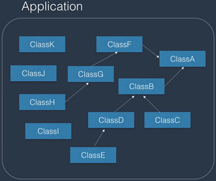<br>無論修改哪個 Class 都僅會影響到本身 |

- 可以透過以下方式達成低耦合設計
    - [封裝(Encapsulation)](#封裝encapsulation)
    - 類別之間的關係，例如[繼承(Inheritance)](#繼承inheritance)和[組合(Composition)](#組合composition)
    - [介面(Interfaces)](#介面interfaces)

### 繼承(Inheritance)

- 兩個類別(Class)間的一種關係，讓其中一個類別的程式可以繼承自另一個類別
- 被繼承者稱為基底類別(Base Class)，繼承者稱為衍生類別(Derived Class)
- 用英文來說是「Is-A」關係，例如「A Car **is a** Vehicle.」，「Car」就是繼承自「Vehicle」
- 繼承的優點
    - 程式可重複利用(Code re-use)
    - 多型(Polymorphic)特性
- 在 C# 中，類別只能繼承自一個類別(不能繼承多個類別)
- 在 C# 中，所有類別(即使未特別指定)都會繼承自 object 類別，所以都會有 ```Equals()```、```GetType()```、```ToString()``` .. 等方法
- 宣告時，在類別名稱後加上「:」即可作繼承
- 以下述情境為例
    1. 假設今天要設計一個簡報程式，我們會有文字、圖片、表格 .. 等等元件，但其實每個類別都會有複製、貼上、移至最上層 .. 等等共同功能，所以我們會建立一個母類別，並把這些共同功能都放在該類別中，再讓其它元件來繼承它
    2. 我們設計的 UML 如下圖
        
    3. 程式碼如下

        ``` csharp
        // Parent class
        public class PresentationObject
        {
            public int Width { get; set; }
            public int Height { get; set; }

            public void Copy() { ... }
        }

        // Child class
        public class Text : PresentationObject
        {
            public int FontSize { get; set; }
            public string FontFamily { get; set; }

            public void AddText(string str) { ... }
        }

        // Main
        partial class Program
        {
            static void Main(string[] args)
            {
                var text = new Text();
                // 可以使用母類別的類別成員
                text.Width = 10;
                text.Copy();
            }
        }
        ```

### 組合(Composition)

- 兩個類別(Class)間的一種關係，讓其中一個類別擁有另一個類別
- 用英文來說是「Has-A」關係，例如「A Car **has an** Engine.」
- 繼承的優點
    - 程式可重複利用(Code re-use)
    - 彈性
    - 具低耦合特性
- 以下述情境為例
    1. 假設今天要設計 DbMigrator 和 Installer 兩個類別，且兩個類別都需要寫 log 的功能
    2. 我們設計的 UML 如下圖
        
    3. 程式碼如下

        ``` csharp
        // 共有的功能
        public class Logger
        {
            public void Log(string message)
            {
                Console.WriteLine(message);
            }
        }

        // 類別一
        public class DbMigrator
        {
            private Logger _logger;

            public DbMigrator(Logger logger)
            {
                this._logger = logger;
            }

            public void Migrate()
            {
                _logger.Log("We are migrating.");
            }
        }

        // 類別二
        public class Installer
        {
            private Logger _logger;

            public Installer(Logger logger)
            {
                this._logger = logger;
            }

            public void Install()
            {
                _logger.Log("We are installing.");
            }
        }

        // Main
        partial class Program
        {
            static void Main(string[] args)
            {
                var dbMigrator = new DbMigrator(new Logger());
                dbMigrator.Migrate();

                var logger = new Logger();
                var installer = new Installer(logger);
                installer.Install();
            }
        }
        ```

### Favor Composition over Inheritance

- 繼承(Inheritance)的缺點
    - 容易被濫用
    - 繼承關係越長，越難維護
    - 造成高耦合
- 任何繼承關係都能轉換成組合關係
- 以下述情境為例

    |              |                       繼承(Inheritance)                       |                                      組合(Composition)                                      |
    |:------------:|:-------------------------------------------------------------:|:-------------------------------------------------------------------------------------------:|
    |    人和狗    | 人和狗都是動物<br> |             人和狗都擁有動物特性<br>             |
    | 加入走路功能 |  動物都會走路<br>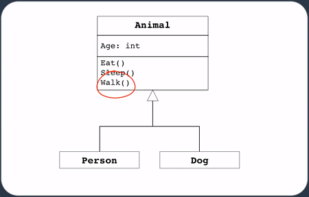  |                 增加走路特性<br>                 |
    |   加入金魚   |  金魚也是動物<br>  | 金魚擁有動物特性、游泳特性，但不擁有走路特性<br> |
    |     差異     | 出現錯誤，因為金魚不會走路，必須修改動物、人、狗 .. 等等類別  |             因為低耦合，所以較不易牽一髮而動全身，特性還可以作成介面(Interface)             |

## Inheritance: Second Pillar of OOP

### 存取修飾詞(Access Modifiers)

- 用來控制類別和其成員的存取範圍
- 為了達到 OOP 概念中的封裝(Encapsulation)，將類別中的資訊隱藏
- C# 共有 5 種存取層級

    |     存取修飾詞     |                               可存取範圍                               |                       封裝(Encapsulation)概念                        |                    範例                     |
    |:------------------:|:----------------------------------------------------------------------:|----------------------------------------------------------------------|:-------------------------------------------:|
    |       public       |                                到處皆可                                |          不符合，<br>到處都能看到類別中的資訊，<br>避免使用          | 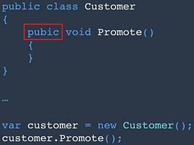 |
    |      private       |                     只有在該類別(Class)中才可存取                      |                                 符合                                 | 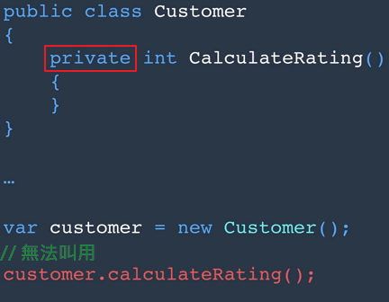 |
    |     protected      |               只有在該類別和繼承該類別之子類別中才可存取               | 不符合，<br>子類別能看到母類別中的資訊，<br>除非不得已，否則避免使用 |  |
    |      internal      | 只有在相同組件(Assembly)中才可存取，不會設在類別成員，通常是設在類別上 |                                                                      |                                             |
    | protected internal |          只有在相同組件、該類別和繼承該類別之子類別中才可存取          |                       不符合，理由同 protected                       |                                             |

### 建構式繼承(Constructor Inheritance)

- 基底類別(Base Class)的建構式一定會最先執行
- 基底類別的建構式不會被繼承
- 承上，欲使用基底類別的建構式，可以透過 ```: base()``` 的寫法來繼承基底類別的建構式
- 以下述程式碼為例
    1. 建立基底類別 Vehicle 和其衍生類別 Car，並各自建立建構式

        ``` csharp
        // Base Class
        public class Vehicle
        {
            public Vehicle()
            {
                Console.WriteLine("Vehicle is being initialized.");
            }
        }

        // Derived Class
        public class Car : Vehicle
        {
            public Car()
            {
                Console.WriteLine("Car is being initialized.");
            }
        }

        // Main
        partial class Program
        {
            static void Main(string[] args)
            {
                // 建立 Car 物件
                var car = new Car();
            }
        }

        // output:
        // Vehicle is being initialized.
        // Car is being initialized.
        ```

    2. 從上述程式碼輸出可以看出基底類別的建構式會先執行
    3. 假設今天 Vehicle 增加了一個 carPlateNumber 唯讀欄位

        ``` csharp
        // Base Class
        public class Vehicle
        {
            // 增加一個 _carPlateNumber 唯讀欄位
            private readonly string _carPlateNumber;

            public Vehicle(string carPlateNumber)
            {
                // 唯讀欄位必須在建構式中給值
                this._carPlateNumber = carPlateNumber;

                Console.WriteLine($"Vehicle is being initialized. {carPlateNumber}");
            }
        }

        // Derived Class
        public class Car : Vehicle
        {
            // 透過 :base() 的方式，可以將 Car 建構式收到的參數傳遞到 Vehicle 類別
            public Car(string carPlateNumber)
                : base(carPlateNumber)
            {
                Console.WriteLine($"Car is being initialized. {carPlateNumber}");
            }
        }

        // Main
        partial class Program
        {
            static void Main(string[] args)
            {
                // Car 物件必須給車牌號碼才能建立
                var car = new Car("ABC-1234");
            }
        }

        // output:
        // Vehicle is being initialized. ABC-1234
        // Car is being initialized. ABC-1234
        ```

### Upcasting and Downcasting

#### 向上轉型(Upcasting)

- 從衍生類別(Derived Class)建立的物件，使用基底類別(Base Class)的成員(屬性、方法 .. 等等)，這個過程稱為向上轉型
- 向上轉型為隱含轉換，不需要特別寫出欲轉型的目標類別

    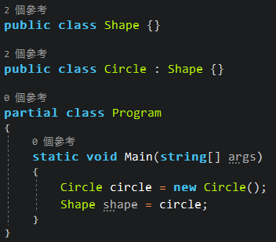

- 其實轉型前後，都是指向記憶體中的同一個位址，只是用不同檢視看到不同類別成員，以下述程式碼為例

    ``` csharp
    // Base Class
    public class Shape
    {
        public int Width { get; set; }
        public int Height { get; set; }
    }

    // Derived Class
    public class Text : Shape
    {
        public int FontSize { get; set; }
    }

    // Main
    partial class Program
    {
        static void Main(string[] args)
        {
            Text text = new Text();
            Shape shape = text;

            // text 跟 shape 其實是同一個記憶體位址
            // 所以以下兩行，其實都在更改同一個物件的 Width
            text.Width = 200;
            shape.Width = 100;

            Console.WriteLine(text.Width);
        }
    }

    // output:
    // 100
    ```

- 向上轉型的現實案例
    1. StreamReader
        - StreamReader 在宣告時，其中一個建構式是要傳入 Stream

            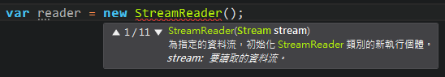

        - 因為 Stream 是 FileStream、MemoryStream .. 等等類別的基底類別，所以不需要指定類別，即可當作 Stream 使用

            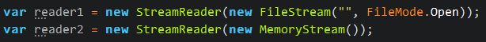

    2. ArrayList
        - ArrayLst.Add() 可傳入 object

            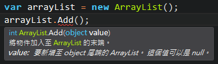

        - 因為 object 是任何類別的基底類別，所以不需要指定類別，即可將 int、string 等等類別傳入

            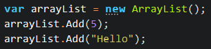

#### 向下轉型(Downcasting)

- 從基底類別(Base Class)建立的物件，使用衍生類別(Derived Class)的成員(屬性、方法 .. 等等)，這個過程稱為向下轉型
- 向下轉型需要用 ```(DerivedClass)BaseClass``` 的方式，寫出欲轉型的目標類別

    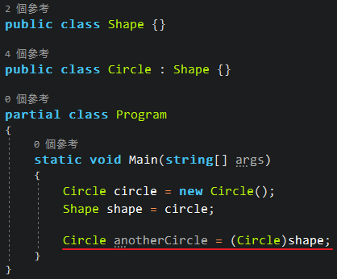

- 向下轉型有可能會出現 InvalidCastException，所以比較安全的作法是使用 ```as``` 關鍵字，若轉型失敗會是 null，不會直接丟 exception

    

- 承上點，也可以使用 ```is``` 關鍵字來檢查

    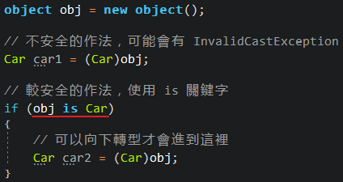

- 向下轉型的現實案例
    1. Windows Form 或 WPF Application 中的按按鈕事件
        - sender 雖然指的是按鈕本身，但因為使用的是基底類別 object，所以只有 object 自己的類別成員能使用

            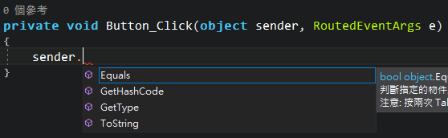

        - 不過如果使用向下轉型，指定 sender 為 Button 類別，就能使用 Button 的類別成員

            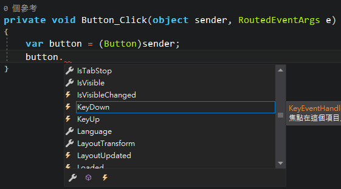

### Boxing and Unboxing

首先要先了解

1. Value Types 和 Reference Types 的差異，可以參考 [C# Basics.md](C%23%20Basics.md#Value-Types-and-Reference-Types)
2. 在 .Net Framework 中，Object 類別是所有類別的基底類別

#### 裝箱(Boxing)

- 將 Value Types 類別建立的物件，轉換成 Object 類別的過程，稱為裝箱
- 以下述程式碼為例

    ``` csharp
    // boxing
    int number = 10;
    object obj1 = number;

    // also boxing
    object obj2 = 10;
    ```

- 承上例，記憶體會將數字 10，改用堆積(Heap)方式儲存，而非堆疊(Stack)

    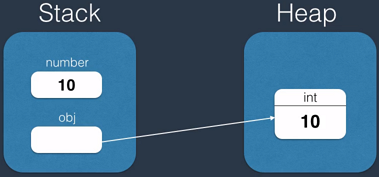

#### 拆箱(Unboxing)

- 將 Object 類別建立的物件，轉換成 Value Types 類別的過程，稱為拆箱
- 以下述程式碼為例

    ``` csharp
    // boxing
    object obj = 10;

    // unboxing
    int number = (int)obj;
    ```

#### 裝箱和拆箱的現實案例

- 無論裝箱或拆箱都會影響效能，因為多了一層轉換，應避免使用
- 以下述程式碼為例

    1. ArrayLst.Add() 可傳入 object

        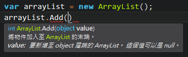

    2. 在向上轉型(Upcasting)章節已經學到，可以將 int、string .. 等等類別傳入

        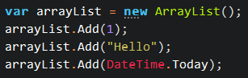

    3. 但這樣的 ArrayList 除了不是個型別安全(Type Safe)的物件，在傳入 Value Types 時其實就作了裝箱的動作，無形中影響效能

        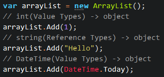

    4. 所以最好別用 ArrayList，而是改用 List<>

## Polymorphism: Third Pillar of OOP

### 方法覆寫(Method Overriding)

- 修改從基底類別(Base Class)繼承來的方法(Method)
- 透過在基底類別的方法加上 ```virtual``` 關鍵字，並在衍生類別的方法加上 ```override``` 關鍵字即可作到方法覆寫

    ``` csharp
    // Base Class
    public class Shape
    {
        public virtual void Draw()
        {
            // Default implementation
        }
    }

    // Derived Class
    public class Circle : Shape
    {
        public override void Draw()
        {
            // New implementation
        }
    }
    ```

- 如果衍生類別的方法沒有作 override，則會沿用基底類別的方法內容
- 現實案例，假設我們有個 Shape 類別定義了不同的形狀，另外有一個 Canvas 類別可以將 ```List<Shape>``` 逐一繪製，比較下述兩種寫法

    <table>
        <tr>
            <th></th>
            <th>沒有運用封裝、繼承、方法覆寫的概念</th>
            <th>運用封裝、繼承、方法覆寫的概念</th>
        </tr>
        <tr>
            <td>程式碼</td>

<td>

``` csharp
// ShapeType.cs
// 把不同形狀作成列舉
public enum ShapeType
{
    Circle,
    Rectangle
}

// Shape.cs
// Shape 使用 Type 屬性來判斷哪種形狀
public class Shape
{
    public int Width { get; set; }
    public int Height { get; set; }
    public ShapeType Type { get; set; }
}

// Canvas.cs
// Canvas 定義不同形狀應該怎麼繪製
public class Canvas
{
    public void DrawShapes(List<Shape> shapes)
    {
        foreach (var shape in shapes)
        {
            switch (shape.Type)
            {
                case ShapeType.Circle:
                    Console.WriteLine("Draw a circle.");
                    break;
                case ShapeType.Rectangle:
                    Console.WriteLine("Draw a rectangle.");
                    break;
            }
        }
    }
}

// Program.cs
partial class Program
{
    static void Main(string[] args)
    {
        var shapes = new List<Shape>();
        shapes.Add(new Shape { Type = ShapeType.Circle });
        shapes.Add(new Shape { Type = ShapeType.Rectangle });

        var canvas = new Canvas();
        canvas.DrawShapes(shapes);
    }
}
```

</td>
<td>

``` csharp
// Shape.cs
// Shape 提供可被覆寫的 Draw() 方法，並定義所有形狀共有的屬性
public class Shape
{
    public int Width { get; set; }
    public int Height { get; set; }

    public virtual void Draw() { }
}

// Circle.cs
// Circle 繼承自 Shape，並覆寫 Draw() 方法成自己所需的樣子
public class Circle : Shape
{
    public override void Draw()
    {
        Console.WriteLine("Draw a circle.");
    }
}

// Rectangle.cs
// Rectangle 繼承自 Shape，並覆寫 Draw() 方法成自己所需的樣子
public class Rectangle : Shape
{
    public override void Draw()
    {
        Console.WriteLine("Draw a rectangle.");
    }
}

// Canvas.cs
// Canvas 只負責繪製，不必管是哪個類別、該怎麼繪製
public class Canvas
{
    public void DrawShapes(List<Shape> shapes)
    {
        foreach (var shape in shapes)
        {
            shape.Draw();
        }
    }
}

// Program.cs
partial class Program
{
    static void Main(string[] args)
    {
        var shapes = new List<Shape>();
        shapes.Add(new Circle());
        shapes.Add(new Rectangle());

        var canvas = new Canvas();
        canvas.DrawShapes(shapes);
    }
}
```

</td>
        </tr>
        <tr>
            <td>差異</td>
            <td>
                <ul>
                    <li>當今天多了其它新的形狀，例如 Triangle，需要改到 ShapeType 列舉、Canvas 類別，所有引用到 ShapeType.cs 和 Canvas.cs 的程式也都需要重新編譯</li>
                    <li>當形狀越來越多，Canvas.cs 會越長越大支，降低可讀性</li>
                </ul>
            </td>
            <td>
                <ul>
                    <li>當今天多了其它新的形狀，例如 Triangle，僅需要增加一個 Triangle 類別(繼承自 Shape)，放到 Triangle.cs 供人引用，其它程式碼皆不必修改亦不必重新編譯</li>
                    <li>當形狀越來越多，只是會有越來越多支 .cs 檔</li>
                </ul>
            </td>
        </tr>
    </table>
