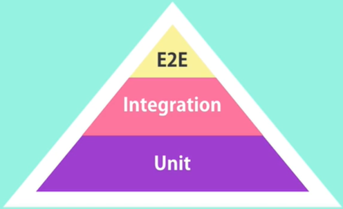
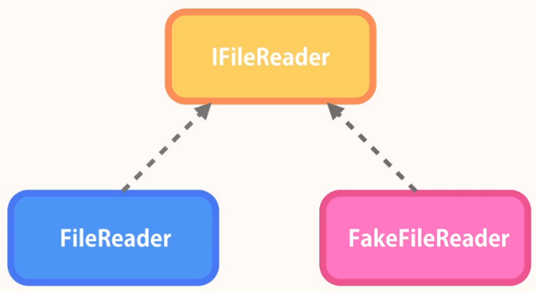

# Unit Testing for C# Developers


Course Link: <https://codewithmosh.com/p/unit-testing-for-csharp-developers>

---

## Getting Started

### 自動化測試的優點

- 用更少的時間，頻繁測試程式碼
- 部署程式碼時更有信心
- 重構時更有信心

### 測試的類型

- 單元測試 (Unit Test): 測試應用程式中的一個單元，且不包含外在的相依資源
- 整合測試 (Integration Test): 測試應用程式，且包含外在的相依資源
- 端對端測試 (End-to-End Test): 透過 UI 測試整個應用程式，例如 Selenium

  

### 測試工具

- NUnit
- MSTest
- xUnit

選哪個工具不重要，重要的是心法

### MSTest

- 測試函式命名習慣為 `{原函式名稱}_{情境}_{預期結果}`，例如 `CanBeCancelledBy_UserIsAdmin_ReturnsTrue()`
- 函式內會依序分三個部分
    1. Arrange: 初始化物件
    2. Act: 對物件採取動作，例如呼叫方法 (Method)
    3. Assert: 驗證結果是否與預期相符
- 測試 class 使用 `[TestClass]` 屬性
- 測試 function 使用 `[TestMethod]` 屬性

    ``` csharp
    [TestClass]
    public class ReservationTests
    {
        [TestMethod]
        public void CanBeCancelledBy_UserIsAdmin_ReturnsTrue()
        {
            // Arrange
            var reservation = new Reservation();

            // Act
            var result = reservation.CanBeCancelledBy(new User() { IsAdmin = true });

            // Assert
            Assert.IsTrue(result);
        }
    }
    ```

### NUnit

- 測試 class 使用 `[TestFixture]` 屬性
- 測試 function 使用 `[Test]` 屬性

    ``` csharp
    [TestFixture]
    public class ReservationTests
    {
        [Test]
        public void CanBeCancelledBy_UserIsAdmin_ReturnsTrue()
        {
            // Arrange
            var reservation = new Reservation();

            // Act
            var result = reservation.CanBeCancelledBy(new User() { IsAdmin = true });

            // Assert 可以從以下三種寫法選一種
            Assert.IsTrue(result);
            Assert.That(result, Is.True);
            Assert.That(result == true);
        }
    }
    ```

- 測試函式彼此間不應該共用實體，以下為錯誤示範

    ``` csharp
    [TestFixture]
    public class MathTests
    {
        // We shouldn't share the same instance between test functions
        private Math _math;

        [Test]
        public void Max_FirstArgumentIsGreater_ReturnTheFirstArgument()
        {
            var result = _math.Max(2, 1);

            Assert.That(result, Is.EqualTo(2));
        }

        [Test]
        public void Max_SecondArgumentIsGreater_ReturnTheSecondArgument()
        {
            var result = _math.Max(1, 2);

            Assert.That(result, Is.EqualTo(2));
        }
    }
    ```

### Test-driven Development (TDD)

在寫正式 code 之前先寫測試專案，會經過以下三個步驟

1. 先寫出一個會失敗的測試案例
2. 寫出最簡單的正式 code 以通過測試案例
3. 需要的話重構正式 code

## Fundamentals of Unit Testing

### 良好的單元測試之特徵

- 乾淨、可讀、可維護
- 不包含任何邏輯，例如 if else 或 for loop

### What to Test and What Not to Test

#### What to Test

大致上可以分為兩類函式

|          |                         Query Function                         |                  Command Function                   |
|----------|----------------------------------------------------------------|-----------------------------------------------------|
|   定義   | 不一定指查詢 DB，只要目的是取得資料的都可以當成 query function | 改變記憶體或 DB 狀態、或操控外部相依服務之 function |
| 測試方法 |                    驗證所有路徑可能回傳的值                    |      驗證物件的狀態、是否正確呼叫外部相依服務       |

#### What Not to Test

- 程式語言本身的功能
- 第三方套件之功能

### 單元測試的命名和架構

|          |  正式專案   |                   測試專案                   |
|----------|-------------|----------------------------------------------|
| 專案名稱 |  TestNinja  |          TestNinja<b>.UnitTests</b>          |
| 類別名稱 | Reservation |           Reservation<b>Tests</b>            |
| 方法名稱 |             | {MethodName}\_{Scenario}\_{ExpectedBehavior} |

### NUnit 常用屬性

#### [SetUp]

NUnit 在進入每個測試函式前，都會先呼叫有 `[SetUp]` 屬性的函式，所以可以在這裡建立新實體，這樣就可以避免在每個測試函式中都要作 new 實體的動作

``` csharp
[TestFixture]
public class MathTests
{
    private Math _math;

    // We can use the [SetUp] function to create a new instance
    // before every time we enter any test function
    [SetUp]
    public void SetUp()
    {
        _math = new Math();
    }

    [Test]
    public void Max_FirstArgumentIsGreater_ReturnTheFirstArgument()
    {
        var result = _math.Max(2, 1);

        Assert.That(result, Is.EqualTo(2));
    }

    [Test]
    public void Max_SecondArgumentIsGreater_ReturnTheSecondArgument()
    {
        var result = _math.Max(1, 2);

        Assert.That(result, Is.EqualTo(2));
    }
}
```

#### [TearDown]

NUnit 在離開每個測試函式後，都會呼叫有 `[TearDown]` 屬性的函式

#### [TestCase]

透過 `[TestCase](arg1, arg2 ..)` 屬性可以將測試函式參數化

``` csharp
[TestFixture]
public class MathTests
{
    private Math _math;

    [SetUp]
    public void SetUp()
    {
        _math = new Math();
    }

    [Test]
    [TestCase(2, 1, 2)]
    [TestCase(1, 2, 2)]
    [TestCase(1, 1, 1)]
    public void Max_WhenCalled_ReturnTheGreaterArguments(int a, int b, int expectedResult)
    {
        var result = _math.Add(a, b);

        Assert.That(result, Is.EqualTo(expectedResult));
    }
}
```

#### [Ignore]

透過 `[Ignore]("reason")` 屬性可以暫時略過該測試函式

## Core Unit Testing Techniques

### NUnit 常用的 Assertion

``` csharp
// 忽略大小寫的 EqualTo
Assert.That(result, Is.EqualTo("abc").IgnoreCase);

// 驗證 result 的起始文字
Assert.That(result, Does.StartWith("<strong>"));

// 驗證 result 的結尾文字
Assert.That(result, Does.EndWith("</strong>"));

// 驗證 result 是否包含元素 - 寫法1
Assert.That(result, Does.Contain(1));
Assert.That(result, Does.Contain(3));

// 驗證 result 是否包含元素 - 寫法2 (不在乎元素順序)
Assert.That(result, Is.EquivalentTo(new [] {1, 3}));

// 驗證 result 的元素是否依序排列
Assert.That(result, Is.Ordered);

// 驗證 result 的元素是否無重複
Assert.That(result, Is.Unique);

// 驗證 result 是否為 NotFound 類別
Assert.That(result, Is.TypeOf<NotFound>());

// 驗證 result 是否為 NotFound 類別或其衍生類別
Assert.That(result, Is.InstanceOf<NotFound>());
```

### 測試 Exception

透過委派 (Delegate)

``` csharp
public void Log_InvalidError_ThrowArgumentNullException(string error)
{
    var logger = new ErrorLogger();

    // 直接呼叫會回傳 exception，造成驗證失敗
    //logger.Log(error);

    // 透過匿名委派驗證 exception 類別
    Assert.That(() => logger.Log(error), Throws.ArgumentNullException);
}
```

### 測試事件 (Event)

``` csharp
public class ErrorLogger
{
    public event EventHandler<Guid> ErrorLogged;

    public void Log(string error)
    {
        ErrorLogged?.Invoke(this, Guid.NewGuid());
    }
}

[TestFixture]
public class ErrorLoggerTests
{
    [Test]
    public void Log_ValidError_RaiseErrorLoggedEvent(string error)
    {
        var logger = new ErrorLogger();

        var id = Guid.Empty;
        logger.ErrorLogged += (sender, args) => { id = args; };

        logger.Log("a");

        Assert.That(id, Is.Not.EqualTo(Guid.Empty));
    }
}
```

### 測試 private 或 protected 方法

不需要也不應該測試 private 或 protected 方法，
因為在測試公開的 API 或方法時，便會包含到所有的 private 或 protected 方法

## Breaking the External Dependencies

在測試外部相依資源時，會使用 Fake Object (或稱為 Test Double) 取代原本的外部 class，
透過 Dependency Injection 抽取出 Interface，
既可在 production code 裡使用外部相依資源，也可在 testing code 中作測試



### 透過 DI 重構出可測試的程式碼

例如有一 production code 如下

``` csharp
public class VideoService
{
    public string ReadVideoTitle()
    {
        var str = File.ReadAllText("video.txt");
        var video = JsonConvert.DeserializeObject<Video>(str);
        if (video == null)
            return "Error parsing the video.";
        return video.Title;
    }
}

// production code 主程式
public class Program
{
    public static void Main()
    {
        var service = new VideoService();
        var result = service.ReadVideoTitle();
    }
}
```

由於 `VideoService` class 和 `File` class 為高耦合關係，無法作測試，
所以可以先將此相依關係拆到另一個獨立的 class

``` csharp
public class FileReader
{
    public string Read(string path)
    {
        return File.ReadAllText(path);
    }
}

public class VideoService
{
    public string ReadVideoTitle()
    {
        //var str = File.ReadAllText("video.txt");
        var str = new FileReader().Read("video.txt");
        var video = JsonConvert.DeserializeObject<Video>(str);
        if (video == null)
            return "Error parsing the video.";
        return video.Title;
    }
}

// production code 主程式
public class Program
{
    public static void Main()
    {
        var service = new VideoService();
        var result = service.ReadVideoTitle();
    }
}
```

至此，程式邏輯和耦合性皆未有改變，
所以更進一步，將獨立出來的 `FileReader` 抽出 Interface，
並透過 DI 達成低耦合且可測試的程式

``` csharp
public interface IFileReader
{
    string Read(string path);
}

public class FileReader : IFileReader
{
    public string Read(string path)
    {
        return File.ReadAllText(path);
    }
}

public class VideoService
{
    // 以方法參數作 DI 為例
    public string ReadVideoTitle(IFileReader fileReader)
    {
        // 相依 Interface，而非 Class
        var str = fileReader.Read("video.txt");
        var video = JsonConvert.DeserializeObject<Video>(str);
        if (video == null)
            return "Error parsing the video.";
        return video.Title;
    }
}

// production code 主程式
public class Program
{
    public static void Main()
    {
        var service = new VideoService();
        // 使用 production code 的實際 class
        var result = service.ReadVideoTitle(new FileReader());
    }
}

// === 以下為 testing code ===
public class FakeFileReader : IFileReader
{
    // testing code 不再需要相依 File class
    public string Read(string path)
    {
        return "";
    }
}

[TestFixture()]
public class VideoServiceTests
{
    [Test()]
    public void ReadVideoTitle_EmptyFile_ReturnError()
    {
        var service = new VideoService();

        // 直接使用 FakeFileReader
        var result = service.ReadVideoTitle(new FakeFileReader());

        Assert.That(result, Does.Contain("error").IgnoreCase);
    }
}
```

承上例，以下示範透過以屬性作 DI

``` csharp
public interface IFileReader
{
    string Read(string path);
}

public class FileReader : IFileReader
{
    public string Read(string path)
    {
        return File.ReadAllText(path);
    }
}

public class VideoService
{
    // 以屬性作 DI 為例
    public IFileReader FileReader { get; set; }

    public VideoService()
    {
        FileReader = new FileReader();
    }

    public string ReadVideoTitle()
    {
        var str = FileReader.Read("video.txt");
        var video = JsonConvert.DeserializeObject<Video>(str);
        if (video == null)
            return "Error parsing the video.";
        return video.Title;
    }
}

// production code 主程式
public class Program
{
    public static void Main()
    {
        // 設定 FileReader 屬性
        var service = new VideoService();
        service.FileReader = new FileReader();
        var result = service.ReadVideoTitle();
    }
}

// === 以下為 testing code ===
public class FakeFileReader : IFileReader
{
    public string Read(string path)
    {
        return "";
    }
}

[TestFixture()]
public class VideoServiceTests
{
    [Test()]
    public void ReadVideoTitle_EmptyFile_ReturnError()
    {
        // 設定 FileReader 屬性
        var service = new VideoService();
        service.FileReader = new FakeFileReader();

        var result = service.ReadVideoTitle();

        Assert.That(result, Does.Contain("error").IgnoreCase);
    }
}
```

承上例，以下示範透過以建構子作 DI

``` csharp
public interface IFileReader
{
    string Read(string path);
}

public class FileReader : IFileReader
{
    public string Read(string path)
    {
        return File.ReadAllText(path);
    }
}

public class VideoService
{
    // 使用 private field
    private IFileReader _fileReader;

    // 以建構子作 DI 為例
    public VideoService(IFileReader fileReader = null)
    {
        _fileReader = fileReader ?? new FileReader();
    }

    public string ReadVideoTitle()
    {
        var str = _fileReader.Read("video.txt");
        var video = JsonConvert.DeserializeObject<Video>(str);
        if (video == null)
            return "Error parsing the video.";
        return video.Title;
    }
}

// production code 主程式
public class Program
{
    public static void Main()
    {
        var service = new VideoService();
        var result = service.ReadVideoTitle();
    }
}

// === 以下為 testing code ===
public class FakeFileReader : IFileReader
{
    public string Read(string path)
    {
        return "";
    }
}

[TestFixture()]
public class VideoServiceTests
{
    [Test()]
    public void ReadVideoTitle_EmptyFile_ReturnError()
    {
        // 使用 FakeFileReader 為建構子參數
        var service = new VideoService(new FakeFileReader());

        var result = service.ReadVideoTitle();

        Assert.That(result, Does.Contain("error").IgnoreCase);
    }
}
```

※ 在現實世界，會透過 DI Framework 的容器去集中管理所有的 DI 註冊和注入

### Mocking Framework

透過 Mocking Framework 產生 Fake Object，可以簡化每個測試都要實作不同行為的 Interface 的困擾，
例如原本有兩種 test case 便需要實作兩個不同行為的 `IFileReader`

``` csharp
public class FakeEmptyFileReader : IFileReader
{
    public string Read(string path)
    {
        return "";
    }
}

public class FakeAbcFileReader : IFileReader
{
    public string Read(string path)
    {
        return "ABC";
    }
}

[TestFixture()]
public class VideoServiceTests
{
    [Test()]
    public void ReadVideoTitle_EmptyFile_ReturnError()
    {
        var service = new VideoService(new FakeEmptyFileReader());

        var result = service.ReadVideoTitle();

        Assert.That(result, Does.Contain("error").IgnoreCase);
    }

    [Test()]
    public void ReadVideoTitle_AbcFile_ReturnTitle()
    {
        var service = new VideoService(new FakeAbcFileReader());

        var result = service.ReadVideoTitle();

        Assert.That(result, Is.EqualTo("ABC"));
    }
}
```

如果透過 Mocking Framework，便不需要實作那麼多次 Interface，以 Moq 為例

``` csharp
[TestFixture()]
public class VideoServiceTests
{
    [Test()]
    public void ReadVideoTitle_EmptyFile_ReturnError()
    {
        // 直接建立一個 Fake Object，並指定其行為
        var fileReader = new Mock<IFileReader>();
        fileReader.Setup(fr => fr.Read("video.txt")).Returns("");
        // 要使用 Mock<T>.Object 將物件轉回原本介面的實作
        var service = new VideoService(fileReader.Object);

        var result = service.ReadVideoTitle();

        Assert.That(result, Does.Contain("error").IgnoreCase);
    }

    [Test()]
    public void ReadVideoTitle_AbcFile_ReturnTitle()
    {
        // 直接建立一個 Fake Object，並指定其行為
        var fileReader = new Mock<IFileReader>();
        fileReader.Setup(fr => fr.Read("video.txt")).Returns("ABC");
        // 要使用 Mock<T>.Object 將物件轉回原本介面的實作
        var service = new VideoService(fileReader.Object);

        var result = service.ReadVideoTitle();

        Assert.That(result, Is.EqualTo("ABC"));
    }
}
```

#### 在 Mocking Framework 驗證 Fake Object

``` csharp
// === Production Code ===
public class OrderService
{
    private readonly IStorage _storage;

    public OrderService(IStorage storage)
    {
        _storage = storage;
    }

    public int PlaceOrder(Order order)
    {
        var orderId = _storage.Store(order);

        // Some other work

        return orderId;
    }
}

public class Order
{
}

public interface IStorage
{
    int Store(object obj);
}

// === Testing Code ===
[TestFixture]
public class OrderServiceTests
{
    [Test]
    public void PlaceOrder_WhenCalled_StoreTheObject()
    {
        var storage = new Mock<IStorage>();
        var service = new OrderService(storage.Object);

        var order = new Order();
        service.PlaceOrder(order);

        // 透過 "Verify" 去驗證是否有執行此方法
        storage.Verify(s => s.Store(order));
    }
}
```

#### 不要濫用 Mocking Framework

只有在測試外部相依資源時才考慮使用，如下例

``` csharp
[TestFixture]
public class ProductTests
{
    // 不必要的濫用 Mocking Framework 會造成閱讀困難
    [Test]
    public void GetPriceTest_GoldCustomer_Apply30PercentDiscount_2()
    {
        var customer = new Mock<ICustomer>();
        customer.Setup(c => c.IsGold).Returns(true);
        var product = new Product() { ListPrice = 100 };

        var result = product.GetPrice(customer.Object);

        Assert.That(result, Is.EqualTo(70));
    }

    // 不使用 Mocking Framework 就能做到一樣的事
    [Test]
    public void GetPriceTest_GoldCustomer_Apply30PercentDiscount_1()
    {
        var product = new Product() { ListPrice = 100 };

        var result = product.GetPrice(new Customer() { IsGold = true });

        Assert.That(result, Is.EqualTo(70));
    }
}
```
