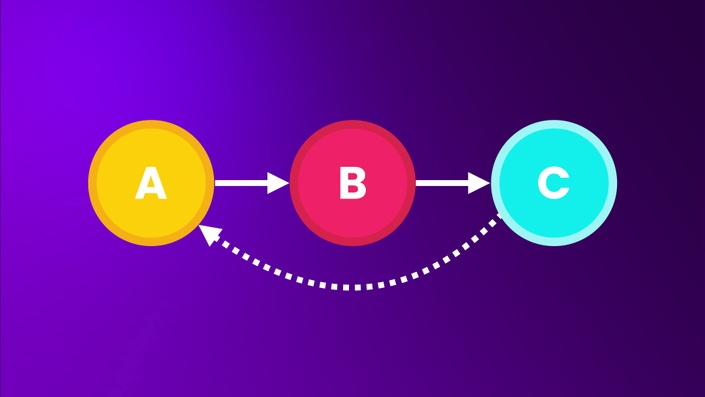
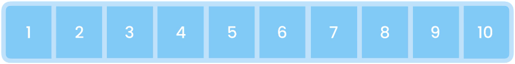
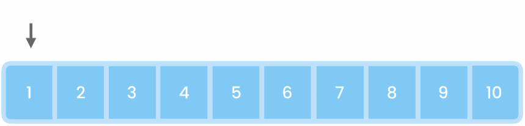
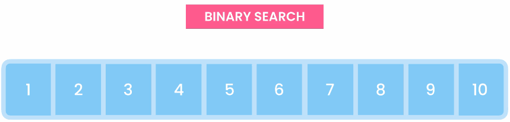
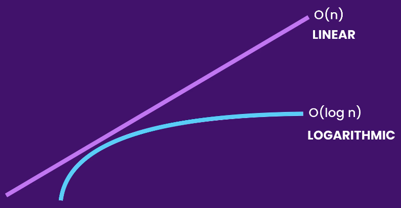
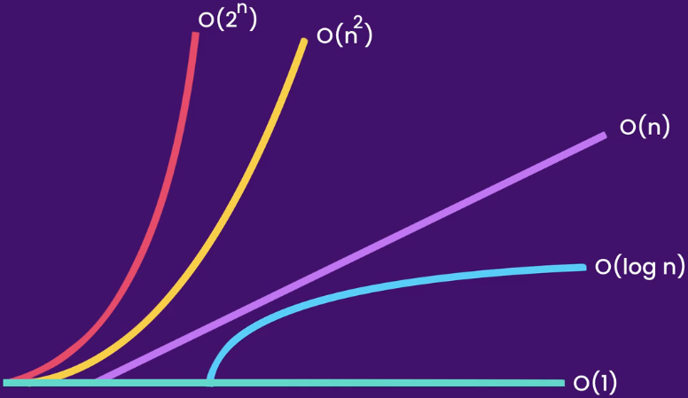

# The Ultimate Data Structures & Algorithms: Part 1



Course Link: <https://codewithmosh.com/p/data-structures-algorithms-part1>

---

## Getting Started

Part 1 主要演示線性結構 (Linear Structure)，包含

- Arrays
- Linked Lists
- Stacks
- Queues
- Has Tables

---

## The Big O Notation

用來描述一個演算法的效能，隨著 input 的成長，會有多少程度的影響到效能

### O(1)

參考下述程式碼

``` java
public class Main {
    public void log(int[] numbers) {
        System.out.println(numbers[0]);
    }
}
```

無論輸入的 `numbers` 有多大，程式都是執行固定次數(常數次)，所以時間複雜度記作 **O(1)**，執行次數為**常數時間**

.

如果有多行 O(1) 的程式碼呢？

``` java
public class Main {
    public void log(int[] numbers) {
        System.out.println(numbers[0]);
        System.out.println(numbers[0]);
        System.out.println(numbers[0]);
    }
}
```

執行步驟依然不會受 `numbers` 的增長而影響，所以時間複雜度還是記作 **O(1)**

### O(n)

參考下述程式碼

``` java
public class Main {
    public void log(int[] numbers) {
        for (int i = 0; i < numbers.length; i++)
            System.out.println(numbers[i]);
    }
}
```

輸入的 `numbers` 長度為 N，程式就會執行 N 次，所以時間複雜度記作 **O(n)**，執行次數為**線性成長**

.

如果在 for loop 前後加上 O(1) 的程式碼呢？

``` java
public class Main {
    public void log(int[] numbers) {
        System.out.println(); // O(1)
        for (int i = 0; i < numbers.length; i++) // O(n)
            System.out.println(numbers[i]);
        System.out.println(); // O(1)
    }
}
```

因為常數時間影響有限，此段程式碼的時間複雜度依然是記作 **O(n)**

.

如果同一個 input 有多行 O(n) 的程式碼呢？

``` java
public class Main {
    public void log(int[] numbers) {
        for (int i = 0; i < numbers.length; i++) // O(n)
            System.out.println(numbers[i]);

        for (int i = 0; i < numbers.length; i++) // O(n)
        System.out.println(numbers[i]);
    }
}
```

同理，兩個 O(n) 的動作不會記作 O(2n)，因為 `numbers` 的長度造成的影響還是線性時間，所以時間複雜度仍然記作 **O(n)**

.

如果多個 input 有各自 O(n) 的程式碼呢？

``` java
public class Main {
    public void log(int[] numbers, String[] names) {
        for (int i = 0; i < numbers.length; i++) // O(n)
            System.out.println(numbers[i]);

        for (int i = 0; i < names.length; i++) // O(m)
        System.out.println(numbers[i]);
    }
}
```

雖然時間複雜度看起來是 O(n + m)，但 input 造成的影響還是線性時間，所以時間複雜度仍然記作 **O(n)**

### O(n<sup>2</sup>)

參考下述程式碼

``` java
public class Main {
    public void log(int[] numbers) {
        for (int i = 0; i < numbers.length; i++) // O(n)
            for (int j = 0; j < numbers.length; j++) // O(n)
                System.out.println(numbers[i] + ", " + numbers[j]);
    }
}
```

輸入的 `numbers` 長度為 N，程式就會執行 N<sup>2</sup> 次，所以時間複雜度記作 **O(n<sup>2</sup>)**，執行次數為**指數成長**

.

如果在前面加上 O(n) 的程式碼呢？

``` java
public class Main {
    public void log(int[] numbers) {
        for (int i = 0; i < numbers.length; i++) // O(n)
            System.out.println(numbers[i]);

        for (int i = 0; i < numbers.length; i++) // O(n)
            for (int j = 0; j < numbers.length; j++) // O(n)
                System.out.println(numbers[i] + ", " + numbers[j]);
    }
}
```

因為和 O(n<sup>2</sup>) 比較起來，O(n) 的影響還是有限，此段程式碼的時間複雜度依然是記作 **O(n<sup>2</sup>)**

.

如果又多了一層 for loop 呢？

``` java
public class Main {
    public void log(int[] numbers) {
        for (int i = 0; i < numbers.length; i++) // O(n)
            for (int j = 0; j < numbers.length; j++) // O(n)
                for (int k = 0; k < numbers.length; k++) // O(n)
                    System.out.println(numbers[i] + ", " + numbers[j]);
    }
}
```

不同於前例增加的程式只有 O(n) 的影響，在此例加上第三層 for loop 會明顯的增加更多步驟，所以時間複雜度便會明確的記作 **O(n<sup>3</sup>)**

### O(log n)

想像我們要在一已排序數列中，找出任一數字



- 方法 1 - Linear Search

    從 1, 2, 3 ... 開始找起，最糟糕的情況就是我們要找的目標在數列的最後，此方法的時間複雜度為 **O(n)**

    

- 方法 2 - Binary Search

    每次尋找都將數列切半，若該數字非目標，則判斷目標在數列右邊或左邊，重複步驟至找到為止，此方法的時間複雜度為 **O(log n)**，執行次數為**對數成長**

    

O(log n) 的效能會比 O(n) 好很多



### O(2<sup>n</sup>)

最耗費效能 (暫時無範例)

### 時間複雜度總結

時間複雜度由高至低，依序為

O(2<sup>n</sup>) > O(n<sup>2</sup>) > O(n) > O(log n) > O(1)



### 空間複雜度

電腦執行演算法所需要耗費的空間(記憶體)成本，通常會和時間成本成反比，參考下述程式碼

``` java
public class Main {
    public void greet(String[] names) {
        for (int i = 0; i < names.length; i++)
            System.out.println("Hi " + names[i]);
    }
}
```

無論輸入的 `names` 有多大，程式需要額外配置的空間都只有 for loop 中的變數 `i`，所以此段程式碼的空間複雜度記作 **O(1)**

.

如果有一區域變數，直接複製 `names` 呢？

``` java
public class Main {
    public void greet(String[] names) {
        String[] copy = new String[names.length];

        for (int i = 0; i < names.length; i++)
            System.out.println("Hi " + names[i]);
    }
}
```

輸入的 `names` 長度為 N，程式需要額外配置給 `copy` 的空間就是 N，所以空間複雜度記作 **O(n)**
