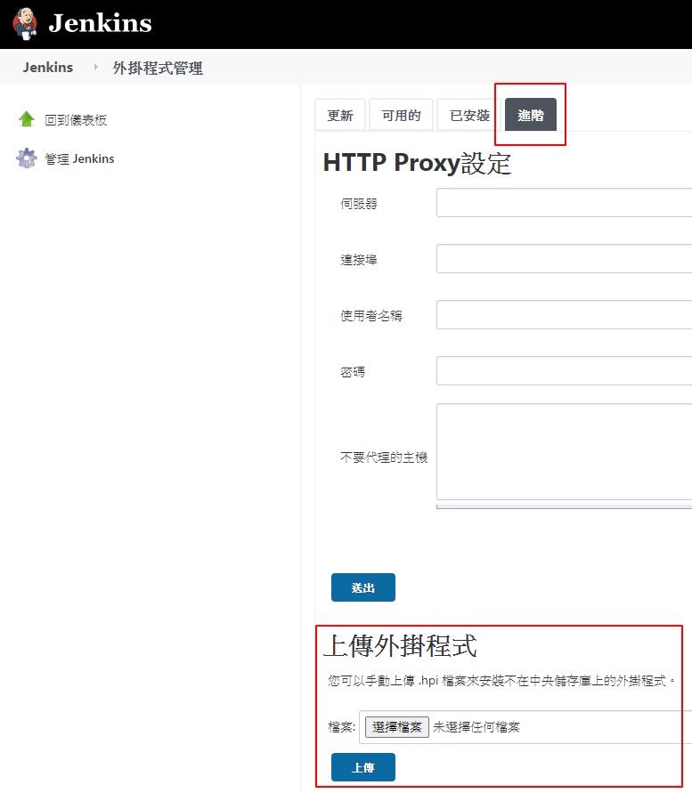

# 外掛

## 路徑

管理 Jenkins -> 管理外掛程式

## 外掛列表

| Plugin Name                                                                                      | Description                                                                                                         |
|:-------------------------------------------------------------------------------------------------|:--------------------------------------------------------------------------------------------------------------------|
| [Safe Restart](https://plugins.jenkins.io/saferestart/)                                          | 在左側選單顯示重啟 Jenkins 的連結                                                                                   |
| [Publish Over SSH](https://plugins.jenkins.io/publish-over-ssh/)                                 | 可透過 ssh 部署檔案至目標 server                                                                                    |
| [Multibranch Scan Webhook Trigger](https://plugins.jenkins.io/multibranch-scan-webhook-trigger/) | 讓 Multibranch pipeline 可透過 webhook 觸發                                                                         |
| [Email Extension](https://plugins.jenkins.io/email-ext/)                                         | 可以夾帶附件的 email 外掛  ※ v2.74 寄不了，暫時使用 v2.69                                                     |
| [Office 365 Connector](https://plugins.jenkins.io/Office-365-Connector/)                         | 推送訊息到 Microsoft Teams，串接方式可參考[文章](https://dotblogs.com.tw/stanley14/2018/08/04/Jenkins_O365_MSTeams) |

## 離線安裝

無法透過管理介面安裝外掛時，可以先從連結離線下載檔案，再從「進階 -> 上傳外掛程式」作上傳

