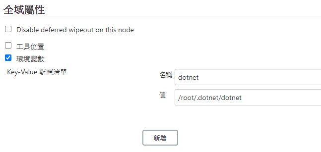
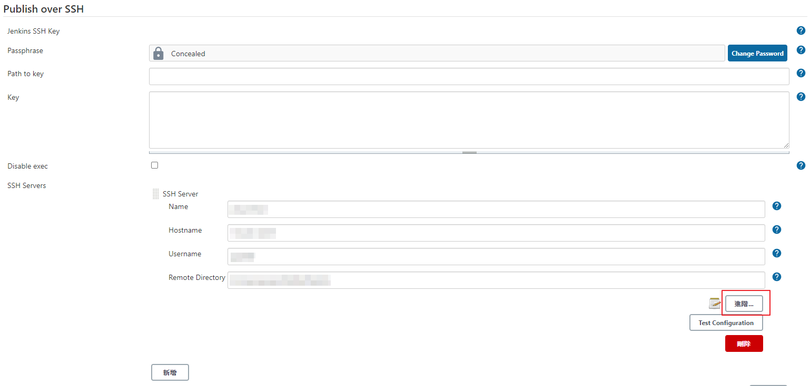
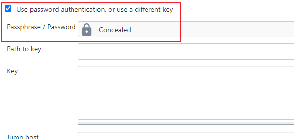
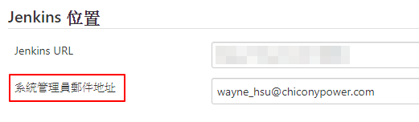
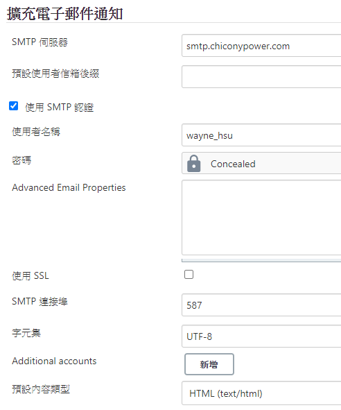

# 設定系統

## 路徑

管理 Jenkins -> 設定系統

## 環境變數

- 設定好的環境變數可以在 Jenkinsfile 使用

    

## SSH Servers

- 需先安裝 [Publish Over SSH](https://plugins.jenkins.io/publish-over-ssh/)
- 設定 Name (辨識用)、Hostname、Username 和 Remote Directory

    

- 點開「進階」，勾選「Use password authentication, or use a different key」，並填入密碼

    

## Email 通知

- 需先安裝 [Email Extension](https://plugins.jenkins.io/email-ext/)，才能寄送有附件的 email
- 設定「系統管理員郵件地址」

    

- 設定「擴充電子郵件通知」，使用者名稱要和系統管理員郵件地址的帳號相同

    
