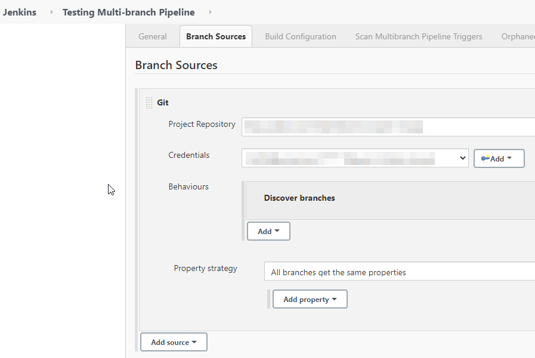
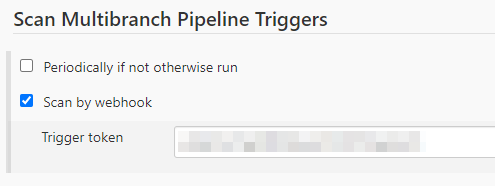

# Multibranch Pipeline

## 路徑

新增作業 -> Multibranch Pipeline

## 設定 Branch Sources



## 設定 webhook token

- 需先安裝 [Multibranch Scan Webhook Trigger](https://plugins.jenkins.io/multibranch-scan-webhook-trigger/)
- 假設 toekn 值是「abc」，屆時 webhook 就是呼叫「`{Jenkins_Server_Url}`/multibranch-webhook-trigger/invoke?token=abc」

    

## Jenkinsfile

- 新增 Jenkinsfile 檔案在 source code 根目錄作為 Pipeline 設定，不同 branch 可透過不同的 Jenkinsfile 作各自的配置
- 各步驟語法可透過 Snippet Generator 產生 (路徑：Jenkins -> `{作業名稱}` -> Pipeline Syntax)
- Linux 環境變數有以下幾種寫法，每個外掛跟關鍵字支援的寫法不同，我找不到特定規則，若使用錯誤的規則，可能會造成變數未被取代或是直接報錯「groovy.lang.MissingPropertyException: No such property」

    | Description                                        | Example                       |
    |:---------------------------------------------------|:------------------------------|
    | 字串單引號                                         | 'This is $BUILD_NUMBER'       |
    | 字串單引號、變數使用大括號                         | 'This is ${currentDate}'      |
    | 字串雙引號、變數使用大括號                         | "This is ${BUILD_NUMBER}"     |
    | 字串雙引號、變數使用大括號、變數加上「env.」前綴詞 | "This is ${env.BUILD_STATUS}" |

- Jenkinsfile 範本如下

    ``` java
    pipeline {
        agent any
        environment {
            /* 自訂環境變數 */
            currentDate = Calendar.getInstance().getTime().format('YYYYMMdd_HHmmss', TimeZone.getTimeZone("Asia/Taipei"))
        }
        stages {
            stage('Begin') {
                steps {
                    /* 推送訊息至 Teams */
                    office365ConnectorSend message: "Build # ${BUILD_NUMBER} - Start!", webhookUrl: 'https://outlook.office.com/webhook/xxxxx'
                    /* 寄送 email */
                    emailext body: '$PROJECT_NAME - Build # $BUILD_NUMBER - Start!', subject: 'Jenkins Notificaiton - Build Started', to: 'wayne_hsu@chiconypower.com'
                }
            }
            stage('Clean') {
                steps {
                    sh '$dotnet clean "Calculator.sln" --configuration Debug'
                }
            }
            stage('Build') {
                steps {
                    sh '$dotnet build "Calculator.sln" --configuration Debug'
                }
            }
            stage('Unit Test') {
                steps {
                    sh '$dotnet test "test/Calculator.Core.UnitTests/Calculator.Core.UnitTests.csproj" --logger "trx;LogFileName=${currentDate}.trx"'
                }
                /* 此 post 區塊代表在其 stage 執行完成後，若狀態為 failure 時執行 */
                post {
                    failure {
                        office365ConnectorSend color: '#ff0000', webhookUrl: 'https://outlook.office.com/webhook/xxxxx'
                        emailext attachmentsPattern: "test/Calculator.Core.UnitTests/TestResults/${currentDate}.trx", body: '$PROJECT_NAME - Build # $BUILD_NUMBER - $BUILD_STATUS: <br> Check console output at $BUILD_URL to view the results.', subject: 'Jenkins Notificaiton - Test Failed', to: 'wayne_hsu@chiconypower.com'
                    }
                }
            }
            stage('Publish') {
                steps {
                    sh '$dotnet publish "src/Calculator.Api/Calculator.Api.csproj" --configuration Debug --output "publish/Debug"'
                }
            }
            stage('Deploy') {
                steps {
                    sshPublisher(
                        publishers: [
                            sshPublisherDesc(
                                configName: 'Linux Host',
                                transfers: [
                                    sshTransfer(
                                        cleanRemote: false,
                                        excludes: '',
                                        execCommand: '',
                                        execTimeout: 120000,
                                        flatten: false,
                                        makeEmptyDirs: false,
                                        noDefaultExcludes: false,
                                        patternSeparator: '[, ]+',
                                        remoteDirectory: '',
                                        remoteDirectorySDF: false,
                                        removePrefix: 'publish',
                                        sourceFiles: 'publish/**'
                                    )
                                ],
                                usePromotionTimestamp: false,
                                useWorkspaceInPromotion: false,
                                verbose: true
                            )
                        ]
                    )
                }
            }
        }
        /* 此 post 區塊代表在所有 stage 執行完成後，無論狀態為何皆執行 */
        post {
            always {
                office365ConnectorSend message: "Build # ${BUILD_NUMBER} - Finish!<br>Build result: ${env.BUILD_STATUS}", webhookUrl: 'https://outlook.office.com/webhook/xxxxx'
                emailext body: '$PROJECT_NAME - Build # $BUILD_NUMBER - Finish!<br>Build result: $BUILD_STATUS', subject: 'Jenkins Notificaiton - Build Finished', to: 'wayne_hsu@chiconypower.com'
            }
        }  
    }
    ```
