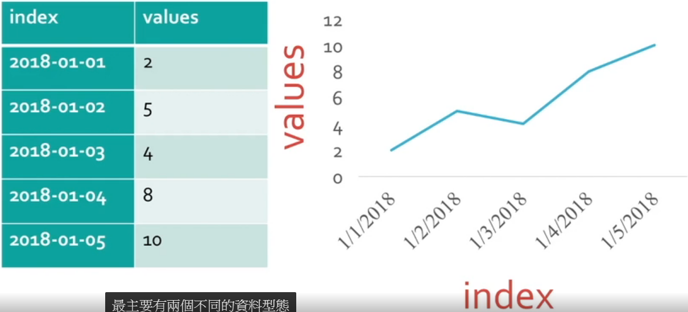
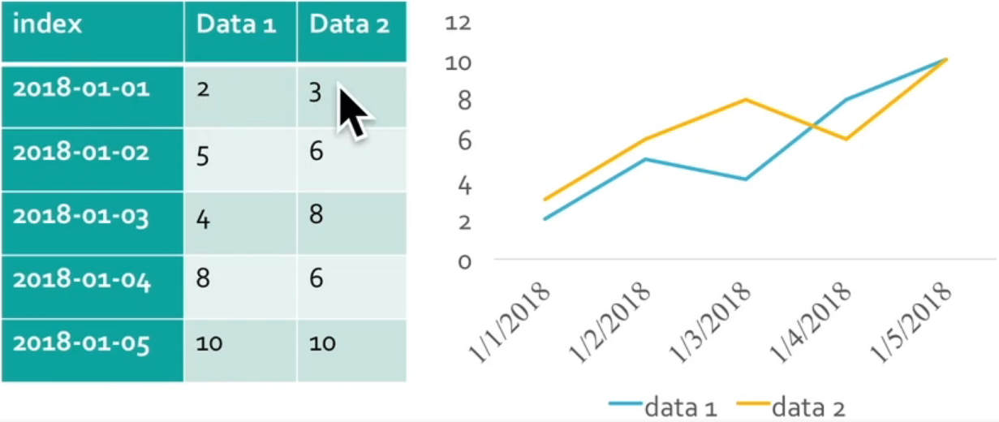

# 小資族選股策略


Course Link: <https://hahow.in/courses/5a2170d5a6d4a5001ec3148d/main>

---

## 名詞解釋

| 名詞     | 定義                                                          |
| -------- | ------------------------------------------------------------- |
| 股票價值 | `股價 * 持有張數 * 1000`                                      |
| 摩擦成本 | 交易時產生的成本，包括手續費和證交稅                          |
| 手續費   | 每次買賣都要扣掉<br>`股票價值 * 手續費率` (通常是 1.425/1000) |
| 證交稅   | 賣出時才要扣掉<br>`股票價值 * 證交稅率` (通常是 3/1000)       |

## Python 基本語法

### 特性

- 變數不需宣告
- 句尾不必分號( ; )

### string

- 字串可以用雙引號或單引號包起來

### array

- index 從 0 開始
- 陣列取 sub-array 的方式如下

    ``` python
    arr = ['a', 'b', 'c', 'd']
    # 取 index >= 1 但 < 3 的 sub-array
    sub = arr[1:3]
    print(sub)

    # output:
    # ['b', 'c']
    ```

### dictionary

用來存放 key/value

``` python
# 宣告
dic = {'Apple': 50, 'Banana': 20}

# 添加
dic['Cherry'] = 70

# 取值
dic['Apple']
# output:
# 50

# 取全部 key 或 value
dic.keys()
dic.values()
# output:
# ['Apple', 'Banana', 'Cherry']
# [50, 20, 70]
```

### function

``` python
# 宣告
def add(x, y):
    result = x + y
    return result
```

### if/else

- 條件式後面要有冒號( : )
- 用句首空格區別區塊
- else if 寫成 `elif`

``` python
a = 1
b = 2

if a > b:
    print(a)
elif:
    print('equal')
else:
    print(b)
```

### for loop

``` python
for i in [1, 2, 3, 4]:
    print(i)

# output:
# 1
# 2
# 3
# 4
```

``` python
# 用 range() 要小心不包含最後的數字
for i in range(0, 4):
    print(i)

# output:
# 1
# 2
# 3
```

### while loop

``` python
i = 1
while i < 4:
    print(i)
    i = i + 1

# output:
# 1
# 2
# 3
```

## Pandas

- Pandas 之於 Python，就像 Excel 之於 Windows

### 數據型態

- Series: 由 index 和 value 組成一條時間序列
  
- DataFrame: 多個 series 共用同一個 index
  

### 實作 Series

``` python
# 引用 pandas
import pandas as pd

# 透過 pd.date_range() 建立日期陣列
dates = pd.date_range('20200101', periods=6)
val = [1,2,3,4,5,6]

# 透過 pd.Series() 建立物件
s = pd.Series(val, index=dates)
print(s)
# output:
# 2020-01-01    1
# 2020-01-02    2
# 2020-01-03    3
# 2020-01-04    4
# 2020-01-05    5
# 2020-01-06    6

# 透過 loc[index] 查找對應的 value
print(s.loc['20200103'])
# output:
# 3

# 透過 loc[index1:index2] 查找一段區間內的 value (包含區間結尾那筆)
print(s.loc['20200102':'2020-01-04'])
# output:
# 2020-01-02    2
# 2020-01-03    3
# 2020-01-04    4

# 透過 iloc[x] 查找第 x 筆 index 的 value (從 0 開始)
print(s.iloc[0])
# output:
# 1

# 透過 iloc[x:y] 查找第 x 筆 ~ 第 y 筆 index 的 value (不包含區間結尾那筆)
print(s.iloc[1:3])
# output:
# 2020-01-02    2
# 2020-01-03    3

# 最大值
s.max()
# 最小值
s.min()
# 平均值
s.mean()
# 標準差
s.std()

# 累加前面的 value (cum 為 cumulate 的簡寫)
print(s.cumsum())
# output:
# 2020-01-01    1
# 2020-01-02    3
# 2020-01-03    6
# 2020-01-04    10
# 2020-01-05    15
# 2020-01-06    21

# 累乘前面的 value
print(s.cumprod())
# output:
# 2020-01-01    1
# 2020-01-02    2
# 2020-01-03    6
# 2020-01-04    24
# 2020-01-05    120
# 2020-01-06    720

# 移動窗格為2，並做累加
print(s.rolling(2).sum())
# output:
# 2020-01-01     NaN
# 2020-01-02     3.0
# 2020-01-03     5.0
# 2020-01-04     7.0
# 2020-01-05     9.0
# 2020-01-06    11.0

# 移動窗格為2，並取窗格中的最大值
print(s.rolling(2).max())
# output:
# 2020-01-01     NaN
# 2020-01-02     2.0
# 2020-01-03     3.0
# 2020-01-04     4.0
# 2020-01-05     5.0
# 2020-01-06     6.0

# 對 series 中所有 value 做運算
print(s + 1)
# output:
# 2020-01-01    2
# 2020-01-02    3
# 2020-01-03    4
# 2020-01-04    5
# 2020-01-05    6
# 2020-01-06    7

# 對 series 中所有 value 做判斷
print(s > 3)
# output:
# 2020-01-01    False
# 2020-01-02    False
# 2020-01-03    False
# 2020-01-04    True
# 2020-01-05    True
# 2020-01-06    True

# 要求 matplotlib 畫圖
%matplotlib inline
s.plot()
```

### 實作 DataFrame

``` python
import pandas as pd
dates = pd.date_range('20200101', periods=6)

s1 = pd.Series([1,2,3,4,5,6], index=dates)
s2 = pd.Series([5,6,7,8,9,10], index=dates)
s3 = pd.Series([11,12,5,7,8,2], index=dates)

# 將多條 series 放到 dictionary
dictionary = {
    'c1': s1,
    'c2': s2,
    'c3': s3
}

df = pd.DataFrame(dictionary)
print(df)
# output:
#              c1   c2    c3
# 2020-01-01    1    5    11
# 2020-01-02    2    6    12
# 2020-01-03    3    7    5
# 2020-01-04    4    8    7
# 2020-01-05    5    9    8
# 2020-01-06    6   10    2

# 透過 loc[index] 查找對應的 value
print(df.loc['20200103'])
# output:
# c1    3
# c2    7
# c3    5

# 透過 loc[index1:index2, [seriesName1, ...]] 查找一段區間內，指定 series 的 value (包含區間結尾那筆)
print(df.loc['20200102':'2020-01-04', ['c1', 'c2']])
# output:
#              c1   c2
# 2020-01-02    2    6
# 2020-01-03    3    7
# 2020-01-04    4    8

# 透過 iloc[x] 查找第 x 筆 index 的 value (從 0 開始)
print(df.iloc[0])
# output:
# c1    1
# c2    5
# c3   11

# 透過 iloc[x:y, [m, ...]] 查找第 x 筆 ~ 第 y 筆，指定 series 的 value (不包含區間結尾那筆)
print(s.iloc[0:3, [0, 1]])
# output:
#              c1   c2
# 2020-01-01    1    5
# 2020-01-02    2    6
# 2020-01-03    3    7

# 單獨取得某條 series
print(df['c1'])
# output:
# 2020-01-01    1
# 2020-01-02    2
# 2020-01-03    3
# 2020-01-04    4
# 2020-01-05    5
# 2020-01-06    6

# DataFrame 作累加 (預設方向是由上至下)
print(df.cumsum())
# output:
#              c1   c2    c3
# 2020-01-01    1    5    11
# 2020-01-02    3   11    23
# 2020-01-03    6   18    28
# 2020-01-04   10   26    35
# 2020-01-05   15   35    43
# 2020-01-06   21   45    45

# DataFrame 作累加 (指定方向是由左至右)
print(df.cumsum(axis=1))
# output:
#              c1   c2    c3
# 2020-01-01    1    6    17
# 2020-01-02    2    8    20
# 2020-01-03    3   10    15
# 2020-01-04    4   12    19
# 2020-01-05    5   14    22
# 2020-01-06    6   16    18

# DataFrame 移除某條 series (axis=1 代表使用 column name 指定)
print(df.drop('c1', axis=1))
# output:
#              c2    c3
# 2020-01-01    5    11
# 2020-01-02    6    12
# 2020-01-03    7    5
# 2020-01-04    8    7
# 2020-01-05    9    8
# 2020-01-06   10    2
```
