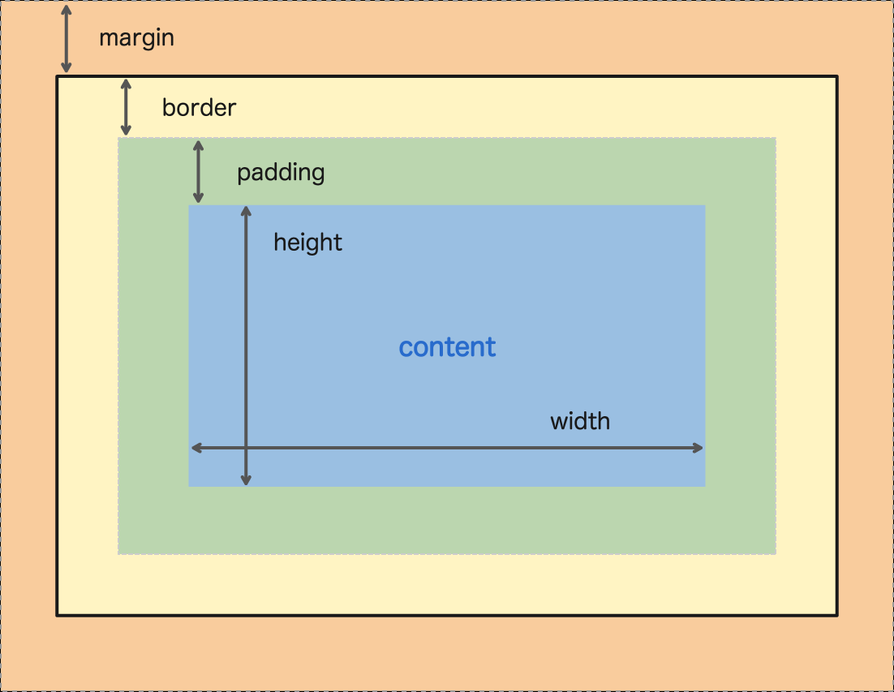
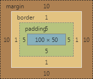
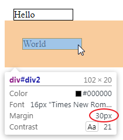
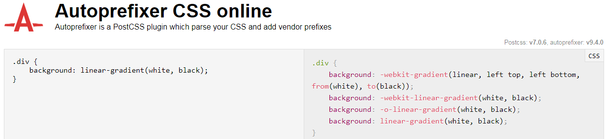

# CSS Tutorials For Beginners

Course Link: <https://www.youtube.com/playlist?list=PL4cUxeGkcC9gQeDH6xYhmO-db2mhoTSrT>

---

## Syntax (語法)

|          |                 inline                 |       embedded       |  external style sheet  |
|:--------:|:--------------------------------------:|:--------------------:|:----------------------:|
|   寫法   |             寫在每個元素上             |  集中寫在每頁特定處  |    集中寫在外部檔案    |
|   範例   | \<p **style="color: red;"**>Hello\</p> |                      |                        |
| 使用時機 |        特別針對某個元素時可使用        | 特別針對某頁時可使用 | 多數情況建議使用此寫法 |

## Comment (註解)

`/*` color: red; `*/`

## Targeting (指定目標)

### by tags

``` css
div {
    color: red;
}
```

``` html
<div id="mydiv">Hello World</div>
```

### by IDs

``` css
#mydiv {
    color: red;
}
```

``` html
<div id="mydiv">Hello World</div>
```

### by Classes

``` css
.myclass {
    color: red;
}
```

``` html
<div class="myclass">Hello World</div>
```

## Targeting Multiple Elements (指定多個目標)

``` css
/* 選擇所有 h1 和 h2 元素 */
h1, h2 {
    color: red;
}
```

## Descendant Selectors (後代選擇器)

``` css
/* 選擇 div 後代的所有 p 元素 */
div p {
    color: red;
}
```

``` html
<!-- 「Hello」和「World」都會被影響 -->
<div>
    <span>
        <p>Hello</p>
    </span>
    <p>World</p>
</div>
```

## Child Selectors (子代選擇器)

``` css
/* 選擇 div 直接子代的 p 元素 */
div > p {
    color: red;
}
```

``` html
<!-- 僅「World」會被影響 -->
<div>
    <span>
        <p>Hello</p>
    </span>
    <p>World</p>
</div>
```

## Adjacent Selectors (相鄰兄弟選擇器)

``` css
/* 選擇緊接在 span 之後的 p 元素 */
span + p {
    color: red;
}
```

``` html
<!-- 僅「World」會被影響 -->
<div>
    <span>
        <p>Hello</p>
    </span>
    <p>World</p>
</div>
```

## Attribute Selectors (屬性選擇器)

``` css
/* 選擇有 id 屬性的 div 元素 */
div[id] {
    color: red;
}

/* 選擇 class 屬性值為「myclass」的 div 元素 */
div[class="myclass"] {
    color: red;
}

/* 選擇 title 屬性值含「od」的 a 元素 */
a[title*="od"] {
    color: red;
}

/* 選擇 title 屬性值含完整「good」字串的 a 元素 */
a[title~="good"] {
    color: red;
}

/* 選擇 href 屬性值開頭為「https」的 a 元素 */
a[href^="https"] {
    color: red;
}

/* 選擇 href 屬性值結尾為「pdf」的 a 元素 */
a[href$="pdf"] {
    color: red;
}
```

``` html
<div id="mydiv">
    <div class="myclass">
        <a title="good title">Hello</a>
        <a href="https://www.google.com">Click</a>
        <a href="note.pdf">Click</a>
    </div>
</div>
```

## Pseudo Selectors (虛擬選擇器)

### Behavioral (行為相關)

#### hover

``` css
a:hover {
    color: red;
}
```

#### active

``` css
a:active {
    color: blue;
}
```

#### visited

``` css
a:visited {
    color: green;
}
```

### Structural (結構相關)

#### First & Last Child

※ child 指的是所有子元素

``` css
/* 選擇 div 元素的後代中，第一個子元素 */
div p:first-child {
    color: red;
}

/* 選擇 div 元素的後代中，最後一個子元素 */
div p:last-child {
    color: blue;
}
```

``` html
<div>
    <p>I'll be red</p>
    <p>2nd</p>
    <p>3rd</p>
    <p>I'll be blue</p>
</div>
```

#### First & Last of Type

※ 若後代由多種元素組成，用 child 有可能會指不到目標元素，需改用 type 的方式

``` css
/* 用這個寫法不會生效，因為 div 元素的第一個子元素不是 p 元素
div p:first-child {
    color: red;
}
*/

/* 選擇 div 元素的後代中，第一個 p 元素 */
div p:first-of-type {
    color: red;
}

/* 選擇 div 元素的後代中，最後一個 p 元素 */
div p:last-of-type {
    color: blue;
}
```

``` html
<div>
    <h1>I'm first child now</h1>
    <p>I'll be red</p>
    <p>2nd</p>
    <p>3rd</p>
    <p>I'll be blue</p>
    <h1>I'm last child now</h1>
</div>
```

#### nth Child

※ nth 的起始值為 1

``` css
/* 選擇第三個 li 元素 */
li:nth-child(3) {
    color: red;
}

/* 選擇所有奇數的 li 元素 */
li:nth-child(odd) {
    color: blue;
}

/* 選擇所有奇數的 li 元素 */
li:nth-child(2n+1) {
    color: blue;
}

/* 選擇所有偶數的 li 元素 */
li:nth-child(even) {
    color: green;
}

/* 選擇所有偶數的 li 元素 */
li:nth-child(2n) {
    color: green;
}
```

``` html
<ul>
    <li>item 1</li>
    <li>item 2</li>
    <li>item 3</li>
    <li>item 4</li>
</ul>
```

#### nth of Type

※ nth 的起始值為 1

## Combining Selectors (選擇器合併使用)

``` css
div.myclass {
    color: red;
}
```

``` html
<!-- 僅「Hello」會被影響 -->
<div>
    <div class="myclass">Hello</div>
    <div>World</div>
</div>
```

## The Universal Selector (通用選擇器)

※ 瀏覽器預設樣式也會被覆蓋

``` css
/* 超連結文字在瀏覽器預設樣式為深藍色，但通用選擇器會覆蓋，所以顏色也會改成紅色 */
* {
    color: red;
}
```

## Conflicts & the Cascade (衝突)

一般情況下，CSS有衝突時

- 寫在後面 > 寫在前面
- 寫在內層(元素上) > 寫在外層

但是也要考量[分數系統](#Selector-Specificity-選擇器分數系統)

## Inheritance (繼承關係)

外層的樣式會繼承到內層

## Selector Specificity (選擇器分數系統)

| Selectors | Points |
|:---------:|:------:|
| Elements  |   1    |
|  Classes  |   10   |
|    IDs    |  100   |

``` css
/* 原本 color 應該會被後寫的覆蓋，但因為這個選擇器有 101 分，所以會獲勝 */
#mydiv p {
    color: red;
}

/* 這個選擇器僅有 10 分 */
.myclass {
    color: blue;
}
```

``` html
<div id="mydiv">
    <p class="myclass">Hello World</p>
</div>
```

## The Important Declaration

「!important」修飾詞會是最強的，但是濫用會造成未來難以 debug

``` css
/* 這個選擇器有 101 分 */
#mydiv p {
    color: red;
}

/* 這個選擇器僅有 10 分，但有「!important」修飾的樣式最強，所以會獲勝 */
.myclass {
    color: blue !important;
}
```

``` html
<div id="mydiv">
    <p class="myclass">Hello World</p>
</div>
```

## Font Size (字體大小)

### Absolute

#### Pixels (px)

``` css
div {
    font-size: 48px;
}
```

### Relative

#### Em's (em) & Percentage (%)

em 和 % 都代表 inherit 後的字體大小乘以 N 倍

``` css
div {
    font-size: 16px;
}

div p {
    font-size: 3em;
}

div span {
    font-size: 50%;
}
```

``` html
<!-- Hello 的字體大小會是 16px -->
<!-- World 的字體大小會是 48px -->
<!-- Today 的字體大小會是 8px -->
<div>
    Hello
    <p>World</p>
    <span>Today</span>
</div>
```

## Font Family (字體)

依宣告順序使用字體，如果 client 端都沒有這些字體，就會使用瀏覽器預設樣式

``` css
p {
    font-family: 'arial', 'calibri';
}
```

## Text Decoration (文字修飾樣式)

底線、刪除線 .. 等等用法，自行參考 [w3schools](https://www.w3schools.com/cssref/pr_text_text-decoration.asp)

``` css
p {
    text-decoration: underline;
}
```

## Font Weight (文字粗體)

粗體用法，自行參考 [w3schools](https://www.w3schools.com/cssref/pr_font_weight.asp)

``` css
p {
    font-weight: bold;
}
```

## Text Transform (文字轉換大小寫)

首字大寫、全大寫、全小寫 .. 等等用法，自行參考 [w3schools](https://www.w3schools.com/cssref/pr_text_text-transform.asp)

``` css
p {
    text-transform: capitalize;
}
```

## Text Color (文字顏色)

分為文字顏色和底色，值可以寫顏色名稱或色碼

``` css
p {
    color: red;
    background-color: black;
}

span {
    color: #112233;
    background-color: #332211;
}
```

## Letter Spacing & Line Height (字母間距和文字行高)

``` css
/* 字母間距 */
p {
    letter-spacing: 3px;
}

/* 單字間距 */
p {
    word-spacing: 6px;
}

/* 文字行高會和文字大小有關係，以下樣式的文字行高會是 24px */
p {
    font-size: 12px;
    line-height: 2em;
}
```

## The Box Model



``` css
div {
    margin: 10px;
    padding: 5px;
    border: 1px solid #000000;
    width: 100px;
    height: 50px;
}
```

Result:



## Margin (外距)

``` css
/* 四邊外距都是 5px */
div {
    margin: 5px;
}

/* 上、右、下、左的外距分別為 5px、10px、15px、20px */
div {
    margin: 5px 10px 15px 20px;
}

/* 上、下的外距為 5px，左右的外距為 10px */
div {
    margin: 5px 10px;
}

/* 分別指定上、右、下、左的外距 */
div {
    margin-top: 5px;
    margin-right: 5px;
    margin-bottom: 5px;
    margin-left: 5px;
}
```

### Vertical Margin Collapse

垂直相鄰的兩個元素若都有 margin，其中間的空隙只會顯示數值較大的那方的 margin，以下為例子

``` css
#div1 {
    width: 100px;
    margin: 15px;
    border: 1px solid #000;
}

#div2 {
    width: 100px;
    margin: 30px;
    border: 1px solid #000;
}
```

``` html
<div id="div1">Hello</div>
<div id="div2">World</div>
```

兩個 div 元素中間的間距不會是 15px + 30px，而是只有 30px



### Horizontally Center the Element (水平置中)

將左右 margin 設為 auto

``` css
div {
    margin: 5px auto;
}
```

## Padding (內距)

``` css
/* 四邊內距都是 5px */
div {
    padding: 5px;
}

/* 上、右、下、左的內距分別為 5px、10px、15px、20px */
div {
    padding: 5px 10px 15px 20px;
}

/* 上、下的內距為 5px，左右的內距為 10px */
div {
    padding: 5px 10px;
}

/* 分別指定上、右、下、左的內距 */
div {
    padding-top: 5px;
    padding-right: 5px;
    padding-bottom: 5px;
    padding-left: 5px;
}
```

## Border (框線)

不同的框線樣式用法，自行參考 [w3schools](https://www.w3schools.com/cssref/pr_border-style.asp)

``` css
div {
    border: 1px solid #000;
}
```

## Block-level Elements & Inline Elements

html 元素天生分為兩類，詳細的元素分類可參考 [w3schools](https://www.w3schools.com/html/html_blocks.asp)

### Block-level Elements

每個元素總是從新的一行開始繪製，會占用所有可用的寬度，以 \<div> 元素為代表

### Inline Elements

每個元素不以新的一行開始繪製，僅占用所需的寬度，而且會忽略上、下邊的 margin，以 \<span> 元素為代表

``` css
.myclass {
    border: 1px solid #000;
    padding: 10px;
    margin: 20px;
    width: 100px;
    height: 50px;
}
```

``` html
<h2>Block-level Elements</h2>
<div class="myclass">Hello</div>
<div class="myclass">Hello</div>
<div class="myclass">Hello</div>
<h2>Inline Elements</h2>
<span class="myclass">World</span>
<span class="myclass">World</span>
<span class="myclass">World</span>
```

| Block-level Elements             | Inline Elements                              |
|----------------------------------|----------------------------------------------|
| 完整套用 Box Model 樣式          | height、width 和上、下邊的 margin 都會被忽略 |
| ![Block-level Elements][BLE_img] | ![Inline Elements][IE_img]|                  |

[BLE_img]: img/20190408_223756.png
[IE_img]: img/20190408_223351.png

## Display

``` css
/* 以 Block-level 的方式顯示元素 (如同 <div> 元素) */
.myclass {
    display: block;
}

/* 以 Inline-level 的方式顯示元素 (如同 <span> 元素) */
.myclass {
    display: inline;
}

/* 以 Inline-level 的方式顯示元素，
但是可以套用 height、width、margin-top 和 margin-bottom */
.myclass {
    display: inline-block;
}
```

其它 display 方式，自行參考 [w3schools](https://www.w3schools.com/cssref/pr_class_display.asp)

## Width & Height (寬度和高度)

``` css
/* 固定值寬度或高度 */
div {
    width: 300px;
    height: 300px;
}

/* 根據父元素寬度或高度，乘以 N % */
/* 此寫法會因當下頁面寬度或高度變化而變化 (即 RWD 寫法) */
div {
    width: 50%;
    height: 30%;
}
```

## Rounded Corners (圓角)

``` css
/* 四個角都是 5px 的圓角 */
div {
    border-radius: 5px;
}

/* 左上、右上、右下、左下的圓角分別為 5px、10px、15px、20px */
div {
    border-radius: 5px 10px 15px 20px;
}

/* 左上、右下的圓角為 5px，右上、左下的圓角為 10px */
div {
    border-radius: 5px 10px;
}
```

## Backgrounds (背景)

``` css
div {
    /* 背景色 */
    background-color: #000000;
    /* 背景圖片 */
    background-image: url(http://www.xxx.com/aaa.jpg);
    background-repeat: no-repeat;
    background-position: center;
    background-size: 100px;
    /* 背景圖片屬性的簡寫 */
    background: url(http://www.xxx.com/aaa.jpg) no-repeat center;
}
```

其它 background 用法，自行參考 [w3schools](https://www.w3schools.com/css/css_background.asp)

## Multiple Backgrounds (多個背景)

``` css
div {
    /* 背景圖片 */
    background-image: url(http://www.xxx.com/aaa.jpg), url(http://www.xxx.com/bbb.jpg);
    background-repeat: no-repeat, no-repeat;
}
```

## Color (顏色)

顏色寫法有三種

### 色碼

``` css
div {
    color: #000000;
}
```

### RGB

``` css
div {
    color: rgb(255, 255, 255);
}
```

### 名稱

``` css
div {
    color: white;
}
```

## Opacity (透明度)

值為 0 時 100% 透明；值為 1 時 0% 透明

``` css
div {
    /* opacity 屬性會同時影響文字和背景 */
    opacity: 0.7;
    /* rgba 僅會影響背景顏色 */
    background: rgba(255, 255, 255, 0.8);
}
```

## Gradients (漸層色)

### Linear-Gradients (線性漸層)

linear-gradient(方向, 起點1顏色 (起點1距離), ..., 終點顏色 (終點距離))

``` css
div {
    /* -moz 前綴是為了讓 Mozilla 瀏覽器能夠使用漸層 */
    /* -webkit 前綴是為了讓 Chrome 瀏覽器能夠使用漸層 */
    /* 建議要使用漸層時，如下四行寫法，可保證在無法使用漸層的瀏覽器也有背景色 */
    background: #ffc0cb;
    background: -moz-linear-gradient(top, #ffc0cb 0%, #03498d 100%);
    background: -webkit-linear-gradient(top, #ffc0cb 0%, #03498d 100%);
    background: linear-gradient(top, #ffc0cb 0%, #03498d 100%);
}
```

其它 Gradients 用法，自行參考 [w3schools](https://www.w3schools.com/css/css3_gradients.asp)

### Radial-Gradients (放射性漸層)

radial-gradient(形狀, 起點1顏色 (起點1距離), ..., 終點顏色 (終點距離))

``` css
div {
    /* -moz 前綴是為了讓 Mozilla 瀏覽器能夠使用漸層 */
    /* -webkit 前綴是為了讓 Chrome 瀏覽器能夠使用漸層 */
    /* 建議要使用漸層時，如下四行寫法，可保證在無法使用漸層的瀏覽器也有背景色 */
    background: #ffc0cb;
    background: -moz-radial-gradient(center, #ffc0cb 0%, #03498d 100%);
    background: -webkit-radial-gradient(center, #ffc0cb 0%, #03498d 100%);
    background: radial-gradient(center, #ffc0cb 0%, #03498d 100%);
}
```

## Box Shadow (陰影)

``` css
div {
    box-shadow: 10px 10px 5px grey;
}
```

其它 Shadow 用法，自行參考 [w3schools](https://www.w3schools.com/css/css3_shadows.asp)

## Browser Support (瀏覽器支援度)

各種瀏覽器對 CSS 的支援度並不相同，可以在 [Can I Use](https://caniuse.com/) 查看，以下有幾種對應方式

### Fallback Options (備案)

``` css
div {
    /* 在無法使用漸層的瀏覽器也有背景色 */
    background: red;
    background: linear-gradient(red, white);
}
```

### Vender Prefixes (供應商前綴)

透過 [Autoprefixer](https://autoprefixer.github.io/) 等網站產生對應的供應商前綴


